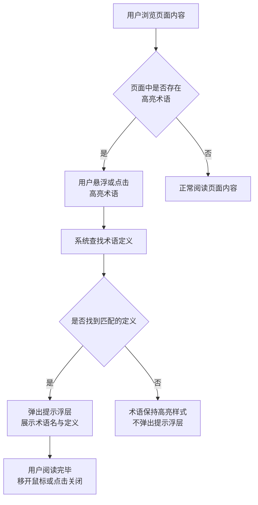
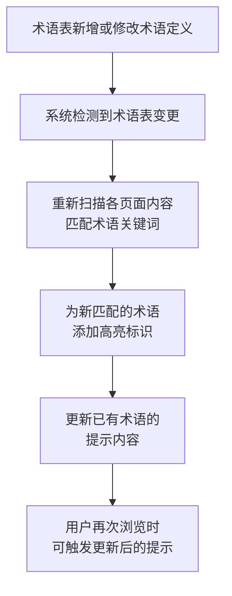
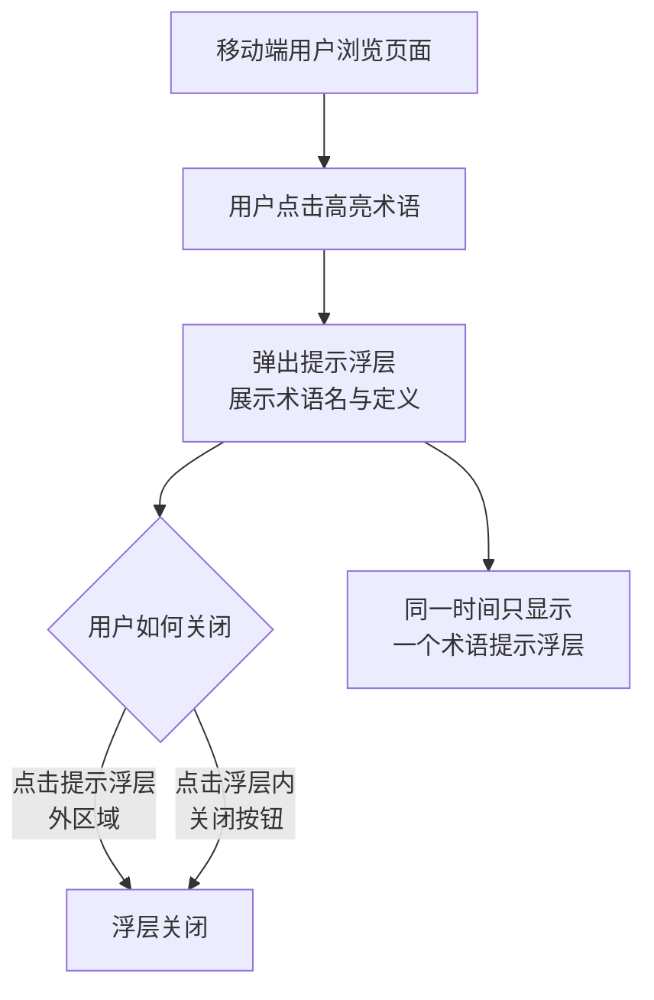

# 术语悬浮提示

## 1. 关键概念

- **术语高亮**：系统自动扫描页面内容，识别命理专业术语（如用神、忌神、病机、十神、格局等）并为它们添加可交互的视觉标识（如虚线下划线），提示用户可查看解释。
- **术语表**：维护在 `0.common/glossary.md` 中的术语定义集合，包含术语名称、定义与出处。术语悬浮提示的内容来源于术语表，两者保持同步。
- **触发方式**：桌面端为鼠标悬浮触发，移动端为点击触发——因移动端无鼠标悬浮操作，改用点击展示与关闭。

## 2. 业务流程

### 2.1 用户查看术语定义

用户在浏览任何含专业术语的页面时，可通过悬浮或点击查看术语的通俗解释。

### 2.2 术语表联动更新

当术语表新增或修改术语定义后，页面上对应术语的提示内容随之更新。

### 2.3 移动端术语提示

移动端因无鼠标悬浮操作，术语提示改为点击触发与关闭。

## 3. 业务规则

- **术语识别范围**：系统仅对术语表中已收录的术语添加高亮与提示，未收录的词汇不做处理。
- **提示内容来源**：所有术语定义均来自术语表（`0.common/glossary.md`），提示浮层中展示术语名称、定义与出处标记。
- **同一术语一致性**：同一术语在不同页面上的定义完全相同，不存在同一术语多种解释的情况。
- **浮层唯一性**：移动端同一时间只显示一个术语提示浮层，用户点击新术语时自动关闭前一个。
- **术语表变更即时生效**：术语表新增或修改后，无需用户手动刷新，下次浏览页面时即可触发新术语的提示。

## 4. 关键页面功能

| 页面/路由 | 功能 | 说明 | URS 追溯 |
|-----------|------|------|----------|
| *（所有含术语的页面）* | 术语高亮标识 | 系统自动扫描页面内容，识别命理专业术语并为它们添加可交互的视觉标识（如虚线下划线），提示用户可查看解释 | NFR-04 |
| *（所有含术语的页面）* | 桌面端悬浮提示 | 桌面端用户鼠标悬浮在高亮术语上时，弹出浮层显示术语名称、定义与出处标记 | NFR-04 |
| *（所有含术语的页面）* | 移动端点击提示 | 移动端用户点击高亮术语时，弹出浮层显示术语名称、定义与出处标记；点击其他区域或关闭按钮关闭浮层 | NFR-04 |
| *（全局）* | 术语表联动更新 | 术语定义与术语表（`0.common/glossary.md`）保持同步，术语表新增或修改术语后，页面上的提示内容随之更新 | NFR-04 |
| *（所有含术语的页面）* | 初学者术语提示引导 | 首次使用产品的用户进入含术语的页面时，系统以引导提示告知可悬浮或点击术语查看解释 | NFR-04 |