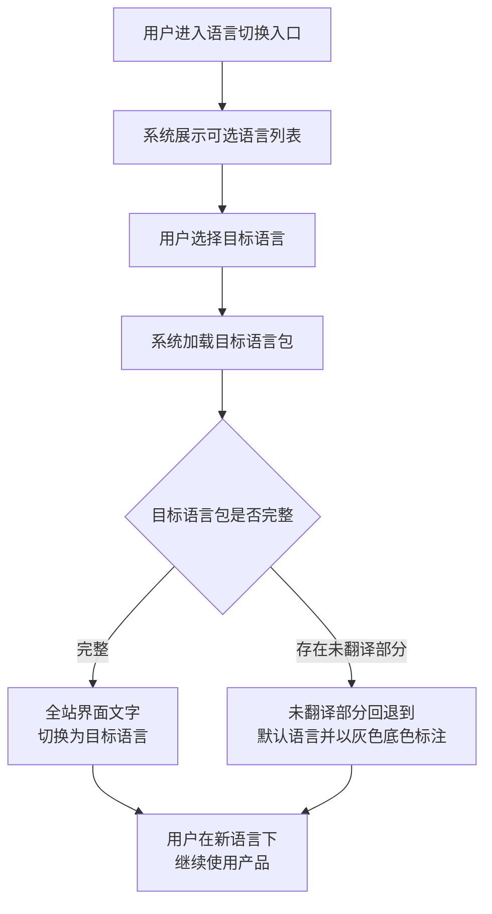
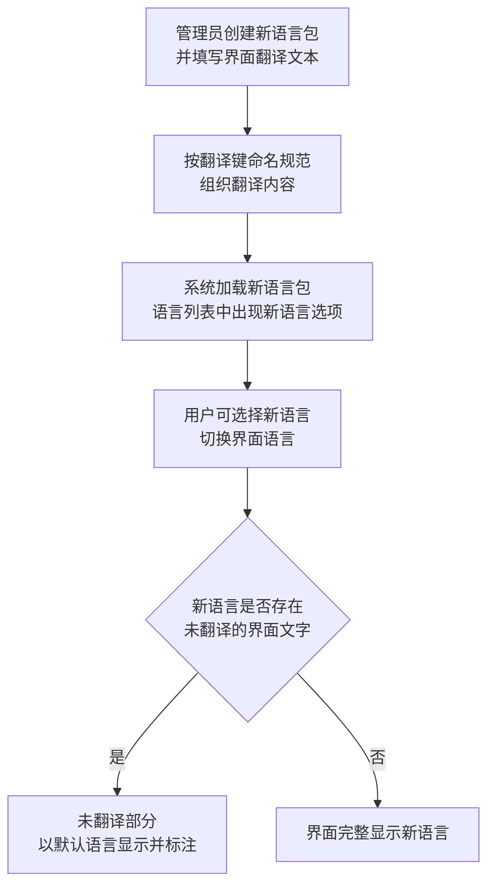
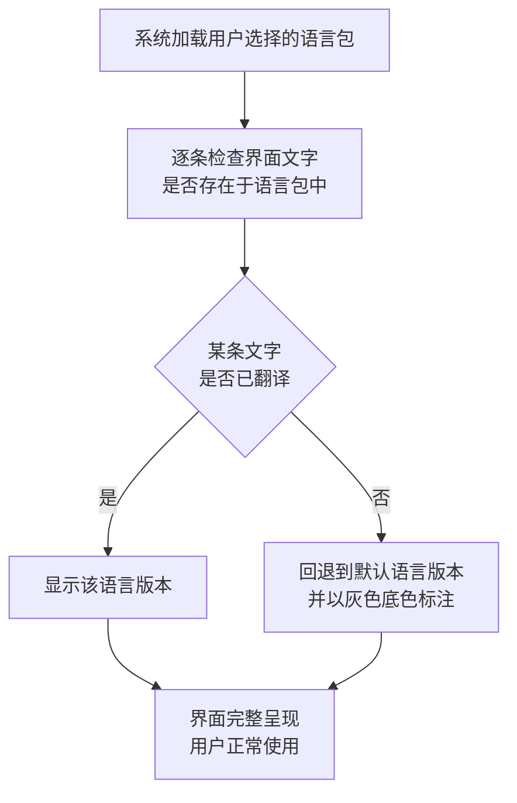

# 多语言扩展基础

## 1. 关键概念

- **默认语言**：产品的默认界面语言为简体中文（zh-CN），所有界面文字首先以简体中文编写，其他语言在此基础上扩展。
- **语言切换**：用户可在设置页面选择界面语言，切换后全站界面文字即时更新为新选择的语言。
- **回退链**（Fallback Chain）：当用户选择的语言缺少某条界面文字的翻译时，系统按"所选语言 → 默认语言（zh-CN）"的顺序逐级回退，确保界面不会出现空白文字。回退部分在视觉上以灰色底色标注，提示用户该部分尚未翻译。
- **语言包**：一种语言对应一组界面文字翻译文件，按统一的翻译键命名规范组织。语言包的完整程度决定了用户使用该语言时的体验完整度。
- **翻译键命名规范**：界面文字按"模块.页面.键名"的层级组织（如 `chart.input.birthDate`），确保翻译键具有可读性与可维护性，新增模块或页面时可按规范扩展。

## 2. 业务流程

### 2.1 用户切换界面语言

用户在设置页面选择目标语言，系统加载对应语言包并更新全站界面文字。

### 2.2 新增语言支持

管理员按规范创建新语言包后，系统将其加入语言列表，用户即可选择使用。

### 2.3 语言回退处理

当用户选择的语言存在缺失翻译时，系统自动回退到默认语言并做视觉标注。

## 3. 业务规则

- **默认语言为简体中文**：新用户首次访问产品时，界面以简体中文（zh-CN）呈现，无需手动选择。
- **语言偏好保持**：用户选择语言后，偏好被记住，后续访问自动使用上次选择的语言，无需重复操作。
- **回退不产生空白**：任何情况下界面文字不会出现空白，缺失翻译一律回退到默认语言（zh-CN）。
- **回退标注可识别**：回退到默认语言的部分以灰色底色标注，让用户清楚知道哪些内容尚未翻译为所选语言。
- **语言切换即时生效**：切换语言后全站界面文字即时更新，无需刷新页面或重新登录。
- **翻译键命名规范**：所有界面文字的翻译键按"模块.页面.键名"的层级组织（如 `chart.input.birthDate`），新增模块或页面时按同一规范扩展。
- **配置驱动**：论断规则与排盘算法分离，语言包同样以数据驱动方式管理，便于后续新增语言而不改动核心功能逻辑。（出处：NFR-03）

## 4. 关键页面功能

| 页面/路由 | 功能 | 说明 | URS 追溯 |
|-----------|------|------|----------|
| `/settings/language` | 语言切换 | 用户在设置页面选择界面语言，切换后全站界面文字即时更新为新选择的语言 | NFR-04 |
| `/settings/language` | 语言回退标注 | 当所选语言存在未翻译的界面文字时，缺失部分以默认语言（zh-CN）显示，并以灰色底色标注以便区分 | NFR-04 |
| *（全局）* | 默认语言呈现 | 新用户首次访问产品时，界面默认以简体中文（zh-CN）呈现 | NFR-04 |
| *（全局）* | 语言偏好保持 | 用户选择语言后，偏好被记住，后续访问自动使用上次选择的语言 | NFR-04 |
| `/settings/language` | 可选语言列表展示 | 语言切换页面展示所有已安装的语言选项，每个语言显示其本地名称（如"简体中文""English"），未完整翻译的语言标注完成度 | NFR-04 |