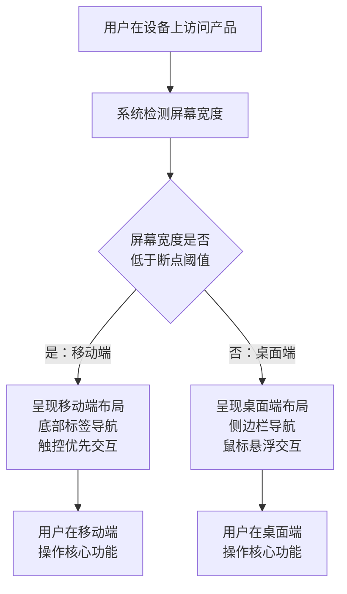
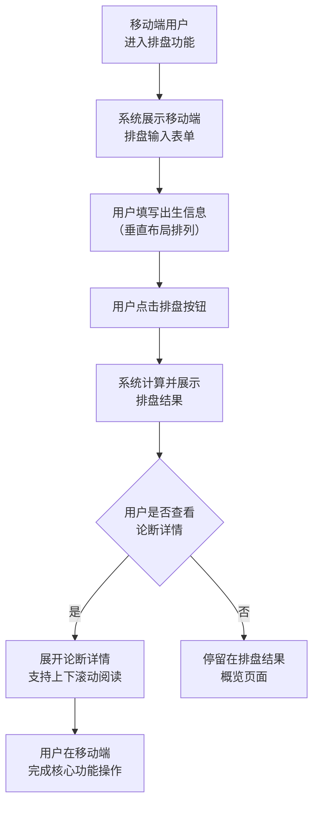
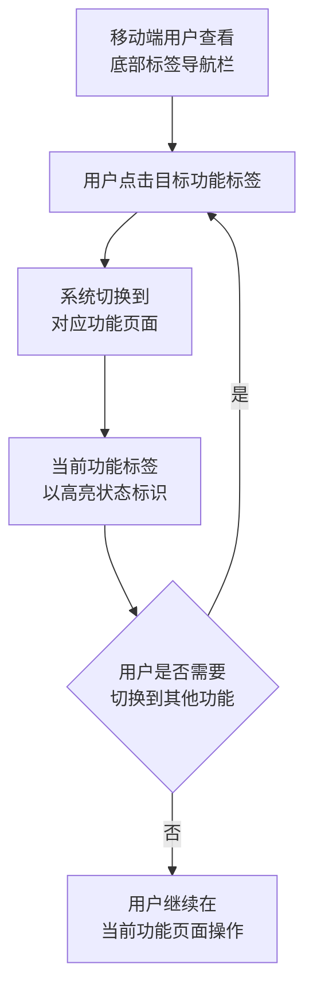

# 移动端适配

## 1. 关键概念

- **响应式布局**：根据用户设备的屏幕宽度自动切换页面布局形态——窄屏使用移动端布局，宽屏使用桌面端布局，确保同一产品在不同设备上均可正常使用。
- **断点阈值**：区分移动端与桌面端的屏幕宽度临界值。屏幕宽度低于阈值时切换为移动端布局（底部标签导航、垂直排列、触控交互），高于阈值时保持桌面端布局（侧边栏导航、水平排列、鼠标悬浮交互）。
- **核心功能移动端可用**：排盘与论断两大核心功能在移动端必须完整可用——用户可在手机上完成从输入出生信息到查看论断结果的全部操作。
- **触控交互适配**：桌面端依赖鼠标悬浮的交互方式（如术语悬浮提示、菜单展开等）在移动端改为点击触发，确保触控操作的自然性。

## 2. 业务流程

### 2.1 设备适配切换

用户在不同设备上访问产品时，系统自动识别屏幕宽度并切换到对应的布局形态。

### 2.2 移动端核心排盘操作

用户在移动端完成排盘输入与结果查看的全流程。

### 2.3 移动端导航切换

移动端用户通过底部标签栏在不同功能模块间切换。

## 3. 业务规则

- **核心功能移动端完整可用**：排盘（输入出生信息并得到命盘）与论断（查看辨病论断报告）两大核心功能在移动端必须完整可用，不得出现功能缺失或操作中断。
- **断点阈值固定**：断点阈值在产品发布时确定，不随页面内容变化，确保用户在不同页面间切换时布局形态一致。
- **导航形态切换规则**：屏幕宽度低于断点阈值时使用底部标签导航栏，高于阈值时使用侧边栏导航，两者所包含的功能入口完全一致。
- **触控交互替代规则**：所有桌面端鼠标悬浮触发的交互（如术语悬浮提示、菜单展开、按钮提示等），在移动端一律改为点击触发；不得要求移动端用户执行"长按悬浮"等反直觉操作。
- **移动端性能要求**：移动端页面首屏展示时间不超过合理范围，排盘计算在本地完成，不因设备性能差异导致明显卡顿。
- **字体与间距适配**：移动端正文文字大小不低于可读下限，按钮与可点击区域的最小尺寸满足触控操作要求，相邻可点击元素之间留有足够间距避免误触。

## 4. 关键页面功能

| 页面/路由 | 功能 | 说明 | URS 追溯 |
|-----------|------|------|----------|
| *（全局）* | 响应式布局切换 | 系统根据屏幕宽度自动切换桌面端或移动端布局，包括导航形态、内容区域宽度、字体大小与间距 | NFR-04 |
| *（移动端全局）* | 移动端底部导航栏 | 移动端使用底部标签栏替代桌面端侧边栏，包含核心功能入口（排盘、论断、历史等），当前功能以高亮状态标识 | NFR-04 |
| `/chart` | 移动端排盘输入适配 | 在移动端屏幕上，排盘输入表单以垂直布局排列，所有输入项可触控操作，确保排盘功能在手机上完整可用 | NFR-04 |
| `/report` | 移动端论断阅读适配 | 论断报告在移动端以可折叠章节展示，支持上下滚动阅读，关键结论优先展示，确保论断功能在手机上完整可用 | NFR-04 |
| *（移动端全局）* | 触控交互适配 | 所有桌面端依赖鼠标悬浮的交互（如术语提示、菜单展开等）在移动端改为点击触发，确保触控操作自然流畅 | NFR-04 |
| *（全局）* | 屏幕宽度变化响应 | 用户调整浏览器窗口大小或旋转设备时，系统实时响应屏幕宽度变化，自动切换到对应布局形态 | NFR-04 |