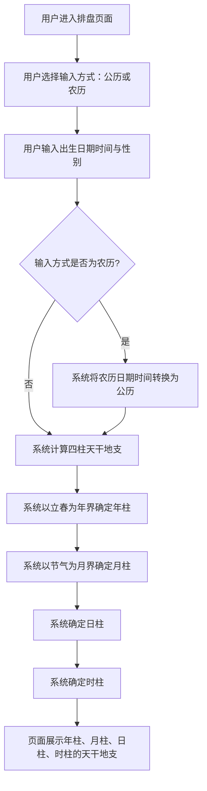
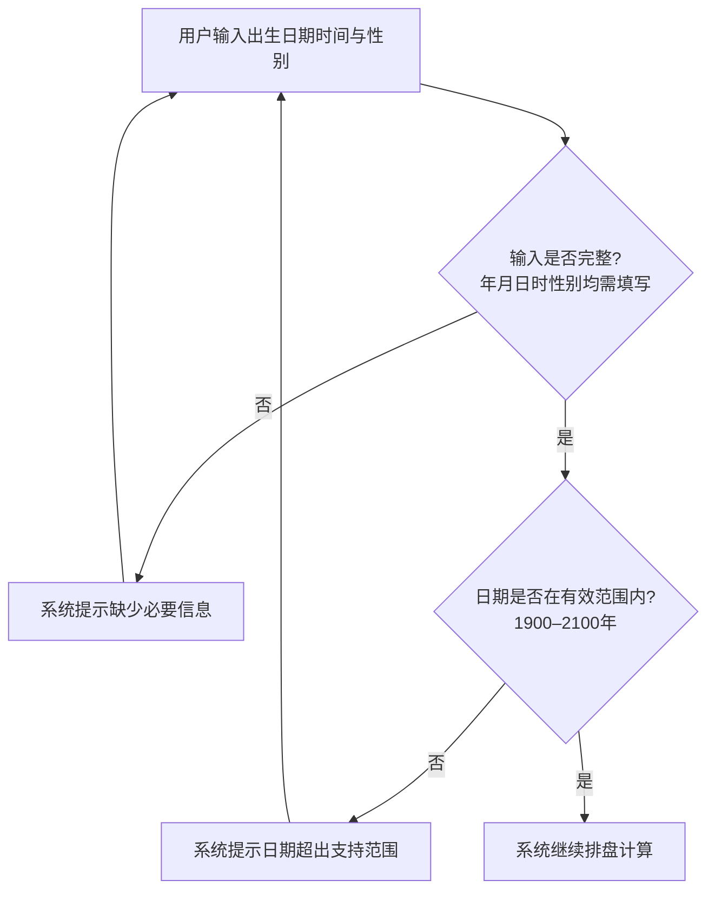

# 四柱排盘

## Part 1 业务流程

### 1.1 四柱排盘主流程

### 1.2 排盘输入校验流程

## Part 2 关键页面功能列表

### 页面 / 功能 1: 排盘输入页

- **URL / 路径（业务命名）**: 排盘输入页
- **目标用户**: 命理学习者、命理从业者、普通用户
- **核心功能**:
  - 选择输入方式（公历或农历）
  - 输入出生日期时间
  - 输入性别
  - 提交排盘请求
  - 查看输入校验提示

### 页面 / 功能 2: 四柱排盘结果页

- **URL / 路径（业务命名）**: 四柱排盘结果页
- **目标用户**: 命理学习者、命理从业者、普通用户
- **核心功能**:
  - 展示年柱天干地支
  - 展示月柱天干地支
  - 展示日柱天干地支
  - 展示时柱天干地支
  - 标注各柱天干与地支的五行属性