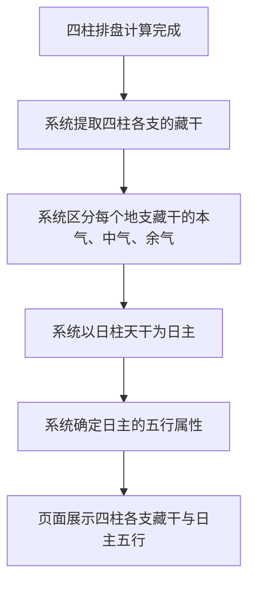

# 藏干与日主

## Part 1 业务流程

### 1.1 藏干提取与日主识别流程

## Part 2 关键页面功能列表

### 页面 / 功能 1: 藏干展示

- **URL / 路径（业务命名）**: 四柱排盘结果页-藏干区域
- **目标用户**: 命理学习者、命理从业者、普通用户
- **核心功能**:
  - 展示四柱各支的藏干
  - 区分藏干的主次关系（本气为主、中气次之、余气最弱）

### 页面 / 功能 2: 日主与五行展示

- **URL / 路径（业务命名）**: 四柱排盘结果页-日主区域
- **目标用户**: 命理学习者、命理从业者、普通用户
- **核心功能**:
  - 展示日主天干
  - 展示日主五行属性（金、木、水、火、土）
  - 提供日主五行含义的悬浮提示