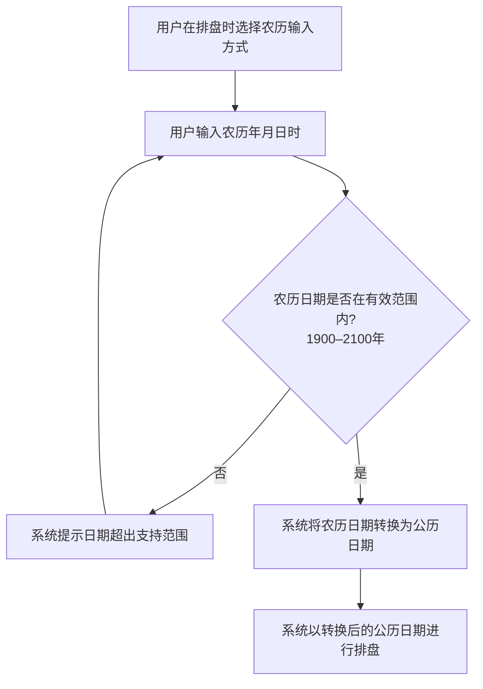
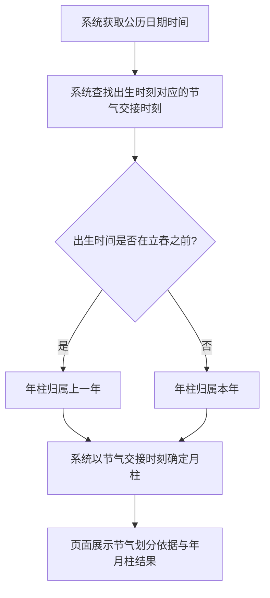
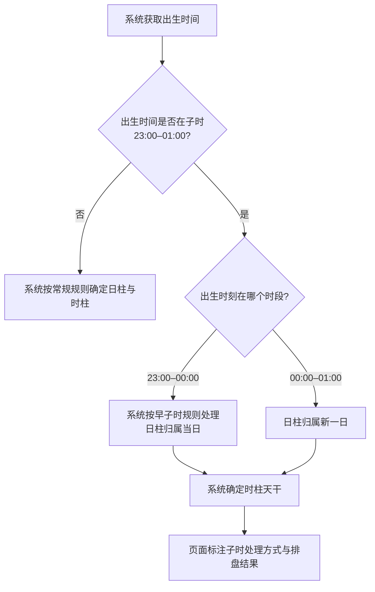

# 农历与节气

## Part 1 业务流程

### 1.1 农历公历互转流程

### 1.2 节气划分月柱流程

### 1.3 早子时与夜子时处理流程

## Part 2 关键页面功能列表

### 页面 / 功能 1: 农历公历互转

- **URL / 路径（业务命名）**: 排盘输入页-农历输入区域
- **目标用户**: 命理学习者、命理从业者、普通用户
- **核心功能**:
  - 支持选择农历输入方式
  - 输入农历年月日时
  - 系统自动将农历日期转换为公历日期
  - 校验农历日期有效性（1900–2100年范围）

### 页面 / 功能 2: 节气划分月柱

- **URL / 路径（业务命名）**: 四柱排盘结果页-节气标注区域
- **目标用户**: 命理学习者、命理从业者、普通用户
- **核心功能**:
  - 展示出生时刻对应的节气名称与交接时刻
  - 标注年柱是否因立春而归属上一年
  - 标注月柱是否因节气交接而跨月
  - 展示月柱地支对应的节气区间

### 页面 / 功能 3: 早子时与夜子时处理

- **URL / 路径（业务命名）**: 四柱排盘结果页-子时标注区域
- **目标用户**: 命理学习者、命理从业者、普通用户
- **核心功能**:
  - 当出生时间在子时（23:00–01:00）时标注早子时或正子时
  - 展示日柱在子时情形下的归属说明
  - 展示时柱天干在子时情形下的取法说明