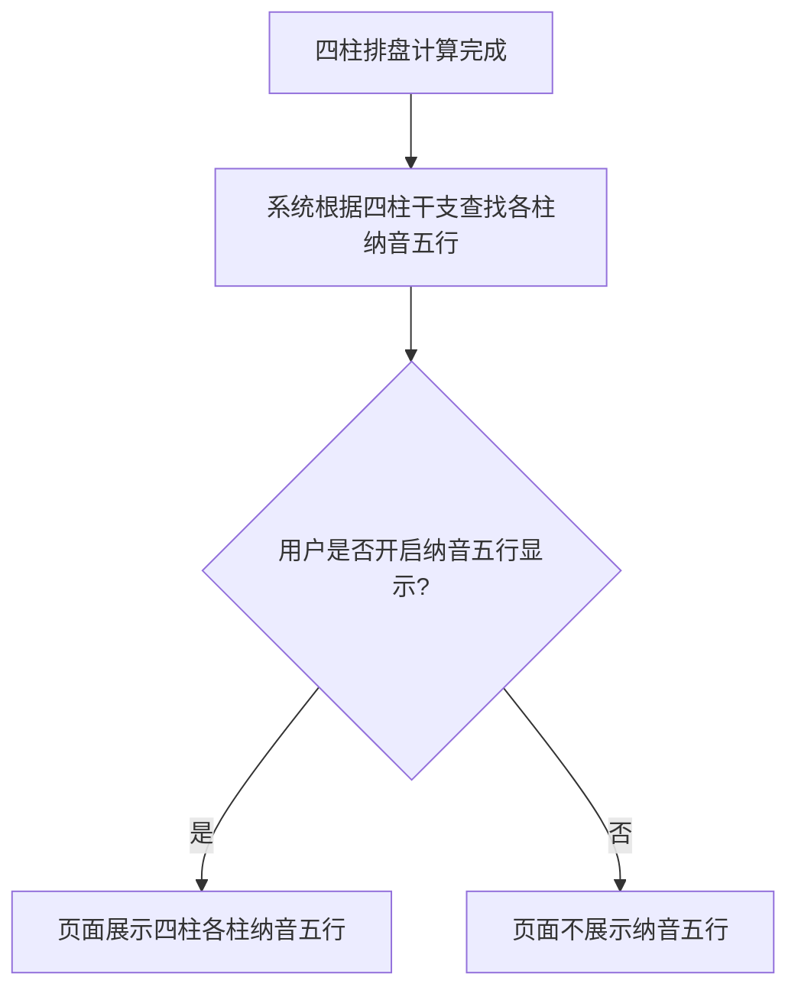

# 纳音五行

## Part 1 业务流程

### 1.1 纳音五行展示流程

## Part 2 关键页面功能列表

### 页面 / 功能 1: 纳音五行显示

- **URL / 路径（业务命名）**: 四柱排盘结果页-纳音五行区域
- **目标用户**: 命理学习者、命理从业者
- **核心功能**:
  - 用户可选择开启或关闭纳音五行显示
  - 展示年柱纳音五行
  - 展示月柱纳音五行
  - 展示日柱纳音五行
  - 展示时柱纳音五行
  - 提供纳音五行含义的悬浮提示