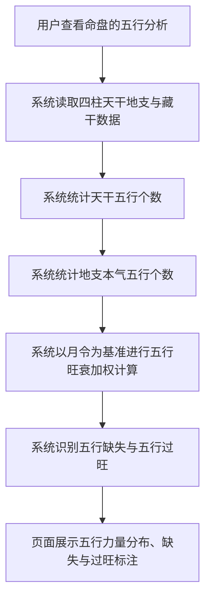
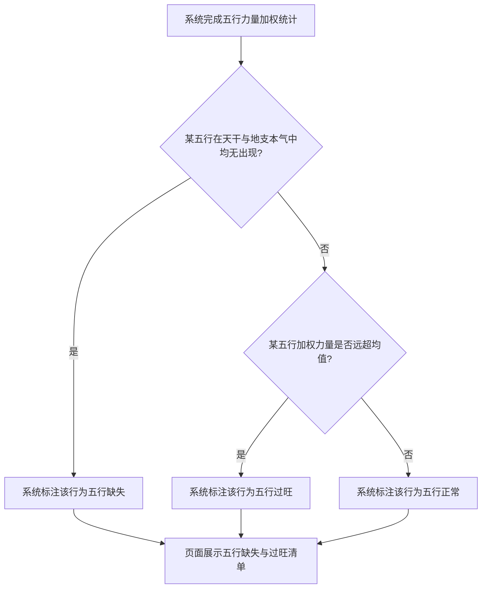

# 五行力量统计

## Part 1 业务流程

### 1.1 五行力量统计主流程

### 1.2 五行缺失与过旺识别流程

## Part 2 关键页面功能列表

### 页面 / 功能 1: 五行力量分布页

- **URL / 路径（业务命名）**: 五行力量分布页
- **目标用户**: 命理学习者、命理从业者、普通用户
- **核心功能**:
  - 查看天干五行个数统计
  - 查看地支本气五行个数统计
  - 查看月令旺衰加权后的五行力量分布
  - 查看五行缺失标注
  - 查看五行过旺标注