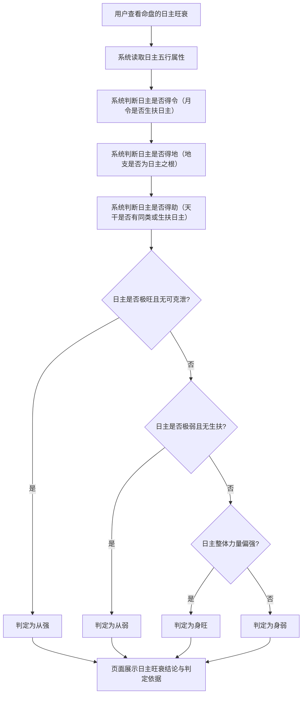

# 日主旺衰判定

## Part 1 业务流程

### 1.1 日主旺衰判定主流程

## Part 2 关键页面功能列表

### 页面 / 功能 1: 日主旺衰判定页

- **URL / 路径（业务命名）**: 日主旺衰判定页
- **目标用户**: 命理学习者、命理从业者、普通用户
- **核心功能**:
  - 查看日主五行属性
  - 查看月令是否生扶日主（得令判断）
  - 查看日主在地支是否有根（得地判断）
  - 查看日主在天干是否有助（得助判断）
  - 查看日主旺衰结论（身旺、身弱、从强、从弱）