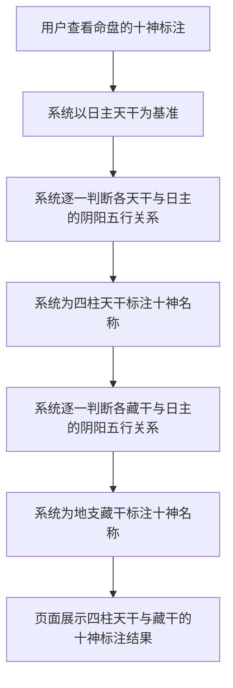

# 十神标注

## Part 1 业务流程

### 1.1 十神标注主流程

```mermaid
graph TD
    A["用户查看命盘的十神标注"] --> B["系统以日主天干为基准"]
    B --> C["系统逐一判断各天干与日主的阴阳五行关系"]
    C --> D["系统为四柱天干标注十神名称"]
    D --> E["系统逐一判断各藏干与日主的阴阳五行关系"]
    E --> F["系统为地支藏干标注十神名称"]
    F --> G["页面展示四柱天干与藏干的十神标注结果"]
```

## Part 2 关键页面功能列表

### 页面 / 功能 1: 十神标注页

- **URL / 路径（业务命名）**: 十神标注页
- **目标用户**: 命理学习者、命理从业者、普通用户
- **核心功能**:
  - 查看四柱天干十神标注
  - 查看地支藏干十神标注