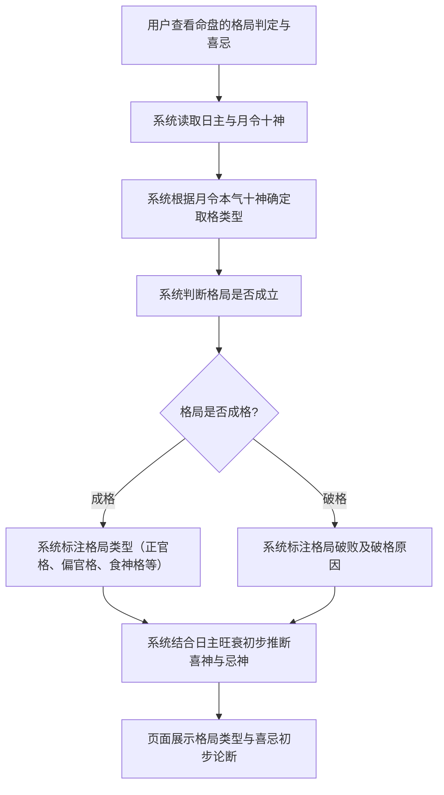
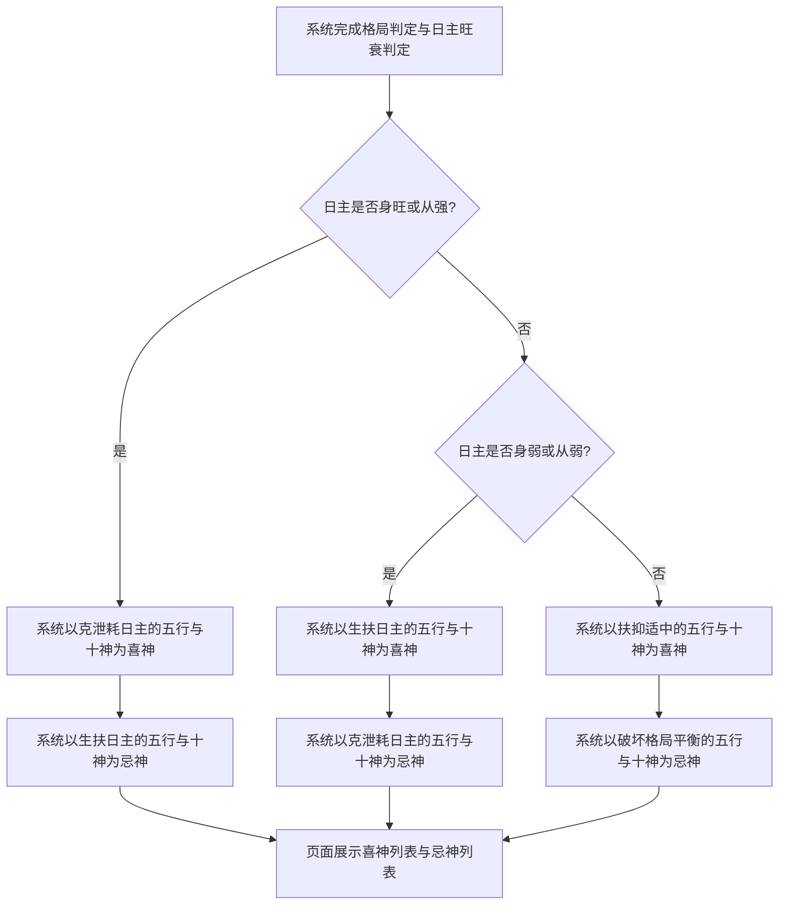

# 格局判定与喜忌

## Part 1 业务流程

### 1.1 格局判定主流程

### 1.2 喜忌初步论断流程

## Part 2 关键页面功能列表

### 页面 / 功能 1: 格局判定页

- **URL / 路径（业务命名）**: 格局判定页
- **目标用户**: 命理学习者、命理从业者、普通用户
- **核心功能**:
  - 查看月令十神取格结果
  - 查看格局类型判定
  - 查看格局成败分析

### 页面 / 功能 2: 喜忌初步论断页

- **URL / 路径（业务命名）**: 喜忌初步论断页
- **目标用户**: 命理学习者、命理从业者、普通用户
- **核心功能**:
  - 查看喜神列表
  - 查看忌神列表
  - 查看闲神列表