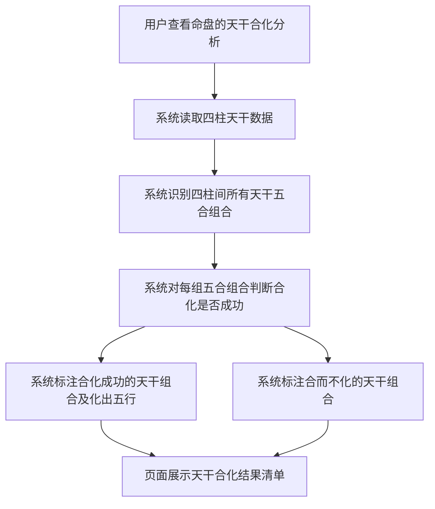
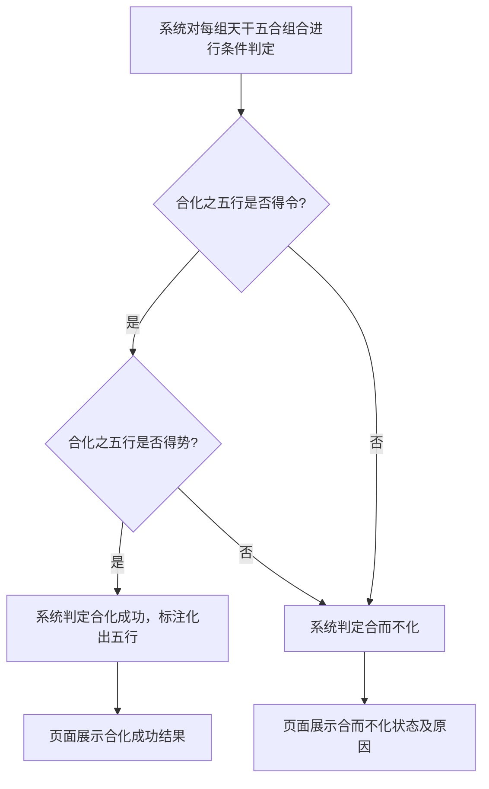

# 天干合化

## Part 1 业务流程

### 1.1 天干合化识别与判定主流程

### 1.2 合化成功条件判定流程

## Part 2 关键页面功能列表

### 页面 / 功能 1: 天干合化结果页

- **URL / 路径（业务命名）**: 天干合化结果页
- **目标用户**: 命理学习者、命理从业者、普通用户
- **核心功能**:
  - 查看四柱间天干五合组合列表
  - 查看每组五合的合化状态（合化成功或合而不化）
  - 查看合化成功组合的化出五行属性
  - 查看合而不化组合的未化原因