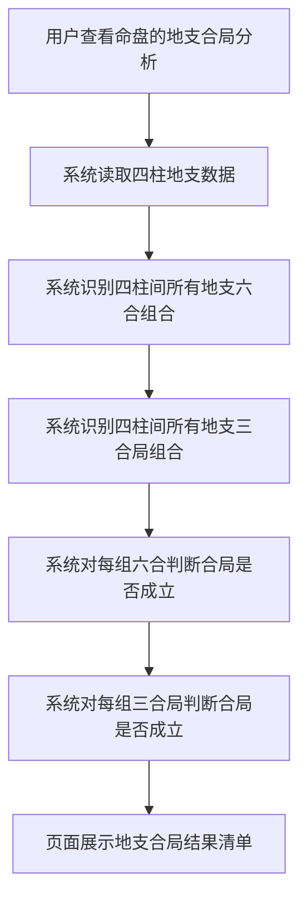
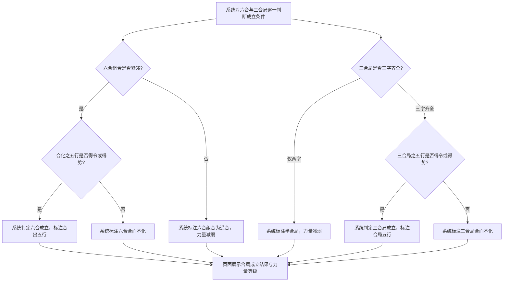

# 地支合局

## Part 1 业务流程

### 1.1 地支合局识别主流程

### 1.2 六合与三合局成立条件判定流程

## Part 2 关键页面功能列表

### 页面 / 功能 1: 地支合局结果页

- **URL / 路径（业务命名）**: 地支合局结果页
- **目标用户**: 命理学习者、命理从业者、普通用户
- **核心功能**:
  - 查看四柱间地支六合组合列表
  - 查看四柱间地支三合局组合列表
  - 查看每组六合的成立状态与力量等级
  - 查看三合局是否三字齐全或仅为半合局
  - 查看合局成立组合的合出五行属性