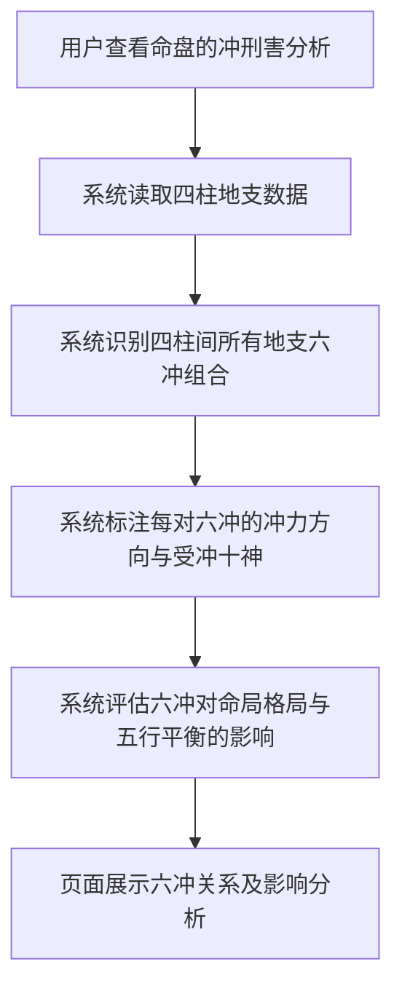
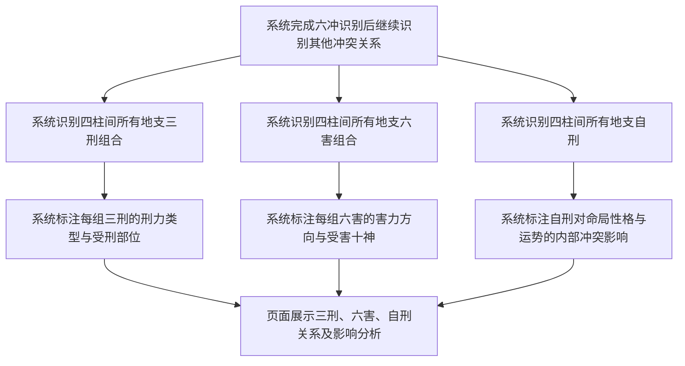

# 冲刑害分析

## Part 1 业务流程

### 1.1 六冲识别与影响分析流程

### 1.2 三刑、六害与自刑识别流程

## Part 2 关键页面功能列表

### 页面 / 功能 1: 六冲分析页

- **URL / 路径（业务命名）**: 六冲分析页
- **目标用户**: 命理学习者、命理从业者、普通用户
- **核心功能**:
  - 查看四柱间地支六冲组合列表
  - 查看每对六冲的冲力方向
  - 查看六冲受冲十神标注

### 页面 / 功能 2: 三刑分析页

- **URL / 路径（业务命名）**: 三刑分析页
- **目标用户**: 命理学习者、命理从业者、普通用户
- **核心功能**:
  - 查看四柱间地支三刑组合列表
  - 查看每组三刑的刑力类型
  - 查看三刑受刑部位标注

### 页面 / 功能 3: 六害与自刑分析页

- **URL / 路径（业务命名）**: 六害与自刑分析页
- **目标用户**: 命理学习者、命理从业者、普通用户
- **核心功能**:
  - 查看四柱间地支六害组合列表
  - 查看每组六害的害力方向
  - 查看每组六害的受害十神
  - 查看四柱间地支自刑列表
  - 查看自刑对命局的内部冲突影响