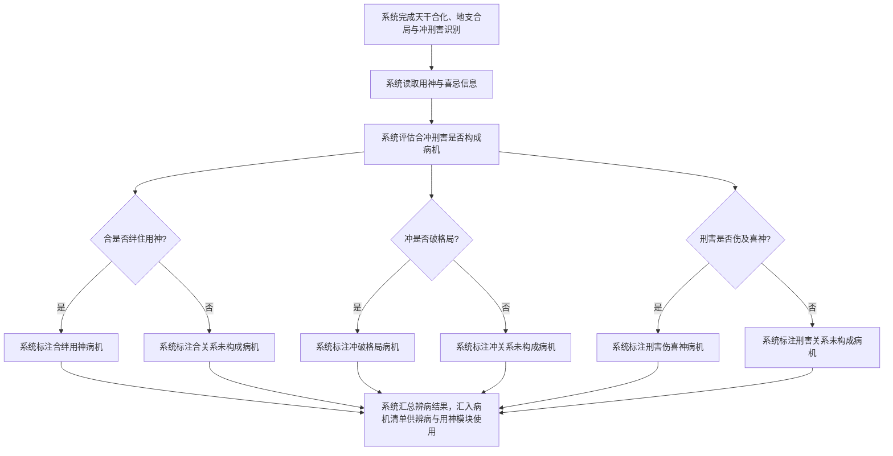
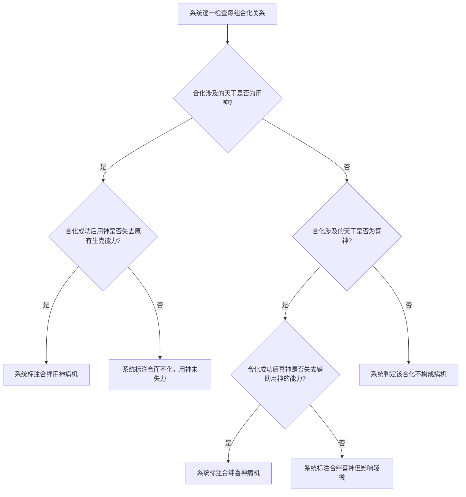
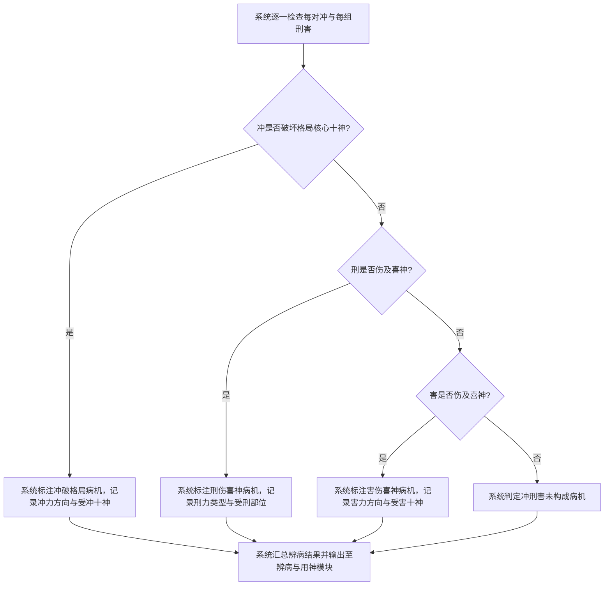

# 合冲刑害辨病

## Part 1 业务流程

### 1.1 合冲刑害辨病主流程

### 1.2 合绊用神详细判定流程

### 1.3 冲破格局与刑害伤喜神判定流程

## Part 2 关键页面功能列表

### 页面 / 功能 1: 合冲刑害辨病结果页

- **URL / 路径（业务命名）**: 合冲刑害辨病结果页
- **目标用户**: 命理学习者、命理从业者、普通用户
- **核心功能**:
  - 查看合冲刑害构成的病机清单
  - 查看合绊用神病机的病位
  - 查看合绊用神病机的病象
  - 查看冲破格局病机的病位
  - 查看冲破格局病机的病象
  - 查看刑害伤喜神病机的病位
  - 查看刑害伤喜神病机的病象
  - 查看未构成病机的合冲刑害关系列表