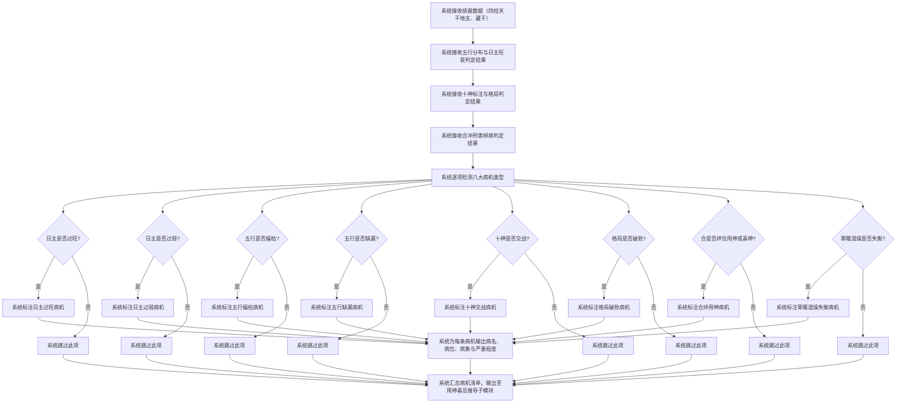
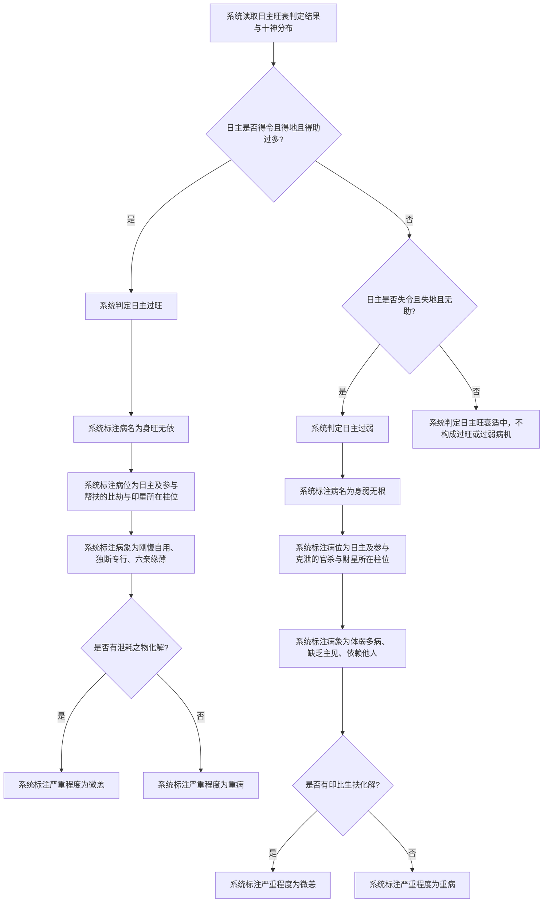
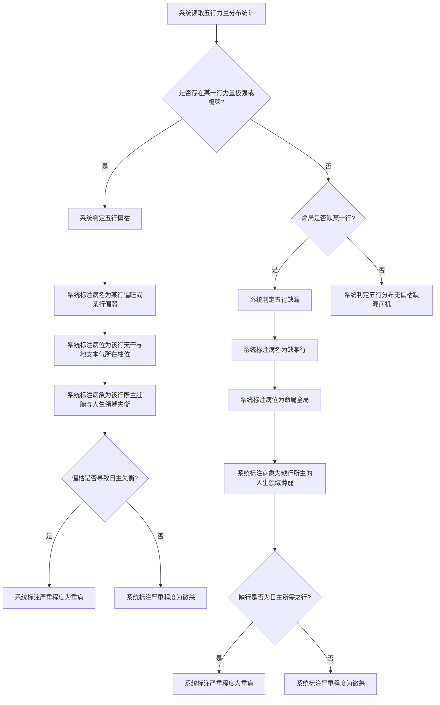
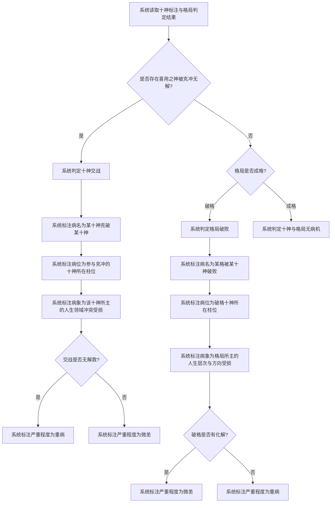
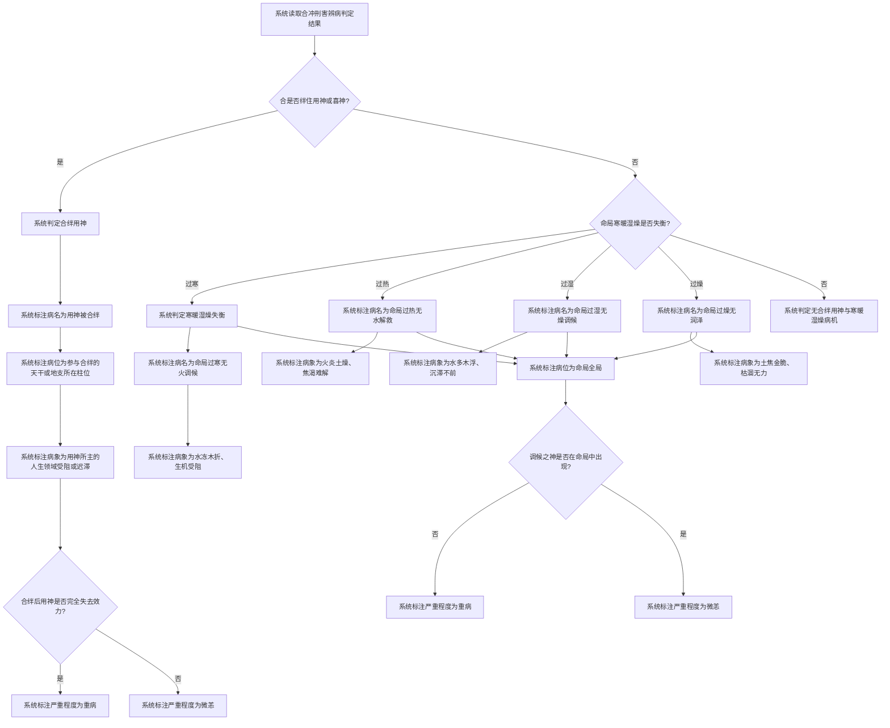

# 识病诊断

## Part 1 业务流程

### 1.1 八大病机逐项诊断主流程

### 1.2 日主过旺与过弱诊断流程

### 1.3 五行偏枯与缺漏诊断流程

### 1.4 十神交战与格局破败诊断流程

### 1.5 合绊用神与寒暖湿燥失衡诊断流程

## Part 2 关键页面功能列表

### 页面 / 功能 1: 病机诊断总览页

- **URL / 路径（业务命名）**: 病机诊断总览页
- **目标用户**: 命理学习者、命理从业者、普通用户
- **核心功能**:
  - 查看命局八大病机类型的逐项检测状态
  - 查看已识别病机的病名列表
  - 查看各病机的严重程度标注（重病、微恙、潜伏）
  - 查看病机清单汇总

### 页面 / 功能 2: 日主过旺过弱诊断页

- **URL / 路径（业务命名）**: 日主过旺过弱诊断页
- **目标用户**: 命理学习者、命理从业者、普通用户
- **核心功能**:
  - 查看日主旺衰判定结果
  - 查看日主过旺病机的病名、病位、病象、严重程度
  - 查看日主过弱病机的病名、病位、病象、严重程度
  - 查看是否有泄耗或生扶化解

### 页面 / 功能 3: 五行偏枯缺漏诊断页

- **URL / 路径（业务命名）**: 五行偏枯缺漏诊断页
- **目标用户**: 命理学习者、命理从业者、普通用户
- **核心功能**:
  - 查看五行力量分布统计
  - 查看五行偏枯病机的病名、病位、病象、严重程度
  - 查看五行缺漏病机的病名、病位、病象、严重程度

### 页面 / 功能 4: 十神交战诊断页

- **URL / 路径（业务命名）**: 十神交战诊断页
- **目标用户**: 命理学习者、命理从业者、普通用户
- **核心功能**:
  - 查看十神交战病机的病名、病位、病象、严重程度
  - 查看克冲关系详情（何十神克破何十神）
  - 查看交战是否有解救

### 页面 / 功能 5: 格局破败诊断页

- **URL / 路径（业务命名）**: 格局破败诊断页
- **目标用户**: 命理学习者、命理从业者、普通用户
- **核心功能**:
  - 查看格局类型与成败判定
  - 查看格局破败病机的病名、病位、病象、严重程度
  - 查看破格原因（何十神破败格局）
  - 查看破格是否有化解

### 页面 / 功能 6: 合绊用神诊断页

- **URL / 路径（业务命名）**: 合绊用神诊断页
- **目标用户**: 命理学习者、命理从业者、普通用户
- **核心功能**:
  - 查看合绊用神病机的病名、病位、病象、严重程度
  - 查看参与合绊的天干或地支
  - 查看合绊后用神是否完全失去效力
  - 查看未构成病机的合关系列表

### 页面 / 功能 7: 寒暖湿燥失衡诊断页

- **URL / 路径（业务命名）**: 寒暖湿燥失衡诊断页
- **目标用户**: 命理学习者、命理从业者、普通用户
- **核心功能**:
  - 查看寒暖湿燥失衡病机的病名、病位、病象、严重程度
  - 查看命局偏寒、偏热、偏湿、偏燥的判定
  - 查看调候之神是否在命局中出现