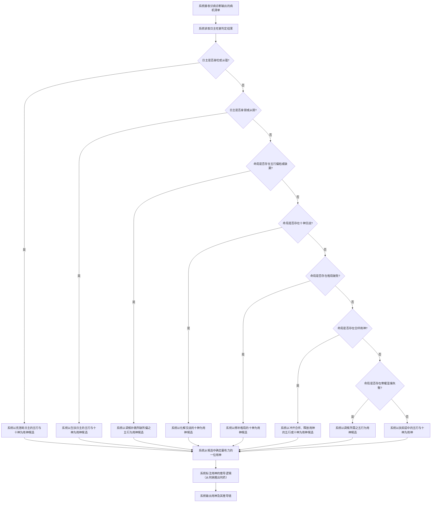
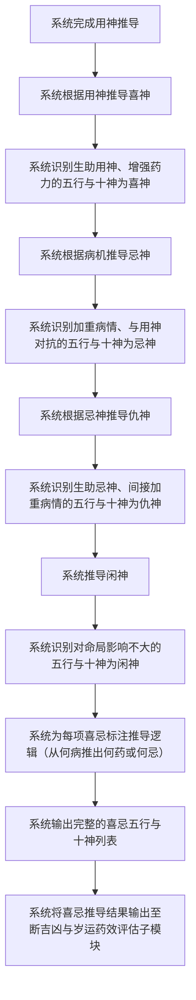
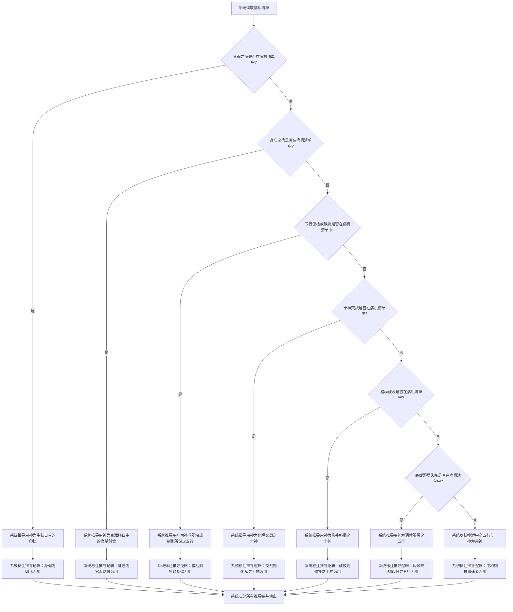

# 用神喜忌推导

## Part 1 业务流程

### 1.1 用神推导主流程

### 1.2 喜忌仇闲推导流程

### 1.3 用神推导逻辑链详情

## Part 2 关键页面功能列表

### 页面 / 功能 1: 用神推导页

- **URL / 路径（业务命名）**: 用神推导页
- **目标用户**: 命理学习者、命理从业者、普通用户
- **核心功能**:
  - 查看命局用神及其五行与十神属性
  - 查看用神的推导逻辑链（从何病推出何药）
  - 查看用神在四柱中的分布位置

### 页面 / 功能 2: 喜忌仇闲列表页

- **URL / 路径（业务命名）**: 喜忌仇闲列表页
- **目标用户**: 命理学习者、命理从业者、普通用户
- **核心功能**:
  - 查看喜神列表及其五行与十神属性
  - 查看忌神列表及其五行与十神属性
  - 查看仇神列表及其五行与十神属性
  - 查看闲神列表及其五行与十神属性
  - 查看每项喜忌的推导逻辑（从何病推出何药或何忌）

### 页面 / 功能 3: 推导逻辑链详情页

- **URL / 路径（业务命名）**: 推导逻辑链详情页
- **目标用户**: 命理学习者、命理从业者、普通用户
- **核心功能**:
  - 查看从病机到用神的完整推导链
  - 查看从用神到喜神的辅助推导逻辑
  - 查看从病机到忌神的对抗推导逻辑
  - 查看从忌神到仇神的间接推导逻辑
  - 查看闲神的判定依据