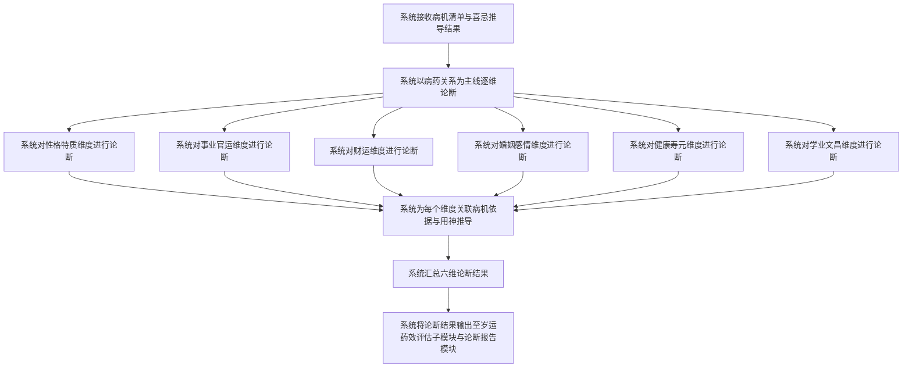
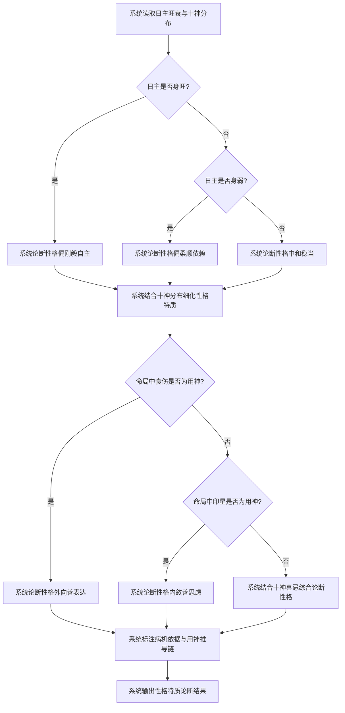
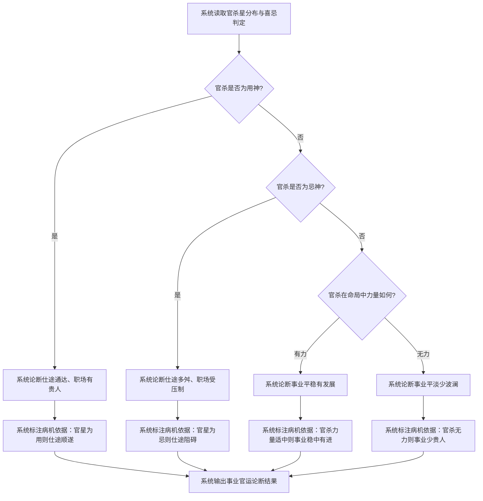
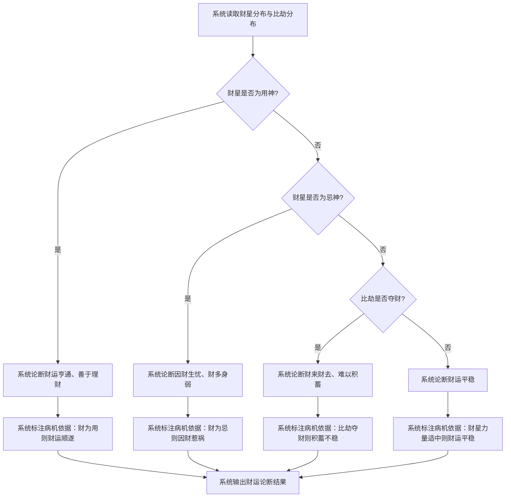
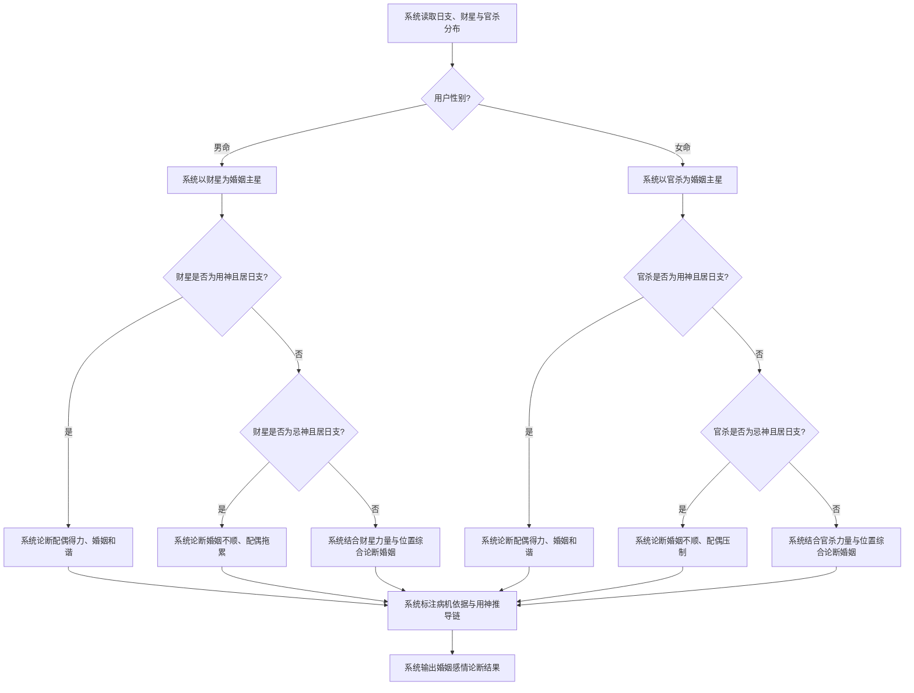
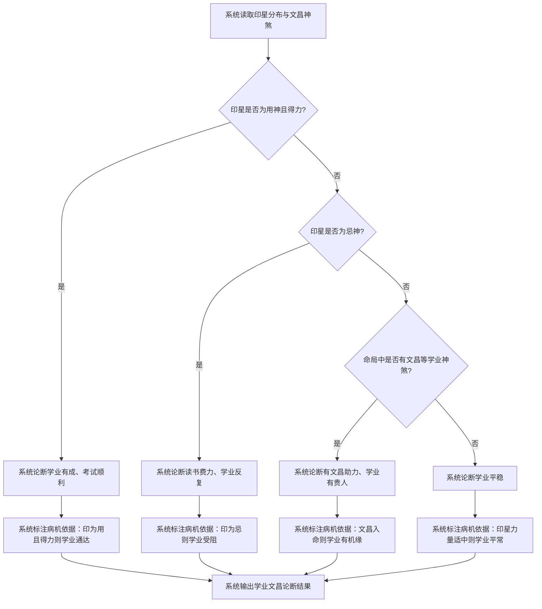

# 断吉凶

## Part 1 业务流程

### 1.1 六维论断主流程

### 1.2 性格特质论断流程

### 1.3 事业官运论断流程

### 1.4 财运论断流程

### 1.5 婚姻感情论断流程

### 1.6 健康寿元论断流程

```mermaid
graph TD
    A["系统读取五行偏枯缺漏与十神交战结果"] --> B{"命局是否存在五行缺漏?"}
    B -->|"是"| C["系统论断缺行所主脏腑薄弱"]
    C --> D["系统标注病机依据：缺行则所主脏腑易病"]
    B -->|"否"| E{"命局是否存在五行偏枯?"}
    E -->|"是"| F["系统论断偏旺之行克伐偏弱之行所主脏腑"]
    F --> G["系统标注病机依据：偏旺克偏弱则受克脏腑受损"]
    E -->|"否"| H{"命局是否存在十神交战伤及健康?"}
    H -->|"是"| I["系统论断交战十神所主脏腑受损"]
    I --> J["系统标注病机依据：交战十神克破则脏腑受病"]
    H -->|"否"| K["系统论断健康基本平稳"]
    K --> L["系统标注病机依据：命局平衡则健康少恙"]
    D --> M["系统输出健康寿元论断结果"]
    G --> M
    J --> M
    L --> M
```

### 1.7 学业文昌论断流程

## Part 2 关键页面功能列表

### 页面 / 功能 1: 六维论断总览页

- **URL / 路径（业务命名）**: 六维论断总览页
- **目标用户**: 命理学习者、命理从业者、普通用户
- **核心功能**:
  - 查看性格特质论断结果
  - 查看事业官运论断结果
  - 查看财运论断结果
  - 查看婚姻感情论断结果
  - 查看健康寿元论断结果
  - 查看学业文昌论断结果

### 页面 / 功能 2: 性格特质论断页

- **URL / 路径（业务命名）**: 性格特质论断页
- **目标用户**: 命理学习者、命理从业者、普通用户
- **核心功能**:
  - 查看性格特质论断结论
  - 查看性格特质论断的病机依据
  - 查看性格特质论断的用神推导链

### 页面 / 功能 3: 事业官运论断页

- **URL / 路径（业务命名）**: 事业官运论断页
- **目标用户**: 命理学习者、命理从业者、普通用户
- **核心功能**:
  - 查看事业官运论断结论
  - 查看事业官运论断的病机依据
  - 查看事业官运论断的用神推导链

### 页面 / 功能 4: 财运论断页

- **URL / 路径（业务命名）**: 财运论断页
- **目标用户**: 命理学习者、命理从业者、普通用户
- **核心功能**:
  - 查看财运论断结论
  - 查看财运论断的病机依据
  - 查看财运论断的用神推导链

### 页面 / 功能 5: 婚姻感情论断页

- **URL / 路径（业务命名）**: 婚姻感情论断页
- **目标用户**: 命理学习者、命理从业者、普通用户
- **核心功能**:
  - 查看婚姻感情论断结论
  - 查看婚姻感情论断的病机依据
  - 查看婚姻感情论断的用神推导链

### 页面 / 功能 6: 健康寿元论断页

- **URL / 路径（业务命名）**: 健康寿元论断页
- **目标用户**: 命理学习者、命理从业者、普通用户
- **核心功能**:
  - 查看健康寿元论断结论
  - 查看健康寿元论断的病机依据
  - 查看健康寿元论断的用神推导链

### 页面 / 功能 7: 学业文昌论断页

- **URL / 路径（业务命名）**: 学业文昌论断页
- **目标用户**: 命理学习者、命理从业者、普通用户
- **核心功能**:
  - 查看学业文昌论断结论
  - 查看学业文昌论断的病机依据
  - 查看学业文昌论断的用神推导链