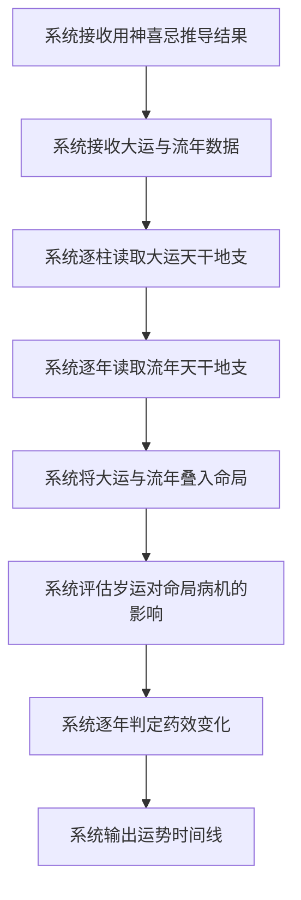
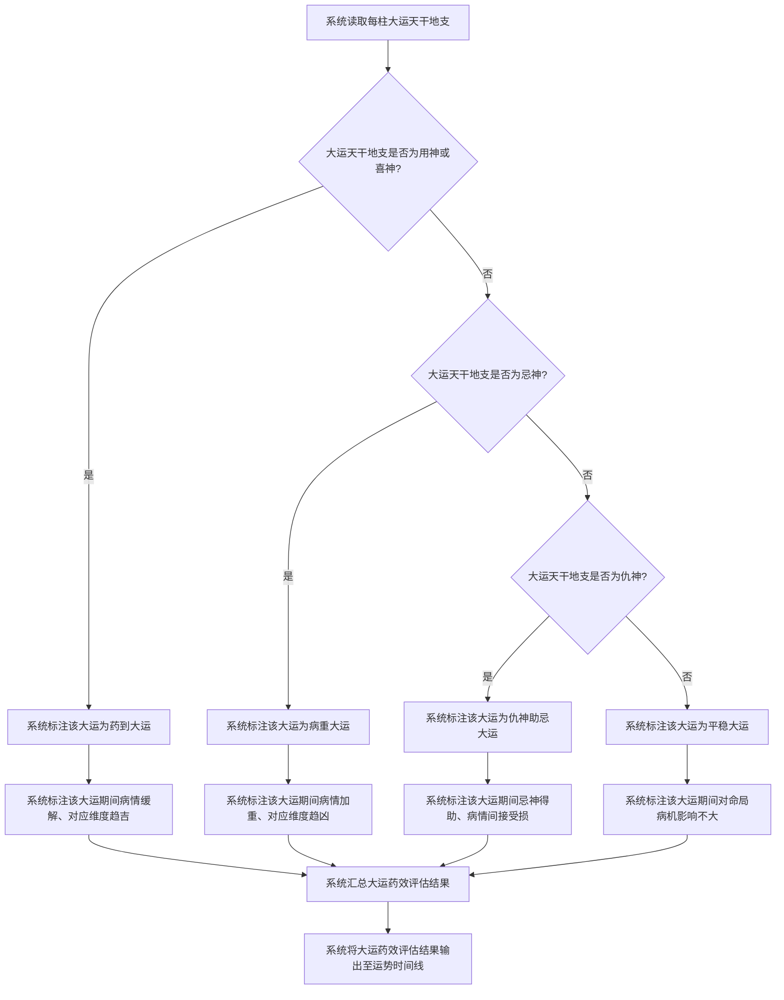
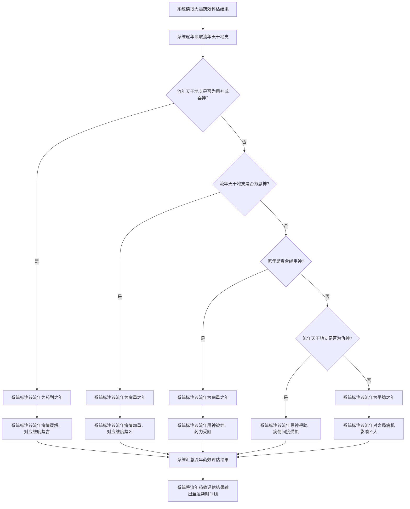
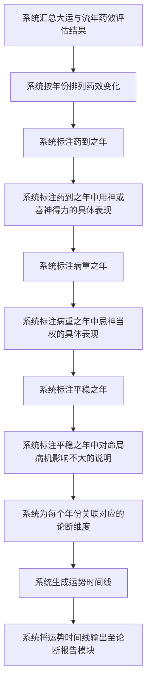

# 岁运药效评估

## Part 1 业务流程

### 1.1 岁运药效评估主流程

### 1.2 大运药效评估流程

### 1.3 流年药效评估流程

### 1.4 运势时间线生成流程

## Part 2 关键页面功能列表

### 页面 / 功能 1: 岁运药效总览页

- **URL / 路径（业务命名）**: 岁运药效总览页
- **目标用户**: 命理学习者、命理从业者、普通用户
- **核心功能**:
  - 查看大运药效评估结果（药到大运、病重大运、平稳大运）
  - 查看流年药效评估结果（药到之年、病重之年、平稳之年）
  - 查看运势时间线总览

### 页面 / 功能 2: 大运药效详情页

- **URL / 路径（业务命名）**: 大运药效详情页
- **目标用户**: 命理学习者、命理从业者、普通用户
- **核心功能**:
  - 查看每柱大运的用神喜忌力量变化
  - 查看药到大运期间病情缓解的对应维度
  - 查看病重大运期间病情加重的对应维度
  - 查看平稳大运期间运势平稳的说明

### 页面 / 功能 3: 流年药效详情页

- **URL / 路径（业务命名）**: 流年药效详情页
- **目标用户**: 命理学习者、命理从业者、普通用户
- **核心功能**:
  - 查看每个流年的用神喜忌力量变化
  - 查看药到之年病情缓解的具体表现
  - 查看病重之年病情加重的具体表现
  - 查看流年是否合绊用神的判定结果
  - 查看平稳之年运势平稳的说明

### 页面 / 功能 4: 运势时间线页

- **URL / 路径（业务命名）**: 运势时间线页
- **目标用户**: 命理学习者、命理从业者、普通用户
- **核心功能**:
  - 按年份查看药效变化时间线
  - 查看药到之年标注与对应论断维度
  - 查看病重之年标注与对应论断维度
  - 查看平稳之年标注与说明
  - 查看每个年份的病机与用神力量消长详情