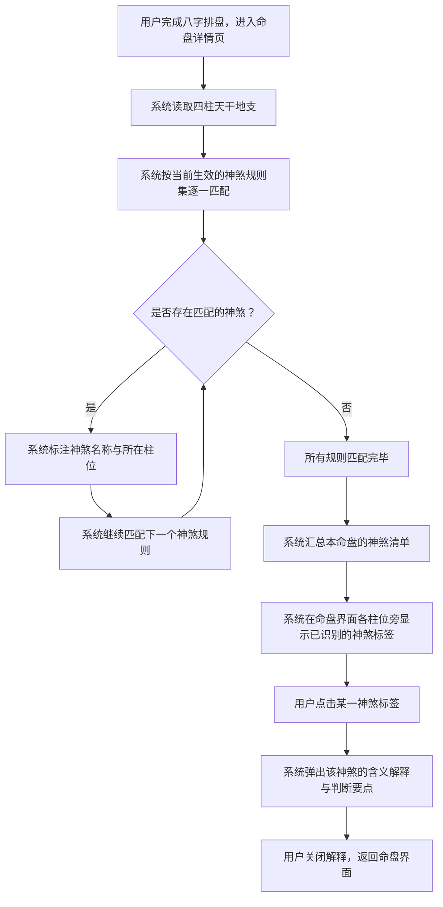
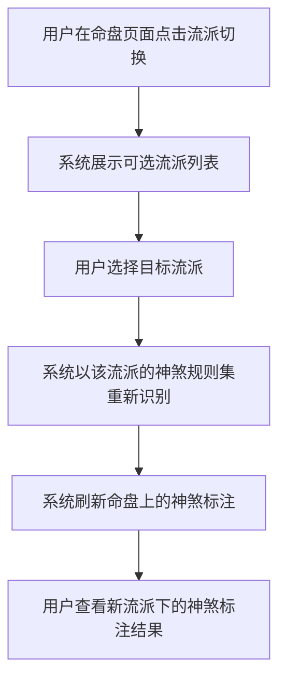

# 神煞识别与标注

## Part 1 业务流程

### 1.1 神煞识别流程

用户完成八字排盘后，系统根据四柱天干地支的组合关系，逐一识别命局中存在的神煞，并在排盘界面上标注结果。

### 1.2 切换流派查看流程

命理从业者可切换不同流派的神煞规则集，查看同一命盘在不同流派下的神煞标注差异。

## Part 2 关键页面功能列表

### 页面 / 功能 1: 命盘神煞标注页

- **URL / 路径（业务命名）**: 命盘详情页 — 神煞标注区域
- **目标用户**: 命理学习者、命理从业者、普通用户
- **核心功能**:
  - 在四柱排盘的每一柱旁显示该柱所含的神煞标签
  - 点击神煞标签弹出含义解释与判断要点
  - 显示神煞的吉凶属性（吉神或凶煞）
  - 标注同一神煞是否多次出现（如双天乙贵人）
  - 流派切换后刷新神煞标注结果

### 页面 / 功能 2: 神煞详情说明页

- **URL / 路径（业务命名）**: 神煞详情说明
- **目标用户**: 命理学习者、命理从业者、普通用户
- **核心功能**:
  - 展示所选神煞的名称、别名与来源经典
  - 说明该神煞的识别规则（以何种天干地支组合判定）
  - 描述该神煞的吉凶含义与在命局中的作用
  - 标注该神煞与当前命盘其他要素的关联（如某吉神恰好落在用神所在柱位）