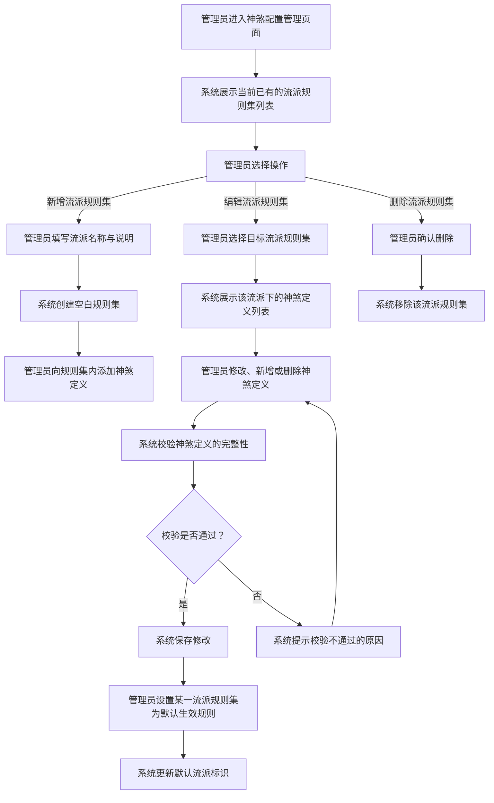
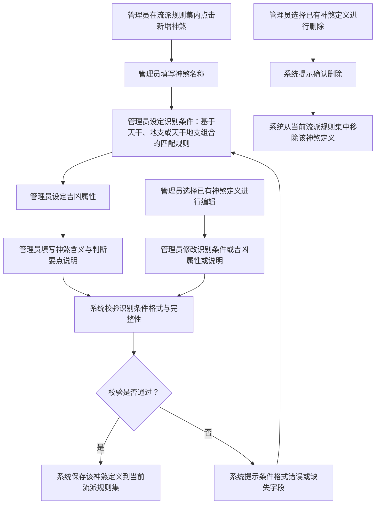
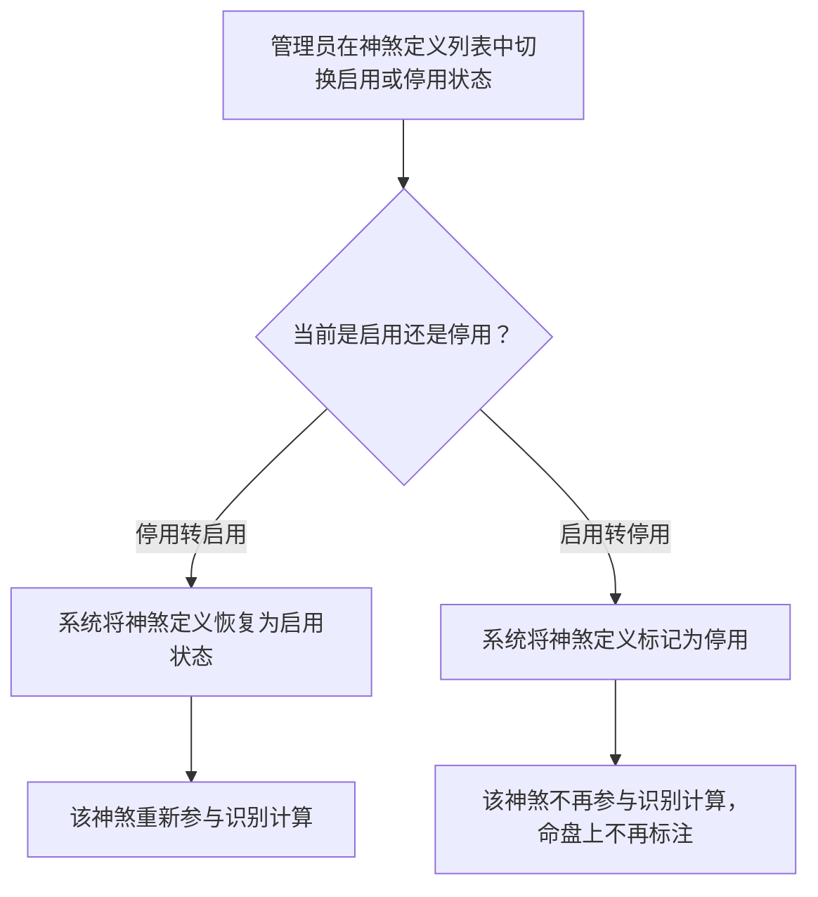

# 神煞配置管理

## Part 1 业务流程

### 1.1 流派规则集管理流程

系统管理员维护不同流派的神煞规则集，每个规则集包含一组神煞定义及其识别条件。

### 1.2 神煞定义增删改流程

管理员在某一流派规则集内对单条神煞定义进行增删改操作。

### 1.3 神煞定义启停流程

管理员可暂时停用某条神煞定义而不删除，停用后该神煞不再参与识别。

## Part 2 关键页面功能列表

### 页面 / 功能 1: 流派规则集列表页

- **URL / 路径（业务命名）**: 神煞流派管理
- **目标用户**: 系统管理员
- **核心功能**:
  - 展示所有流派规则集的名称与说明
  - 新增流派规则集
  - 删除流派规则集
  - 设置默认生效的流派规则集

### 页面 / 功能 2: 神煞定义列表页

- **URL / 路径（业务命名）**: 流派神煞定义列表
- **目标用户**: 系统管理员
- **核心功能**:
  - 展示当前流派规则集下所有神煞定义的名称与吉凶属性
  - 新增神煞定义
  - 编辑已有神煞定义的识别条件与含义说明
  - 删除神煞定义
  - 切换神煞定义的启用或停用状态
  - 按吉凶属性筛选神煞定义

### 页面 / 功能 3: 神煞定义编辑页

- **URL / 路径（业务命名）**: 神煞定义编辑
- **目标用户**: 系统管理员
- **核心功能**:
  - 填写神煞名称与别名
  - 设定识别条件（基于天干、地支或天干地支组合的匹配规则）
  - 设定吉凶属性（吉神或凶煞）
  - 填写神煞含义与判断要点说明
  - 校验识别条件格式的正确性与完整性