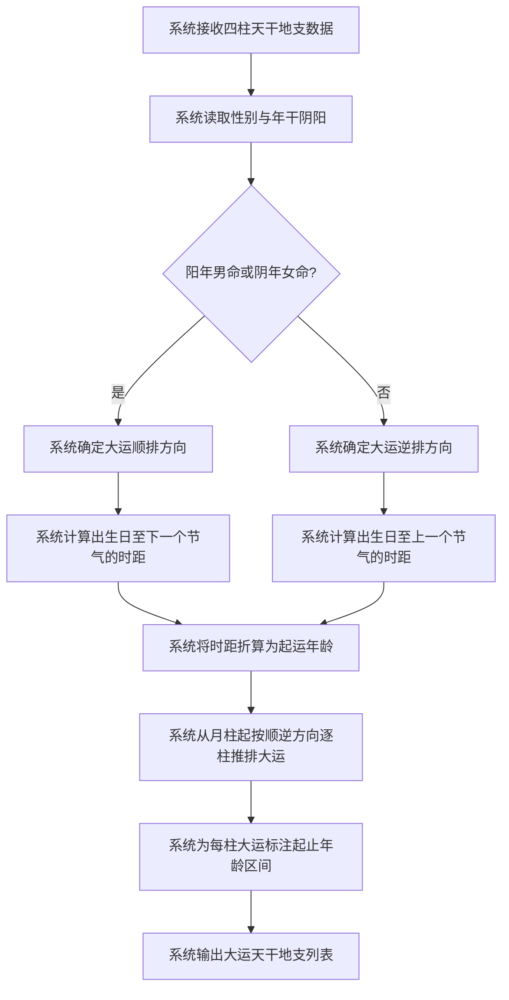

# 起运与大运排列

## Part 1 业务流程

### 1.1 起运年龄计算与大运排列主流程

### 1.2 业务规则

- **大运顺逆规则**：阳年男命与阴年女命大运顺排（从月柱向后推），阴年男命与阳年女命大运逆排（从月柱向前推）。
- **起运年龄折算规则**：顺排时计算出生日至下一个节气的时距，逆排时计算出生日至上一个节气的时距，三日折一年、一日折四个月、一个时辰折十天，得出起运年龄。
- **大运推排规则**：从月柱起按顺逆方向依次推排，每柱大运管十年，天干地支各管五年，起止年龄区间连续衔接。

## Part 2 关键页面功能列表

### 页面 / 功能 1: 大运排列页

- **URL / 路径（业务命名）**: 大运排列页
- **目标用户**: 命理学习者、命理从业者、普通用户
- **核心功能**:
  - 查看起运年龄
  - 查看大运顺逆方向
  - 查看每柱大运天干地支
  - 查看每柱大运起止年龄区间

### 页面 / 功能 2: 大运详情页

- **URL / 路径（业务命名）**: 大运详情页
- **目标用户**: 命理学习者、命理从业者、普通用户
- **核心功能**:
  - 查看指定大运柱的天干地支详情
  - 查看大运天干地支的五行属性
  - 查看大运天干地支与命局四柱的初步对照