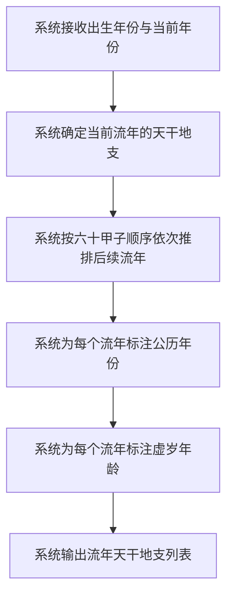

# 流年排列

## Part 1 业务流程

### 1.1 流年排列主流程

### 1.2 业务规则

- **流年推排规则**：流年天干地支按六十甲子顺序推排，每年一柱，与公历年份一一对应。
- **虚岁计算规则**：流年公历年份减去出生公历年份再加一，即为该流年的虚岁年龄。

## Part 2 关键页面功能列表

### 页面 / 功能 1: 流年排列页

- **URL / 路径（业务命名）**: 流年排列页
- **目标用户**: 命理学习者、命理从业者、普通用户
- **核心功能**:
  - 查看当年流年天干地支
  - 查看未来若干年流年天干地支列表
  - 按年份范围筛选流年天干地支

### 页面 / 功能 2: 流年详情页

- **URL / 路径（业务命名）**: 流年详情页
- **目标用户**: 命理学习者、命理从业者、普通用户
- **核心功能**:
  - 查看指定流年的天干地支详情
  - 查看流年天干地支的五行属性
  - 查看流年天干地支与命局四柱的初步对照