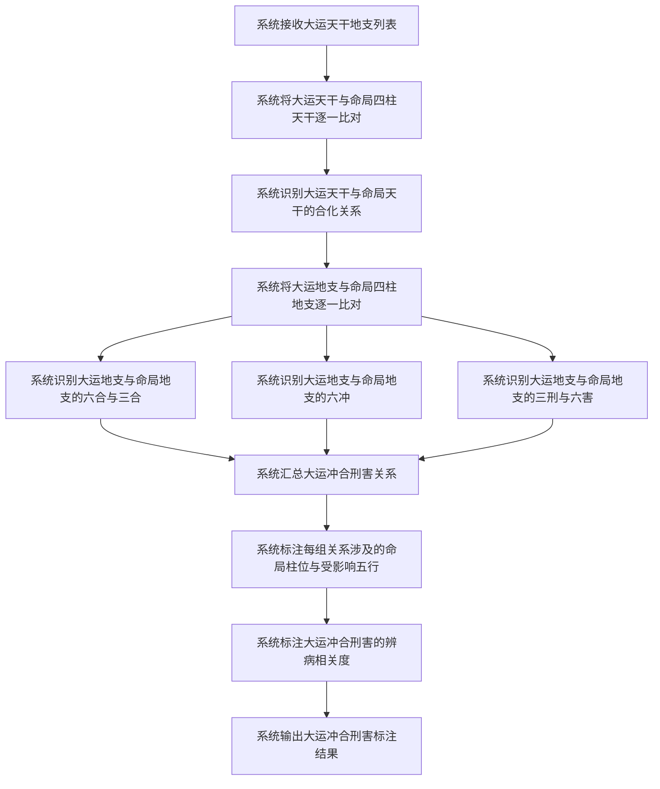
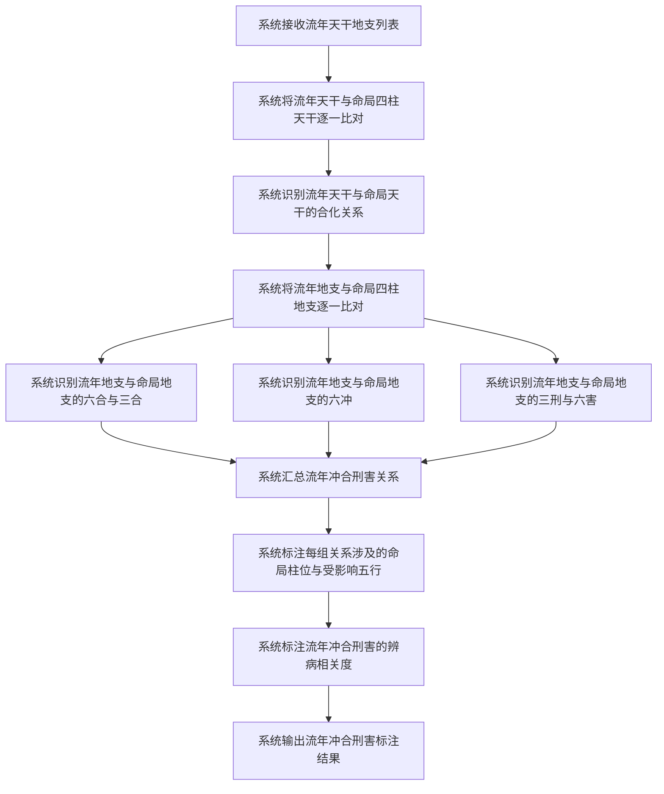

# 岁运冲合刑害

## Part 1 业务流程

### 1.1 大运冲合刑害识别流程

### 1.2 流年冲合刑害识别流程

### 1.3 业务规则

- **冲合刑害识别范围**：大运与流年的天干地支分别与命局四柱（年柱、月柱、日柱、时柱）的天干地支逐一比对，识别天干合化、地支六合、三合、六冲、三刑、六害等全部关系类型。
- **辨病相关度规则**：涉及日柱的冲合刑害标注为高相关（日柱为命局核心，冲合刑害对命局影响最大）；涉及月令的冲合刑害标注为高相关（月令决定五行旺衰，冲合刑害可能改变命局格局）；涉及年柱或时柱的冲合刑害标注为一般相关。
- **辨病意义说明**：冲可能破格或破合，合可能绊住柱位或化五行，刑可能伤及喜神，害可能暗损。具体的用神喜忌影响由辨病与用神模块（模块04）的岁运药效评估进一步判定。

## Part 2 关键页面功能列表

### 页面 / 功能 1: 岁运冲合刑害总览页

- **URL / 路径（业务命名）**: 岁运冲合刑害总览页
- **目标用户**: 命理学习者、命理从业者、普通用户
- **核心功能**:
  - 查看大运与命局的冲合刑害关系列表
  - 查看流年与命局的冲合刑害关系列表
  - 查看冲合刑害关系的辨病相关度标注

### 页面 / 功能 2: 大运冲合刑害详情页

- **URL / 路径（业务命名）**: 大运冲合刑害详情页
- **目标用户**: 命理学习者、命理从业者、普通用户
- **核心功能**:
  - 查看指定大运柱与命局的冲合刑害关系
  - 查看每组冲合刑害涉及的命局柱位
  - 查看每组冲合刑害涉及的五行
  - 查看冲合刑害类型的辨病意义说明

### 页面 / 功能 3: 流年冲合刑害详情页

- **URL / 路径（业务命名）**: 流年冲合刑害详情页
- **目标用户**: 命理学习者、命理从业者、普通用户
- **核心功能**:
  - 查看指定流年与命局的冲合刑害关系
  - 查看每组冲合刑害涉及的命局柱位
  - 查看每组冲合刑害涉及的五行
  - 查看冲合刑害类型的辨病意义说明