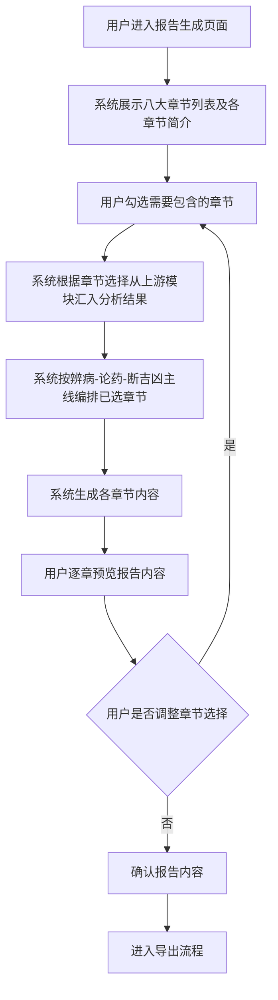

# 报告章节组织

## Part 1 业务流程

> 用户进入报告生成页面，从八大章节中选择需要包含的内容，系统根据选择从上游模块汇入分析结果，按"辨病→论药→断吉凶"主线编排章节顺序并生成报告内容，供用户逐章预览。

### 业务规则

1. **主线顺序规则**：章节必须按照"辨病→论药→断吉凶"的主线顺序编排。即使跳过某些章节，已选章节仍保持此顺序，不得打乱。
2. **默认包含规则**：基本命盘概览章节默认包含，不可取消——该章提供命局基础信息，是后续章节论述的前提。
3. **数据来源对应规则**：每个章节的分析数据来自特定的上游模块——
   - 基本命盘概览 ← 八字排盘与历法模块
   - 命局诊断（识病）← 辨病与用神模块的病机识别部分
   - 用药方略（用神喜忌）← 辨病与用神模块的用神推导部分
   - 分维论断 ← 辨病与用神模块的断吉凶部分
   - 岁运药效 ← 大运流年模块
   - 神煞与特殊格局 ← 神煞标注模块
   - 合冲刑害详解 ← 合冲刑害分析模块
   - 综合论断与建议 ← 汇总以上各章结论
4. **论断有据规则**：每条论断必须关联"所依据的病→所用之药→推导出的结论"，不得凭空断言。
5. **章节衔接规则**：前后章节之间应有逻辑衔接——识病章节的结论是论药章节的前提，论药章节的结论是分维论断的基础。

## Part 2 关键页面功能列表

### 页面/功能 1: 报告生成页

- **URL / 路径（业务命名）**: 报告生成页
- **目标用户**: 命理学习者、命理从业者、普通用户
- **核心功能**:
  - 展示八大章节列表（附各章节简介）
  - 用户勾选需要包含的章节
  - 系统根据章节选择从上游模块汇入分析结果
  - 系统按主线顺序编排已选章节
  - 生成各章节内容

### 页面/功能 2: 章节预览页

- **URL / 路径（业务命名）**: 章节预览页
- **目标用户**: 命理学习者、命理从业者、普通用户
- **核心功能**:
  - 逐章查看报告内容
  - 每条论断展示其病机依据链（病→药→结论）
  - 返回修改章节选择
  - 确认报告内容
  - 进入导出流程