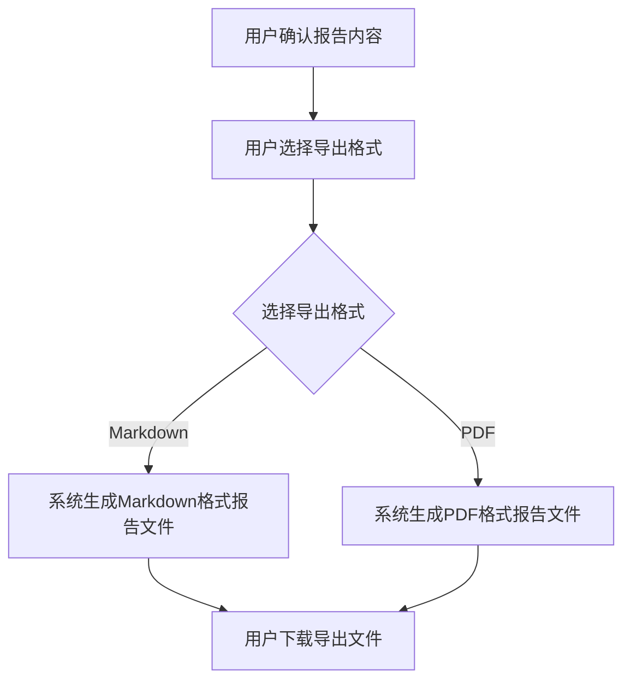

# 报告导出

## Part 1 业务流程

> 用户确认报告内容后，选择导出格式，系统生成对应格式的报告文件供用户下载保存。

### 业务规则

1. **内容一致规则**：导出内容为用户已确认的全部已选章节内容，保持"辨病→论药→断吉凶"的主线结构与预览一致。
2. **格式保真规则**：PDF 导出时保持章节标题层级、论断内容的排版与预览一致。
3. **病机依据完整规则**：导出文件中每条论断仍须保留病机依据链（病→药→结论），与预览内容一致。

## Part 2 关键页面功能列表

### 页面/功能 1: 报告导出页

- **URL / 路径（业务命名）**: 报告导出页
- **目标用户**: 命理学习者、命理从业者、普通用户
- **核心功能**:
  - 选择导出格式
  - 系统生成对应格式的报告文件
  - 下载导出文件