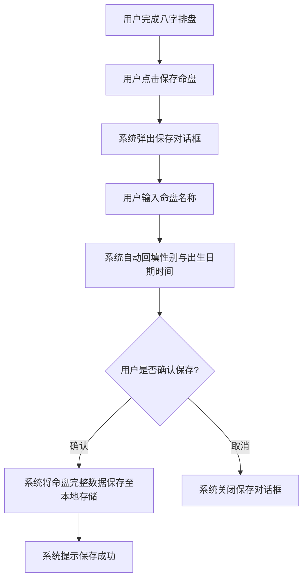
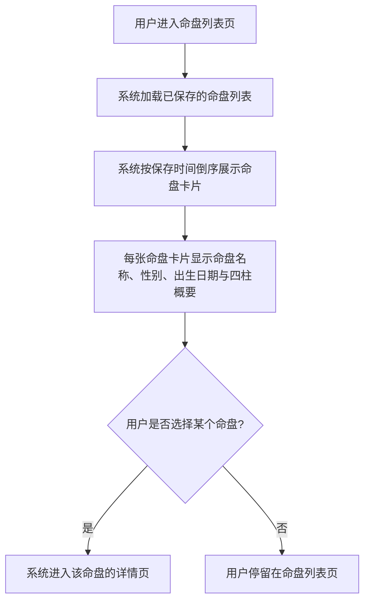
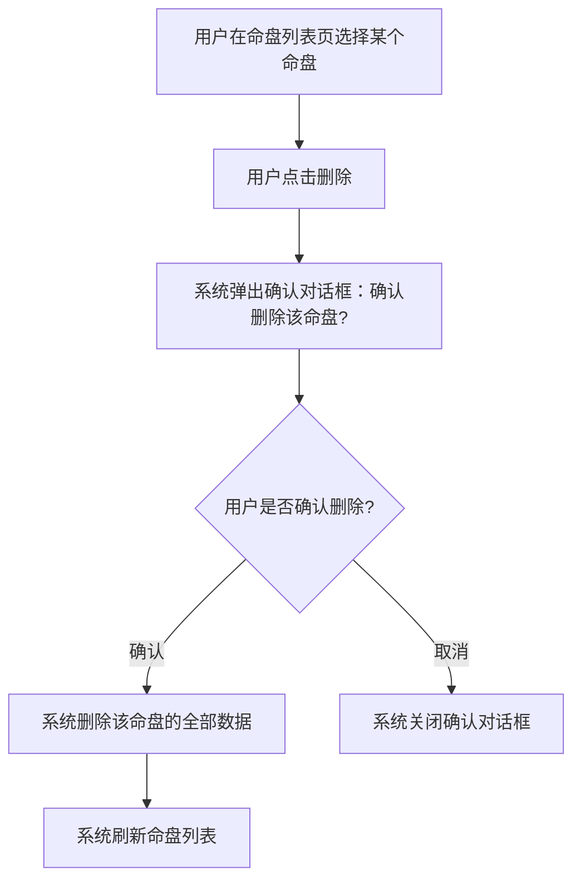

# 命盘保存管理

## Part 1 业务流程

### 1.1 保存命盘主流程

### 1.2 命盘列表查看流程

### 1.3 删除命盘流程

## Part 2 关键页面功能列表

### 页面 / 功能 1: 命盘保存页

- **URL / 路径（业务命名）**: 命盘保存页
- **对应 URS 需求**: FR-09
- **目标用户**: 命理学习者、命理从业者、普通用户
- **核心功能**:
  - 为当前排盘结果指定命盘名称
  - 自动回填性别与出生日期时间信息
  - 将命盘完整数据保存为命盘记录
  - 保存成功后给出提示
- **交互要点 / 业务规则**:
  - 命盘名称不能为空，同一名下不可重名
  - 保存内容包含排盘的全部结果数据（四柱、藏干、五行统计、十神、病机、用神喜忌），便于后续直接引用而无需重新排盘
  - 所有命盘数据保存在本地，不外传

### 页面 / 功能 2: 命盘列表页

- **URL / 路径（业务命名）**: 命盘列表页
- **对应 URS 需求**: FR-09
- **目标用户**: 命理学习者、命理从业者、普通用户
- **核心功能**:
  - 查看已保存的命盘列表
  - 每条命盘记录显示命盘名称、性别、出生日期、四柱概要
  - 点击某条命盘进入该命盘的详情页
  - 删除命盘记录
- **交互要点 / 业务规则**:
  - 命盘列表按保存时间倒序排列
  - 删除前需用户二次确认
  - 删除后列表即时刷新

### 页面 / 功能 3: 命盘详情页

- **URL / 路径（业务命名）**: 命盘详情页
- **对应 URS 需求**: FR-09
- **目标用户**: 命理学习者、命理从业者、普通用户
- **核心功能**:
  - 查看已保存命盘的完整排盘结果
  - 查看命盘的五行统计与十神标注
  - 查看命盘的病机清单与用神喜忌
  - 修改命盘名称
  - 从详情页发起合盘或合婚比较
- **交互要点 / 业务规则**:
  - 修改名称后自动保存
  - 命盘数据为保存时的完整快照，不随时间自动更新流年信息
  - 发起合盘比较时，需选择另一个已保存的命盘