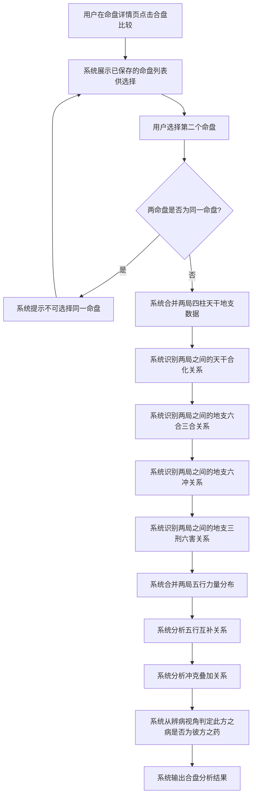
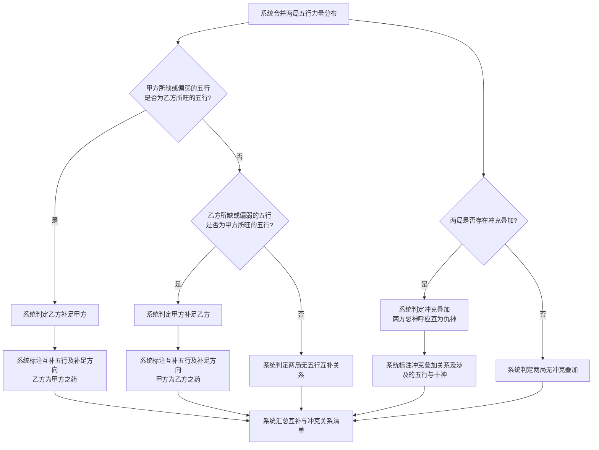
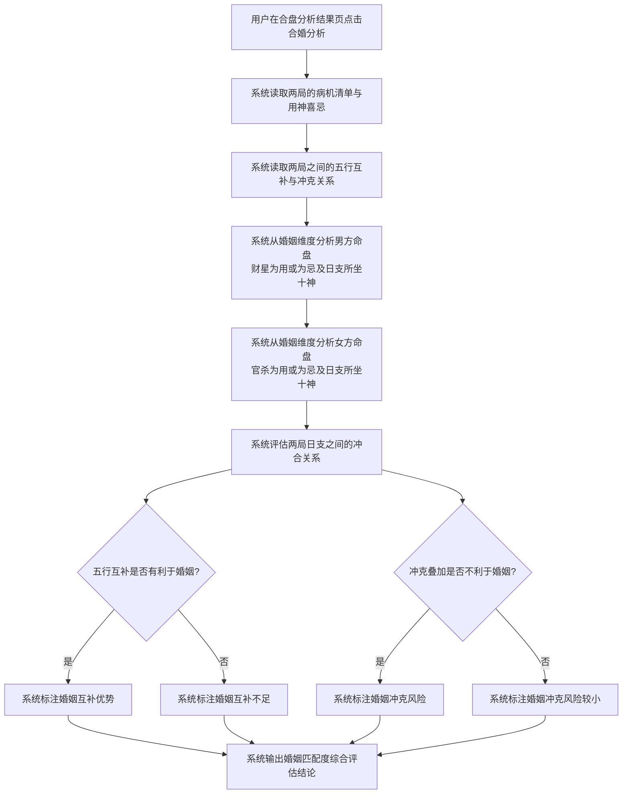

# 合盘与合婚分析

## Part 1 业务流程

### 1.1 合盘分析主流程

### 1.2 五行互补与冲克分析流程

### 1.3 合婚分析流程

## Part 2 关键页面功能列表

### 页面 / 功能 1: 合盘选择页

- **URL / 路径（业务命名）**: 合盘选择页
- **对应 URS 需求**: FR-09
- **目标用户**: 命理学习者、命理从业者、普通用户
- **核心功能**:
  - 选择第一个命盘（从已保存命盘列表中选取）
  - 选择第二个命盘（从已保存命盘列表中选取）
  - 确认后发起合盘比较
- **交互要点 / 业务规则**:
  - 两个命盘不可为同一命盘
  - 两命盘均需已完成排盘与辨病分析
  - 选择命盘后展示其四柱概要供用户确认

### 页面 / 功能 2: 合盘五行互补分析页

- **URL / 路径（业务命名）**: 合盘五行互补分析页
- **对应 URS 需求**: FR-09
- **目标用户**: 命理学习者、命理从业者、普通用户
- **核心功能**:
  - 查看两局合并后的五行力量分布对比
  - 查看甲方所缺或偏弱的五行是否由乙方补足
  - 查看乙方所缺或偏弱的五行是否由甲方补足
  - 查看辨病视角结论：此方之病是否恰为彼方之药
- **交互要点 / 业务规则**:
  - 五行互补分析以两局的用神喜忌为基准：一方之用神所对应的五行是否为另一方命局所旺
  - 互补方向明确标注（甲方缺水且乙方水旺则乙方为甲方之药）
  - 互补结论必须关联病机依据（从何病推出需何药，对方是否提供此药）

### 页面 / 功能 3: 合盘冲克关系分析页

- **URL / 路径（业务命名）**: 合盘冲克关系分析页
- **对应 URS 需求**: FR-09
- **目标用户**: 命理学习者、命理从业者、普通用户
- **核心功能**:
  - 查看两局之间的天干合化关系
  - 查看两局之间的地支六合三合关系
  - 查看两局之间的地支六冲关系
  - 查看两局之间的地支三刑六害关系
  - 查看冲克叠加辨病结论：两方忌神是否呼应叠加、互为仇神
- **交互要点 / 业务规则**:
  - 天干合化与地支合冲刑害的识别规则与合冲刑害分析模块（模块03）一致，此处扩展到两局之间的交互关系
  - 冲克叠加的辨病结论必须关联具体病机（两方的忌神是否同方向叠加）
  - 合关系（天干合化、地支六合三合）既可能为药（化解一方的病），也可能为病（绊住一方的用神），两种情况均需标注

### 页面 / 功能 4: 合婚匹配度分析页

- **URL / 路径（业务命名）**: 合婚匹配度分析页
- **对应 URS 需求**: FR-09
- **目标用户**: 命理学习者、命理从业者、普通用户
- **核心功能**:
  - 查看男方命盘的婚姻维度论断（财星为用或为忌、日支所坐十神）
  - 查看女方命盘的婚姻维度论断（官杀为用或为忌、日支所坐十神）
  - 查看两局日支之间的冲合关系
  - 查看五行互补对婚姻的有利影响
  - 查看冲克叠加对婚姻的不利影响
  - 查看婚姻匹配度综合评估结论
- **交互要点 / 业务规则**:
  - 合婚分析以辨病论断为核心：男看财星（财星为用则配偶得力，财星为忌则婚姻不顺），女看官杀（官杀为用则配偶得力，官杀为忌则婚姻不顺）
  - 日支为婚姻宫，两局日支之间的冲合关系直接影响婚姻和谐程度
  - 五行互补有利于婚姻时（此方之病为彼方之药），标注互补优势；冲克叠加不利于婚姻时，标注冲克风险
  - 婚姻匹配度结论必须有病机依据，不凭空断言