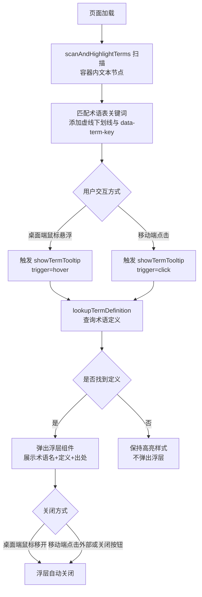
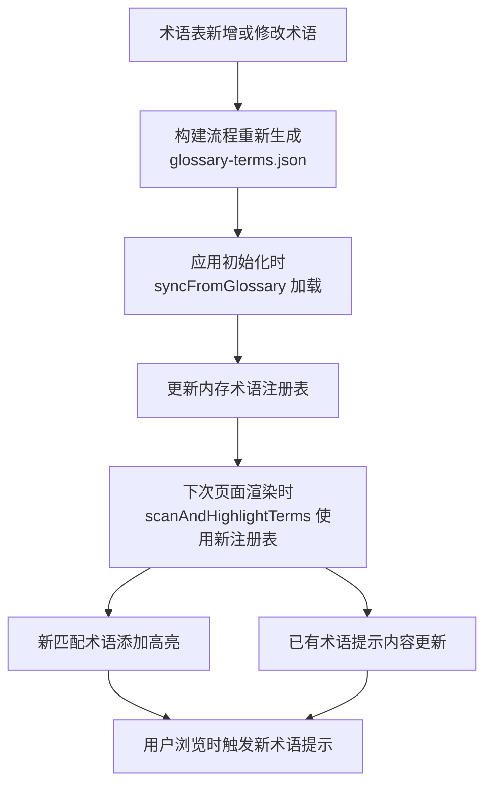
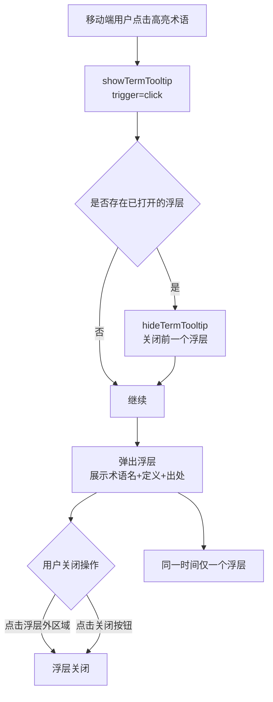
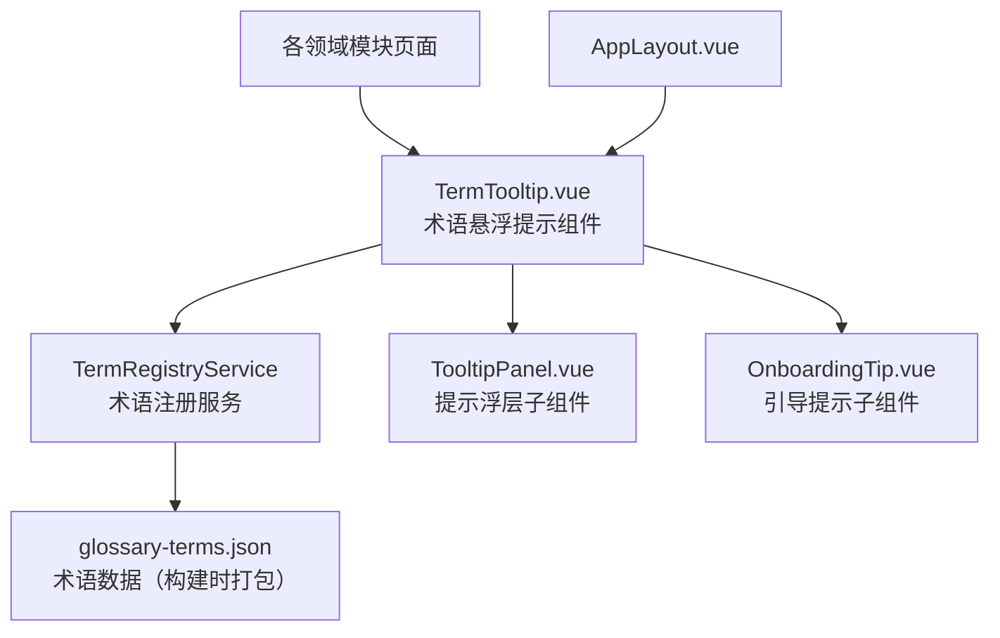

# 术语悬浮提示

> PRD Reference: docs/PRD/00. 通用与外壳模块/01. 术语悬浮提示/术语悬浮提示.md#术语悬浮提示

## 1. 业务流程

### 1.1 用户查看术语定义

**触发**：用户在浏览任何含专业术语的页面时，对高亮术语执行悬浮（桌面端）或点击（移动端）操作。

**步骤**：

1. 页面加载时，`TermTooltip.vue` 组件调用 `scanAndHighlightTerms(container)` 扫描容器内文本节点，匹配术语表中已收录的术语关键词，为匹配项添加虚线下划线样式与 `data-term-key` 属性。
2. 桌面端用户鼠标悬浮在高亮术语上，触发 `showTermTooltip(termKey, position, 'hover')`；移动端用户点击高亮术语，触发 `showTermTooltip(termKey, position, 'click')`。
3. `showTermTooltip()` 调用 `lookupTermDefinition(termKey)` 从术语注册服务获取术语名称、定义与出处。
4. 若查找成功，弹出浮层组件，展示术语名、定义与出处标记；若查找失败（`null`），术语保持高亮样式但不弹出浮层。
5. 用户阅读完毕：桌面端移开鼠标自动关闭浮层；移动端点击浮层外区域或关闭按钮关闭浮层。

**预期结果**：用户即时获得术语的通俗解释，无需离开当前页面。



### 1.2 术语表联动更新

**触发**：术语表（`0.common/glossary.md`）新增或修改术语定义后，前端构建时重新打包术语 JSON 数据。

**步骤**：

1. 术语表更新后，构建流程重新生成术语 JSON（`glossary-terms.json`），包含新增术语的名称、定义与出处。
2. 应用初始化时，`TermRegistryService` 调用 `syncFromGlossary()` 加载最新术语 JSON，更新内存中的术语注册表。
3. `scanAndHighlightTerms(container)` 在下次页面渲染时使用最新注册表，为新匹配的术语添加高亮标识。
4. 已存在的术语提示内容更新为最新定义。

**预期结果**：术语表变更后，页面上的提示内容与术语表保持同步，无需手动刷新。



### 1.3 移动端术语提示

**触发**：移动端用户点击高亮术语。

**步骤**：

1. 移动端用户点击高亮术语，触发 `showTermTooltip(termKey, position, 'click')`。
2. 若当前已有其他术语提示浮层打开，先调用 `hideTermTooltip()` 关闭前一个浮层（浮层唯一性约束）。
3. 弹出新的浮层组件，展示术语名、定义与出处标记，浮层内含关闭按钮。
4. 用户通过以下方式关闭浮层：点击浮层外区域 或 点击浮层内关闭按钮。
5. 首次使用产品的用户进入含术语页面时，`showOnboardingTip()` 展示引导提示，告知可点击术语查看解释。

**预期结果**：移动端用户通过点击即可查看术语解释，体验自然流畅。



## 2. 关键函数设计

### 2.1 scanAndHighlightTerms

```typescript
function scanAndHighlightTerms(container: HTMLElement): HighlightResult
```

- **职责**：扫描指定容器内的文本节点，匹配术语表中已收录的术语关键词，为匹配项添加可交互的视觉标识。
- **核心逻辑**：
  1. 调用 `TermRegistryService.getAllTerms()` 获取全量术语列表。
  2. 使用 TreeWalker 遍历 `container` 内所有文本节点。
  3. 对每个文本节点，按术语长度降序匹配关键词（长词优先，避免子串冲突）。
  4. 将匹配到的文本片段包裹为 `<span class="term-highlight" data-term-key="...">` 元素。
  5. 跳过已处理的节点和 `<script>`/`<style>` 等非内容节点。
  6. 返回 `HighlightResult`，包含匹配术语数量和未匹配术语列表。
- **PRD 追溯**：术语高亮标识 — NFR-04

### 2.2 lookupTermDefinition

```typescript
function lookupTermDefinition(termKey: string): TermDefinition | null
```

- **职责**：根据术语键名查找术语定义。
- **核心逻辑**：
  1. 从 `TermRegistryService` 内存注册表中按 `termKey` 查找。
  2. 找到则返回 `TermDefinition`（含 name、definition、source）；未找到返回 `null`。
- **PRD 追溯**：桌面端悬浮提示 / 移动端点击提示 — NFR-04

### 2.3 showTermTooltip / hideTermTooltip

```typescript
function showTermTooltip(
  termKey: string,
  position: { x: number; y: number },
  trigger: 'hover' | 'click'
): void

function hideTermTooltip(): void
```

- **职责**：弹出或关闭术语提示浮层。
- **核心逻辑**：
  1. `showTermTooltip`：调用 `lookupTermDefinition(termKey)`，成功时渲染浮层组件并定位到触发元素附近；移动端（`trigger='click'`）先调用 `hideTermTooltip()` 确保唯一性；桌面端（`trigger='hover'`）鼠标移出时自动关闭。
  2. `hideTermTooltip`：卸载浮层组件，清除浮层引用。
- **PRD 追溯**：桌面端悬浮提示 / 移动端点击提示 — NFR-04

### 2.4 syncFromGlossary

```typescript
function syncFromGlossary(): void
```

- **职责**：从打包的 glossary JSON 数据同步术语注册表。
- **核心逻辑**：
  1. 加载构建时生成的 `glossary-terms.json`。
  2. 解析为 `TermDefinition[]` 数组，按 `termKey` 索引写入内存注册表。
  3. 术语表更新后重新构建应用时自动同步，无需手动刷新。
- **PRD 追溯**：术语表联动更新 — NFR-04

### 2.5 showOnboardingTip

```typescript
function showOnboardingTip(): void
```

- **职责**：首次使用产品的用户进入含术语页面时，展示引导提示。
- **核心逻辑**：
  1. 检查 localStorage 中 `termOnboardingSeen` 标记。
  2. 若未标记，渲染引导提示浮层，告知用户可悬浮或点击术语查看解释。
  3. 用户确认后写入 `termOnboardingSeen=true`，后续不再展示。
- **PRD 追溯**：初学者术语提示引导 — NFR-04

## 3. 组件架构



## 4. 数据来源

术语定义数据来源于 `0.common/glossary.md`（术语表），在前端构建时通过脚本解析为 `glossary-terms.json`，打包到前端静态资源中。运行时由 `TermRegistryService` 加载并提供给 `TermTooltip.vue` 组件使用。术语表新增或修改后需重新构建前端应用以同步更新。