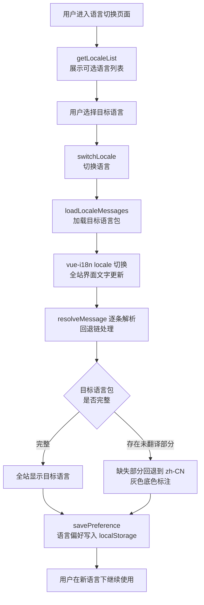
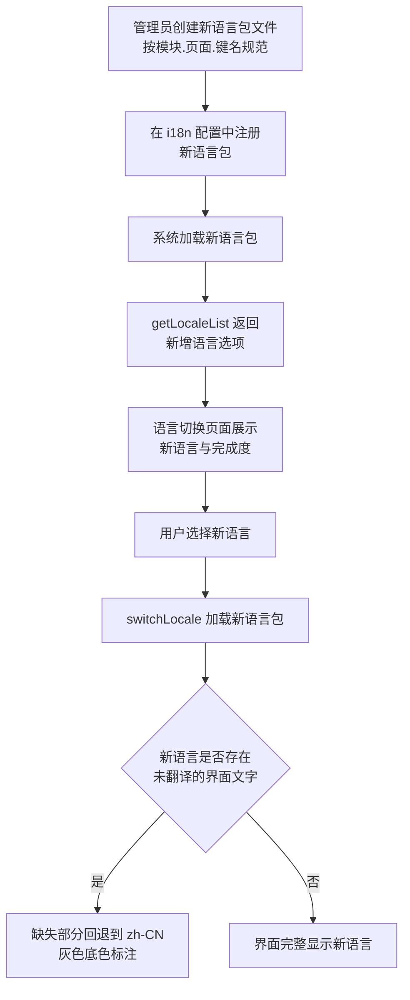
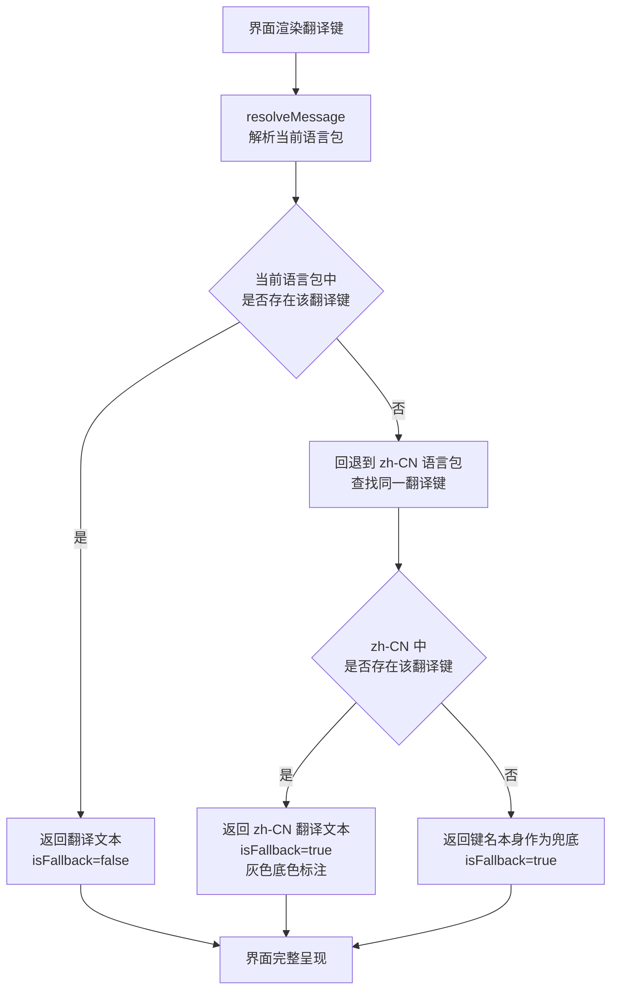
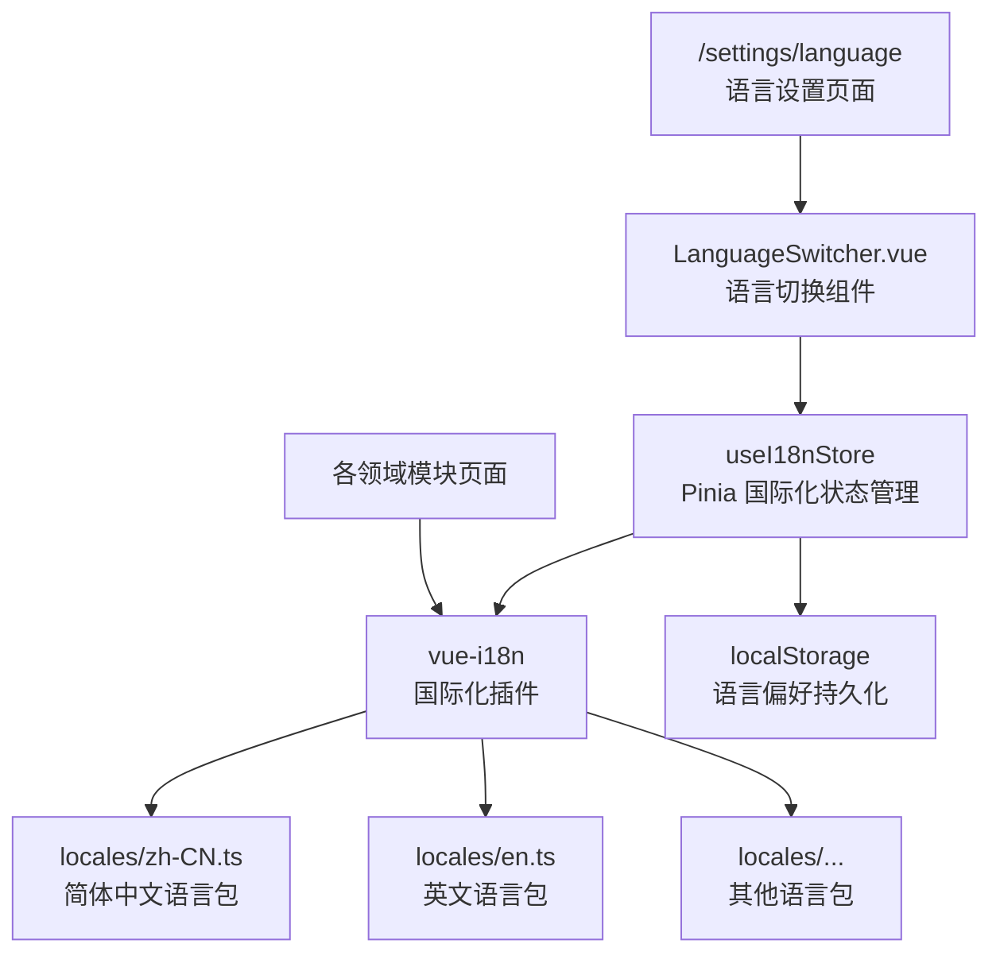

# 多语言扩展基础

> PRD Reference: docs/PRD/00. 通用与外壳模块/02. 多语言扩展基础/多语言扩展基础.md#多语言扩展基础

## 1. 业务流程

### 1.1 用户切换界面语言

**触发**：用户在设置页面（`/settings/language`）选择目标语言。

**步骤**：

1. 用户进入语言切换页面，`LanguageSwitcher.vue` 调用 `getLocaleList()` 展示可选语言列表，每个语言显示本地名称与翻译完成度。
2. 用户选择目标语言，触发 `switchLocale(targetLocale)`。
3. `switchLocale()` 内部调用 `loadLocaleMessages(targetLocale)` 加载目标语言包。
4. 语言包加载完成后，调用 vue-i18n 的 `locale` 切换全局 locale，触发全站界面文字更新。
5. 逐条检查界面文字：调用 `resolveMessage(key, targetLocale)` 对每个翻译键进行回退解析。
6. 若目标语言包完整，全站界面文字切换为目标语言；若存在未翻译部分，回退到默认语言（zh-CN）并以灰色底色标注。
7. 调用 `savePreference(targetLocale)` 将语言偏好写入 localStorage。
8. 全站界面即时更新，无需刷新页面。

**预期结果**：用户切换语言后，全站界面文字即时更新为目标语言，缺失翻译回退到默认语言并做视觉标注。



### 1.2 新增语言支持

**触发**：管理员按翻译键命名规范创建新语言包。

**步骤**：

1. 管理员按"模块.页面.键名"层级创建新语言包文件（如 `code/frontend/src/i18n/locales/en.ts`），填写界面翻译文本。
2. 在 vue-i18n 配置（`code/frontend/src/i18n/index.ts`）中注册新语言包。
3. 系统加载新语言包，`getLocaleList()` 返回的语言列表中新增该语言选项。
4. 语言切换页面展示新语言，标注翻译完成度（已翻译键数 / 总键数）。
5. 用户选择新语言后，`switchLocale()` 加载新语言包并切换界面文字，缺失部分回退到 zh-CN。

**预期结果**：新语言包创建后，语言列表中出现新选项，用户即可选择使用。



### 1.3 语言回退处理

**触发**：用户选择的语言存在缺失翻译键时，`resolveMessage()` 逐条解析界面文字。

**步骤**：

1. vue-i18n 渲染界面文字时，对每个翻译键调用 `resolveMessage(key, currentLocale)`。
2. 首先在目标语言包中查找翻译键。
3. 若找到，返回翻译文本，`isFallback=false`。
4. 若未找到，回退到默认语言（zh-CN）中查找同一翻译键。
5. 从 zh-CN 语言包中找到后，返回 zh-CN 翻译文本并标记 `isFallback=true`。
6. 前端组件检测 `isFallback` 标记，对回退文本以灰色底色 CSS 样式标注，提示用户该部分尚未翻译为所选语言。
7. 确保界面不出现空白文字。

**预期结果**：缺失翻译自动回退到默认语言，界面无空白，回退部分有视觉标注。



## 2. 关键函数设计

### 2.1 switchLocale

```typescript
async function switchLocale(locale: string): Promise<void>
```

- **职责**：切换当前界面语言，加载对应语言包并更新 vue-i18n 全局 locale。
- **核心逻辑**：
  1. 调用 `loadLocaleMessages(locale)` 加载目标语言包。
  2. 若加载成功，将 vue-i18n 实例的 `locale` 设置为 `locale`，触发全站响应式更新。
  3. 调用 `savePreference(locale)` 将偏好写入 localStorage。
  4. 若加载失败（如语言包文件不存在），回退到默认语言 `zh-CN` 并在控制台输出警告。
- **PRD 追溯**：语言切换 — NFR-04

### 2.2 loadLocaleMessages

```typescript
async function loadLocaleMessages(locale: string): Promise<LocaleMessages>
```

- **职责**：加载指定语言的语言包数据。
- **核心逻辑**：
  1. 从 `code/frontend/src/i18n/locales/` 目录动态导入对应语言包文件（如 `zh-CN.ts`、`en.ts`）。
  2. 解析为 `LocaleMessages` 结构（嵌套的键值对映射）。
  3. 合并到 vue-i18n 实例的 `messages` 中。
  4. 返回加载的语言包数据供后续使用。
- **PRD 追溯**：语言切换 — NFR-04

### 2.3 resolveMessage

```typescript
function resolveMessage(key: string, locale: string): ResolvedMessage
```

- **职责**：按回退链解析翻译键，返回翻译文本与回退标记。
- **核心逻辑**：
  1. 在 `locale` 语言包中查找 `key` 对应的翻译文本。
  2. 若找到，返回 `{ text: 翻译文本, isFallback: false }`。
  3. 若未找到，在默认语言包（zh-CN）中查找同一 `key`。
  4. 若在 zh-CN 中找到，返回 `{ text: zh-CN文本, isFallback: true }`。
  5. 若在 zh-CN 中也未找到，返回 `{ text: key, isFallback: true }`（键名作为兜底显示）。
- **PRD 追溯**：语言回退标注 — NFR-04

### 2.4 savePreference / loadPreference

```typescript
function savePreference(locale: string): void
function loadPreference(): string | null
```

- **职责**：将语言偏好持久化到浏览器 localStorage / 从中读取。
- **核心逻辑**：
  1. `savePreference`：将 `locale` 写入 localStorage 键 `bazi_lang_preference`。
  2. `loadPreference`：从 localStorage 读取 `bazi_lang_preference`；无记录时返回 `null`（表示使用默认语言 zh-CN）。
  3. 若 localStorage 不可用（隐私模式等），降级为会话级偏好（刷新后回到默认语言），不影响核心功能。
- **PRD 追溯**：语言偏好保持 — NFR-04

### 2.5 getLocaleList

```typescript
function getLocaleList(): LocaleInfo[]
```

- **职责**：返回所有已安装语言的信息列表。
- **核心逻辑**：
  1. 遍历 vue-i18n 实例中已注册的语言包。
  2. 对每种语言，计算翻译完成度 = 该语言已翻译键数 / zh-CN 总键数 * 100。
  3. 返回 `LocaleInfo[]`，每项包含 `locale`（语言标识）、`localName`（本地名称）、`completionRate`（完成度百分比）。
- **PRD 追溯**：可选语言列表展示 — NFR-04

## 3. 组件架构



## 4. 翻译键命名规范

翻译键按"模块.页面.键名"的层级组织，确保可读性与可维护性：

```
chart.input.birthDate       # 排盘.输入.出生日期
chart.result.heavenlyStem   # 排盘.结果.天干
analysis.wuxing.strength    # 分析.五行.力量
analysis.shishen.label      # 分析.十神.标注
bing.diagnosis.type         # 辨病.诊断.类型
report.export.pdf           # 报告.导出.PDF
common.lang.switch          # 通用.语言.切换
common.lang.fallback         # 通用.语言.回退标注
```

新增模块或页面时按同一规范扩展，zh-CN 语言包作为完整的翻译基准。