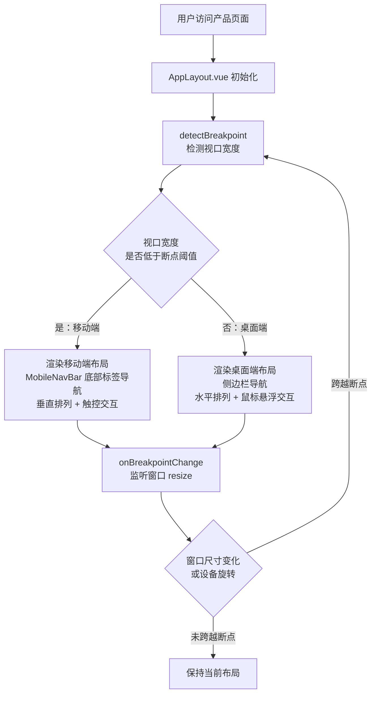
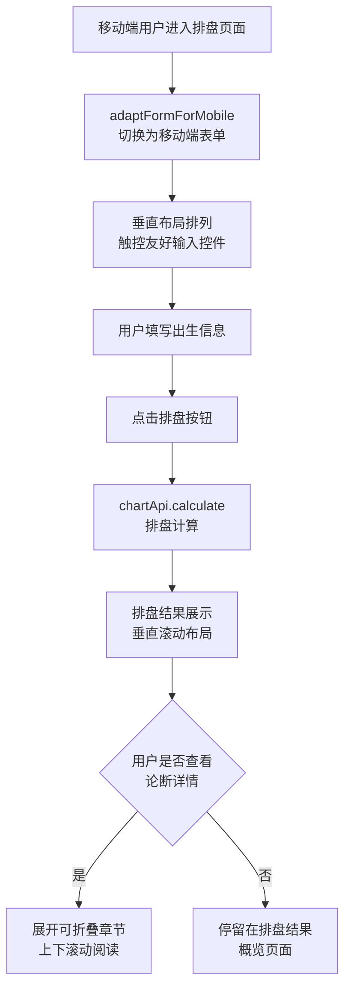
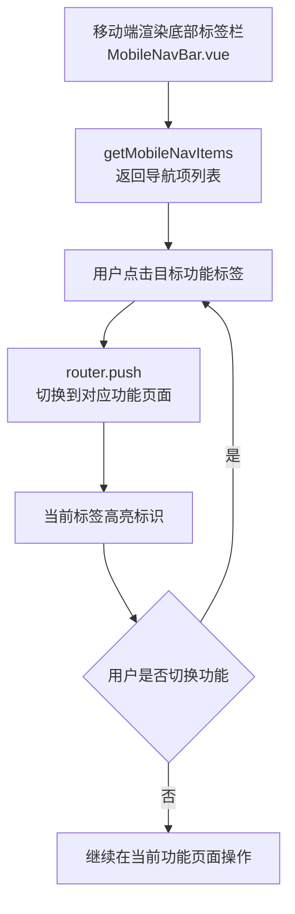
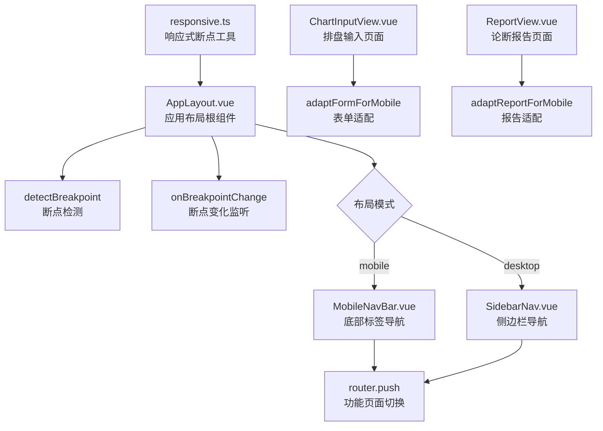

# 移动端适配

> PRD Reference: docs/PRD/00. 通用与外壳模块/03. 移动端适配/移动端适配.md#移动端适配

## 1. 业务流程

### 1.1 设备适配切换

**触发**：用户在任意设备上访问产品，系统检测屏幕宽度。

**步骤**：

1. 用户访问产品页面，`AppLayout.vue` 组件初始化时调用 `detectBreakpoint()` 检测当前视口宽度。
2. 将视口宽度与断点阈值（默认 768px，来自 `responsive.ts` 配置）比较。
3. 若视口宽度 < 断点阈值，切换为移动端布局：渲染 `MobileNavBar.vue` 底部标签导航栏，页面内容垂直排列，交互方式改为触控优先（点击替代悬浮）。
4. 若视口宽度 >= 断点阈值，保持桌面端布局：渲染侧边栏导航，页面内容水平排列，交互方式为鼠标悬浮。
5. 注册 `onBreakpointChange()` 监听器，在窗口 resize 或设备旋转时重新检测断点并切换布局。
6. 切换布局时不刷新页面、不丢失当前状态（Pinia store 保留，vue-i18n locale 保留）。

**预期结果**：用户在不同设备上访问时，自动获得匹配的布局形态，切换时无状态丢失。



### 1.2 移动端核心排盘操作

**触发**：移动端用户进入排盘功能页面（`/chart`）。

**步骤**：

1. 移动端用户进入排盘页面，`ChartInputView.vue` 检测当前为移动端布局，调用 `adaptFormForMobile(formConfig)` 切换为移动端输入表单。
2. 移动端表单采用垂直布局排列，所有输入项（出生日期、时间、性别等）纵向排列，确保在窄屏上可完整显示。
3. 输入控件适配触控操作：日期选择器使用原生日期控件或 Ant Design Vue Mobile 组件，下拉选择增大触控区域。
4. 用户填写出生信息后点击排盘按钮，调用 `chartApi.calculate()` 发起排盘请求。
5. 排盘结果页面（`ChartResultView.vue`）在移动端以垂直滚动布局展示四柱信息，支持上下滑动查看详情。
6. 用户可选择展开论断详情，页面提供可折叠章节，支持上下滚动阅读。

**预期结果**：移动端用户可完成从输入出生信息到查看排盘结果的全部操作，功能完整无缺失。



### 1.3 移动端导航切换

**触发**：移动端用户点击底部标签栏中的功能标签。

**步骤**：

1. 移动端布局渲染 `MobileNavBar.vue` 底部标签导航栏，包含核心功能入口（排盘、论断、历史等）。
2. `getMobileNavItems()` 返回导航项列表，每项包含路由名称、图标与标签文字。
3. 用户点击目标功能标签，`MobileNavBar.vue` 调用 Vue Router 的 `router.push()` 切换到对应功能页面。
4. 当前激活的标签以高亮状态标识（如颜色变化或底部指示条），通过 `router.currentRoute` 匹配当前路由。
5. 页面切换时布局保持移动端形态，不闪烁或短暂回到桌面端布局。
6. 用户可随时通过底部标签栏在不同功能模块间切换。

**预期结果**：移动端用户通过底部标签栏便捷切换功能模块，当前功能始终高亮标识。



## 2. 关键函数设计

### 2.1 detectBreakpoint

```typescript
function detectBreakpoint(): 'mobile' | 'desktop'
```

- **职责**：根据当前视口宽度与断点阈值判断布局模式。
- **核心逻辑**：
  1. 获取 `window.innerWidth`（视口宽度，不含滚动条）。
  2. 与 `getBreakpointValue()` 返回的断点阈值（默认 768px）比较。
  3. 视口宽度 < 阈值返回 `'mobile'`，否则返回 `'desktop'`。
  4. SSR 场景下返回 `'desktop'`（服务端无 `window` 对象）。
- **PRD 追溯**：响应式布局切换 — NFR-04

### 2.2 onBreakpointChange

```typescript
function onBreakpointChange(
  callback: (mode: 'mobile' | 'desktop') => void
): () => void
```

- **职责**：注册断点变化监听器，当视口宽度跨越断点阈值时触发回调。
- **核心逻辑**：
  1. 使用 `window.matchMedia('(max-width: 768px)')` 创建媒体查询监听。
  2. 监听 `change` 事件，当匹配状态变化时调用 `callback` 并传入当前模式。
  3. 返回取消监听函数，组件卸载时调用以防止内存泄漏。
  4. `AppLayout.vue` 在 `onMounted` 注册监听，`onUnmounted` 取消监听。
- **PRD 追溯**：屏幕宽度变化响应 — NFR-04

### 2.3 getMobileNavItems

```typescript
function getMobileNavItems(): NavItem[]
```

- **职责**：返回底部标签导航栏的导航项列表。
- **核心逻辑**：
  1. 从 Vue Router 配置中提取核心功能路由（排盘、论断、历史等）。
  2. 每个导航项包含 `route`（路由路径）、`labelKey`（国际化标签键）、`icon`（Ant Design Vue 图标组件）。
  3. 导航项与桌面端侧边栏导航功能入口完全一致（同一 `router` 配置，不同渲染形态）。
  4. 返回 `NavItem[]` 供 `MobileNavBar.vue` 渲染。
- **PRD 追溯**：移动端底部导航栏 — NFR-04

### 2.4 adaptFormForMobile

```typescript
function adaptFormForMobile(formConfig: FormConfig): MobileFormConfig
```

- **职责**：将排盘输入表单配置适配为移动端垂直布局形态。
- **核心逻辑**：
  1. 将水平排列的表单项改为垂直排列（每行一个输入项）。
  2. 日期选择器切换为触控友好模式（增大触控区域，使用原生日期控件）。
  3. 下拉选择组件增大选项高度与文字大小，满足触控操作最小尺寸要求。
  4. 按钮宽度撑满容器，增大点击区域。
  5. 返回 `MobileFormConfig`，供 `ChartInputView.vue` 在移动端渲染时使用。
- **PRD 追溯**：移动端排盘输入适配 — NFR-04

### 2.5 adaptReportForMobile

```typescript
function adaptReportForMobile(reportConfig: ReportConfig): MobileReportConfig
```

- **职责**：将论断报告配置适配为移动端可折叠章节布局。
- **核心逻辑**：
  1. 将论断报告的固定章节布局改为可折叠 Accordion 布局。
  2. 关键结论（辨病结果、用神喜忌）默认展开，详细论断内容默认折叠。
  3. 字体大小不低于可读下限（正文 14px），行间距适当增加。
  4. 返回 `MobileReportConfig`，供 `ReportView.vue` 在移动端渲染时使用。
- **PRD 追溯**：移动端论断阅读适配 — NFR-04

## 3. 组件架构



## 4. 断点策略

| 参数 | 桌面端 | 移动端 |
|------|--------|--------|
| 视口宽度 | >= 768px | < 768px |
| 导航形态 | 侧边栏导航 | 底部标签导航栏 |
| 内容排列 | 水平排列为主 | 垂直排列为主 |
| 交互方式 | 鼠标悬浮（hover） | 点击（click/tap） |
| 术语提示 | 悬浮触发 | 点击触发 |
| 表单布局 | 水平分组 | 垂直逐项 |
| 报告展示 | 固定章节 | 可折叠 Accordion |

断点阈值 768px 为默认值，配置于 `code/frontend/src/utils/responsive.ts`，可在应用初始化时调整。