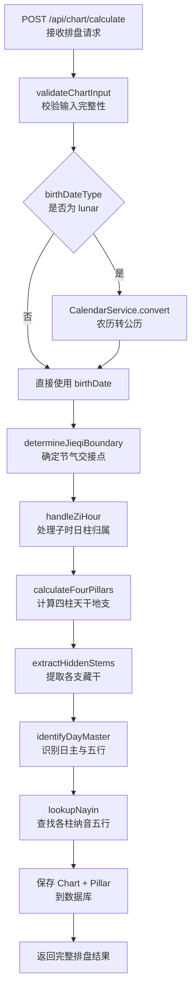

# API 设计 — 01. 八字排盘与历法模块

## 概述

本模块提供八字排盘计算与历法转换两组 REST API，支撑四柱排盘、藏干与日主、农历与节气、纳音五行四个子模块的前后端交互。排盘计算接口（`POST /api/chart/calculate`）返回完整的排盘结果（含四柱、藏干、日主、纳音五行），藏干与日主及纳音五行子模块无独立后端端点，其数据均包含在排盘结果中。历法转换接口（`GET /api/calendar/lunar-solar`、`GET /api/calendar/jieqi`）为纯计算端点，不涉及数据持久化。

所有端点遵循 `code-structure.md §4` 的路径与处理器约定，错误响应遵循 ADR-003（RFC7807 `application/problem+json`）。

## 1. 子模块 API 汇总

### 1.1 四柱排盘

| 方法 | 路径 | PRD 业务功能 | 说明 |
|------|------|-------------|------|
| POST | `/api/chart/calculate` | 排盘输入页 | 接收出生信息，计算并返回完整排盘结果（含四柱、藏干、日主、纳音） |
| GET | `/api/chart/:id` | 四柱排盘结果页 | 按 ID 获取已计算的排盘结果 |

### 1.2 藏干与日主

N/A — 无独立后端端点。藏干与日主数据包含在 `POST /api/chart/calculate` 响应的 `pillars[].hiddenStems` 与 `dayMaster` / `dayMasterElement` 字段中。前端通过 `GET /api/chart/:id` 获取已保存的排盘结果时同步获取藏干与日主数据。

### 1.3 农历与节气

| 方法 | 路径 | PRD 业务功能 | 说明 |
|------|------|-------------|------|
| GET | `/api/calendar/lunar-solar` | 农历公历互转 | 公历与农历日期互转，供排盘输入页使用 |
| GET | `/api/calendar/jieqi` | 节气划分月柱 | 查询指定年份的二十四节气交接时刻 |

### 1.4 纳音五行

N/A — 无独立后端端点。纳音五行数据包含在 `POST /api/chart/calculate` 响应的 `pillars[].nayin` 字段中。前端通过 `GET /api/chart/:id` 获取已保存的排盘结果时同步获取纳音五行数据。

## 2. 端点详情

### 2.1 POST /api/chart/calculate

**处理器**：`ChartController.calculate()`
**服务**：`ChartService`
**PRD 追溯**：排盘输入页、藏干展示、日主与五行展示、早子时与夜子时处理、纳音五行显示

#### 请求

| 字段 | 类型 | 必填 | 约束 | 示例 |
|------|------|------|------|------|
| birthDateType | String | 是 | `"solar"` / `"lunar"` | `"solar"` |
| birthDate | String (ISO 8601) | 条件必填 | `birthDateType` 为 `"solar"` 时必填；1900–2100 年范围 | `"1990-06-15T14:30:00Z"` |
| gender | String | 是 | `"male"` / `"female"` | `"male"` |
| lunarBirthInfo | Object | 条件必填 | `birthDateType` 为 `"lunar"` 时必填 | `{"year":1990,"month":5,"day":23,"isLeapMonth":false}` |
| lunarBirthInfo.year | Int | 是 | 1900–2100 | `1990` |
| lunarBirthInfo.month | Int | 是 | 1–12 | `5` |
| lunarBirthInfo.day | Int | 是 | 1–30（农历日范围） | `23` |
| lunarBirthInfo.isLeapMonth | Boolean | 否 | 默认 `false` | `false` |
| zhourule | String | 否 | `"early_zi"` / `"late_zi"`，默认 `"early_zi"` | `"early_zi"` |

#### 响应（200 OK）

| 字段 | 类型 | 说明 | 示例 |
|------|------|------|------|
| id | Int | 命盘 ID | `1` |
| birthDate | String (ISO 8601) | 公历出生日期时间（UTC） | `"1990-06-15T14:30:00Z"` |
| birthDateType | String | 输入方式 | `"solar"` |
| gender | String | 性别 | `"male"` |
| dayMaster | String | 日主天干 | `"丙"` |
| dayMasterElement | String | 日主五行属性 | `"火"` |
| jieqiName | String? | 出生时刻节气名称 | `"芒种"` |
| jieqiTime | String? (ISO 8601) | 节气交接时刻 | `"1990-06-06T00:00:00Z"` |
| isBeforeLichun | Boolean | 是否在立春之前 | `false` |
| zhourule | String | 子时处理方式 | `"early_zi"` |
| pillars | Array | 四柱数据 | 见下方 |
| pillars[].position | String | 柱位 | `"year"` |
| pillars[].heavenlyStem | String | 天干 | `"庚"` |
| pillars[].earthlyBranch | String | 地支 | `"午"` |
| pillars[].hiddenStems | Object | 藏干数据 | `{"mainQi":"丁","middleQi":"己","residualQi":null}` |
| pillars[].nayin | String? | 纳音五行 | `"路旁土"` |
| createdAt | String (ISO 8601) | 创建时间 | `"2024-01-01T00:00:00Z"` |

#### 错误响应

| HTTP 状态码 | 错误类型 | 说明 |
|------------|---------|------|
| 400 | `https://bazi.app/errors/invalid-input` | 必填字段缺失或格式错误 |
| 400 | `https://bazi.app/errors/date-out-of-range` | 日期超出 1900–2100 年范围 |
| 422 | `https://bazi.app/errors/invalid-lunar-date` | 无效的农历日期（如闰月不存在） |
| 500 | `https://bazi.app/errors/calculation-failed` | 排盘计算内部错误 |

#### 流程图



---

### 2.2 GET /api/chart/:id

**处理器**：`ChartController.getChart()`
**服务**：`ChartService`
**PRD 追溯**：四柱排盘结果页

#### 请求

| 字段 | 类型 | 必填 | 约束 | 示例 |
|------|------|------|------|------|
| id | Int | 是 | 路径参数，有效命盘 ID | `1` |

#### 响应（200 OK）

响应结构与 `POST /api/chart/calculate` 相同。

#### 错误响应

| HTTP 状态码 | 错误类型 | 说明 |
|------------|---------|------|
| 404 | `https://bazi.app/errors/chart-not-found` | 命盘 ID 不存在 |

---

### 2.3 GET /api/calendar/lunar-solar

**处理器**：`CalendarController.convert()`
**服务**：`CalendarService`
**PRD 追溯**：农历公历互转

#### 请求

| 字段 | 类型 | 必填 | 约束 | 示例 |
|------|------|------|------|------|
| direction | String | 是 | `"lunar2solar"` / `"solar2lunar"` | `"lunar2solar"` |
| year | Int | 是 | 1900–2100 | `1990` |
| month | Int | 是 | 1–12 | `5` |
| day | Int | 是 | 1–31（公历）/ 1–30（农历） | `23` |
| isLeapMonth | Boolean | 否 | 默认 `false`，`direction` 为 `"lunar2solar"` 时有效 | `false` |

#### 响应（200 OK）

| 字段 | 类型 | 说明 | 示例 |
|------|------|------|------|
| direction | String | 转换方向 | `"lunar2solar"` |
| originalDate | Object | 原始输入日期 | `{"year":1990,"month":5,"day":23,"isLeapMonth":false}` |
| convertedDate | Object | 转换后日期 | `{"year":1990,"month":6,"day":15}` |

#### 错误响应

| HTTP 状态码 | 错误类型 | 说明 |
|------------|---------|------|
| 400 | `https://bazi.app/errors/invalid-input` | 必填字段缺失或格式错误 |
| 422 | `https://bazi.app/errors/date-out-of-range` | 日期超出 1900–2100 年范围 |
| 422 | `https://bazi.app/errors/invalid-lunar-date` | 无效的农历日期 |

---

### 2.4 GET /api/calendar/jieqi

**处理器**：`CalendarController.getJieqi()`
**服务**：`CalendarService`
**PRD 追溯**：节气划分月柱

#### 请求

| 字段 | 类型 | 必填 | 约束 | 示例 |
|------|------|------|------|------|
| year | Int | 否 | 1900–2100，默认当前年份 | `1990` |

#### 响应（200 OK）

| 字段 | 类型 | 说明 | 示例 |
|------|------|------|------|
| year | Int | 查询年份 | `1990` |
| jieqiList | Array | 二十四节气列表 | 见下方 |
| jieqiList[].name | String | 节气名称 | `"立春"` |
| jieqiList[].datetime | String (ISO 8601) | 节气交接时刻（UTC） | `"1990-02-04T00:00:00Z"` |
| jieqiList[].description | String | 节气说明 | `"春季开始"` |

#### 错误响应

| HTTP 状态码 | 错误类型 | 说明 |
|------------|---------|------|
| 400 | `https://bazi.app/errors/invalid-input` | `year` 参数格式错误 |
| 422 | `https://bazi.app/errors/year-out-of-range` | 年份超出 1900–2100 范围 |

## 3. 数据模型映射

| 端点 | 读取表 | 写入表 | 说明 |
|------|--------|--------|------|
| `POST /api/chart/calculate` | — | Chart, Pillar | 创建命盘与四柱记录 |
| `GET /api/chart/:id` | Chart, Pillar | — | 读取命盘与四柱 |
| `GET /api/calendar/lunar-solar` | — | — | 纯计算，无数据库读写 |
| `GET /api/calendar/jieqi` | — | — | 纯计算，无数据库读写 |

## 4. 错误处理总则

所有错误响应遵循 ADR-003（RFC7807 `application/problem+json`）：

```json
{
  "type": "https://bazi.app/errors/invalid-input",
  "title": "输入校验失败",
  "status": 400,
  "detail": "birthDate 字段为必填项且格式须为 ISO 8601"
}
```

| HTTP 状态码 | 适用场景 |
|------------|---------|
| 400 | 请求参数缺失、格式错误、枚举值非法 |
| 404 | 命盘 ID 不存在 |
| 422 | 业务规则校验失败（日期超出范围、无效农历日期） |
| 500 | 排盘计算内部错误 |

## 5. 跨模块依赖

| 依赖方向 | 说明 |
|----------|------|
| 本模块 → 0.common/glossary.md | 术语定义数据用于前端悬浮提示 |
| 模块 02–08 → 本模块 | 通过 `chartId` 引用 Chart + Pillar 数据进行后续分析 |
| 模块 08 → 本模块 | 命盘保存管理通过 `POST /api/chart/save` 保存排盘结果引用 |