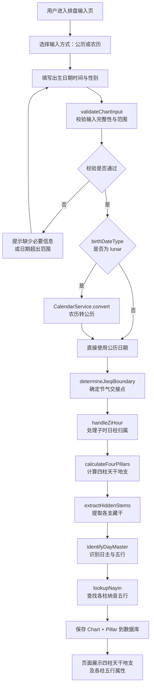
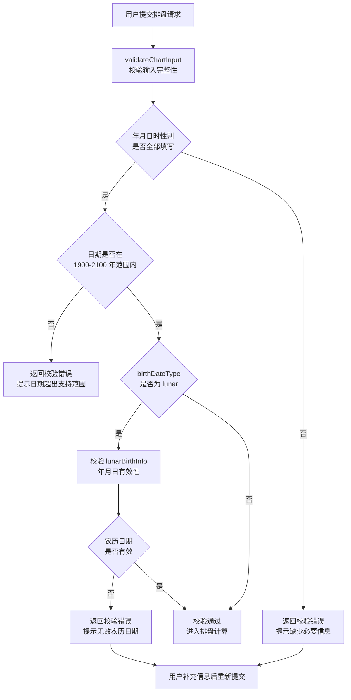
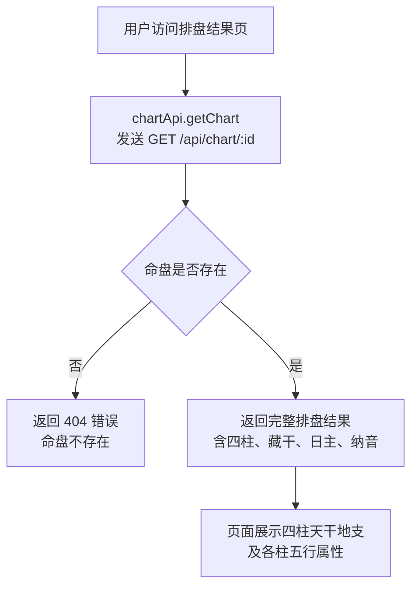
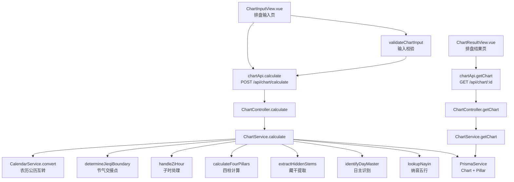

# 四柱排盘

> PRD Reference: docs/PRD/01. 八字排盘与历法模块/01. 四柱排盘/四柱排盘.md#四柱排盘

## 1. 业务流程

### 1.1 四柱排盘主流程

**触发**：用户在排盘输入页（`/chart`）填写出生信息并提交排盘请求。

**步骤**：

1. 用户进入排盘输入页，选择输入方式（公历或农历），填写出生日期时间与性别。
2. 前端调用 `validateChartInput()` 校验输入完整性（年月日时性别均需填写）与日期范围（1900–2100年）。
3. 校验通过后，前端调用 `chartApi.calculate()` 发送 `POST /api/chart/calculate` 请求。
4. 后端 `ChartController.calculate()` 接收请求，`ChartService.calculate()` 执行排盘计算：
   - 若 `birthDateType` 为 `"lunar"`，调用 `CalendarService.convert()` 将农历日期转换为公历日期。
   - 调用 `determineJieqiBoundary()` 确定出生时刻对应的节气交接点。
   - 调用 `handleZiHour()` 处理子时日柱归属。
   - 调用 `calculateFourPillars()` 计算四柱天干地支。
   - 调用 `extractHiddenStems()` 提取各支藏干（本气、中气、余气）。
   - 调用 `identifyDayMaster()` 识别日主天干及其五行属性。
   - 调用 `lookupNayin()` 查找各柱纳音五行。
5. 排盘结果（Chart + 四条 Pillar 记录）写入数据库，返回完整结果。
6. 前端跳转至排盘结果页（`/chart/result`），展示年柱、月柱、日柱、时柱的天干地支及各柱五行属性。

**预期结果**：用户输入出生信息后，系统计算并展示完整的八字四柱排盘结果。



### 1.2 排盘输入校验流程

**触发**：用户在排盘输入页提交前，或后端接收到排盘请求时。

**步骤**：

1. 前端 `validateChartInput()` 校验输入完整性：年、月、日、时、性别均需填写。
2. 若存在空字段，返回校验错误提示，用户补充信息后重新提交。
3. 校验日期范围：出生日期须在 1900–2100 年之间。
4. 若日期超出范围，返回错误提示。
5. 若输入方式为农历，额外校验 `lunarBirthInfo` 的年月日有效性（如闰月是否存在）。
6. 全部校验通过后，允许提交排盘请求。

**预期结果**：无效输入在提交前被拦截，有效输入进入排盘计算。



### 1.3 获取已保存排盘结果

**触发**：用户访问排盘结果页（`/chart/result`）时，或从命盘历史列表恢复排盘结果时。

**步骤**：

1. 前端通过 URL 参数或 Pinia store 中的 `chartId` 调用 `chartApi.getChart()` 发送 `GET /api/chart/:id` 请求。
2. 后端 `ChartController.getChart()` 接收请求，`ChartService.getChart(id)` 从数据库读取 Chart 及关联的 Pillar 记录。
3. 若命盘不存在，返回 404 错误。
4. 若命盘存在，返回完整的排盘结果（含四柱、藏干、日主、纳音）。

**预期结果**：用户可查看已保存的排盘结果，无需重新计算。



## 2. 关键函数设计

### 2.1 ChartService.calculate

```typescript
async function calculate(input: CalculateChartDto): Promise<ChartResult>
```

- **职责**：接收出生信息，执行完整的八字排盘计算并持久化结果。
- **核心逻辑**：
  1. 校验输入参数完整性（委托 `validateChartInput`）。
  2. 若 `birthDateType` 为 `"lunar"`，调用 `CalendarService.convert()` 将农历日期转换为公历日期。
  3. 调用 `determineJieqiBoundary()` 确定出生时刻对应的节气交接点，计算 `jieqiName`、`jieqiTime`、`isBeforeLichun`。
  4. 调用 `handleZiHour()` 根据出生时间与 `zhourule` 参数确定日柱归属。
  5. 调用 `calculateFourPillars()` 计算四柱天干地支（年柱以立春为界，月柱以节气为界）。
  6. 调用 `extractHiddenStems()` 提取四柱各支藏干（本气、中气、余气）。
  7. 调用 `identifyDayMaster()` 以日柱天干为日主，确定日主五行属性。
  8. 调用 `lookupNayin()` 查找各柱干支组合对应的纳音五行。
  9. 将 Chart 记录与四条 Pillar 记录写入数据库。
  10. 返回完整排盘结果。
- **PRD 追溯**：排盘输入页、四柱排盘结果页 — FR-01, FR-09, FR-10

### 2.2 ChartService.getChart

```typescript
async function getChart(id: number): Promise<ChartResult | null>
```

- **职责**：按命盘 ID 读取已保存的排盘结果（含四柱数据）。
- **核心逻辑**：
  1. 按 `id` 查询 `Chart` 表，同时预加载关联的 `Pillar` 记录。
  2. 若 `deletedAt` 不为 `null`（软删除），返回 `null`。
  3. 若记录不存在，返回 `null`（由 Controller 层返回 404）。
  4. 组装 `ChartResult` 返回。
- **PRD 追溯**：四柱排盘结果页 — FR-09

### 2.3 validateChartInput

```typescript
function validateChartInput(input: CalculateChartDto): ValidationResult
```

- **职责**：校验排盘输入参数的完整性与有效性。
- **核心逻辑**：
  1. 检查必填字段：`birthDateType`、`gender` 不可为空；`birthDateType` 为 `"solar"` 时 `birthDate` 必填，为 `"lunar"` 时 `lunarBirthInfo` 必填。
  2. 检查日期范围：1900–2100 年。
  3. 检查 `zhourule` 枚举值：仅允许 `"early_zi"` 或 `"late_zi"`。
  4. 返回 `ValidationResult`，包含是否通过与错误信息列表。
- **PRD 追溯**：排盘输入页（输入校验） — FR-09, NFR-02

### 2.4 calculateFourPillars

```typescript
function calculateFourPillars(solarDate: Date, jieqiInfo: JieqiInfo, zhourule: string): FourPillars
```

- **职责**：根据公历日期、节气信息与子时规则计算四柱天干地支。
- **核心逻辑**：
  1. **年柱**：以立春为年界。若出生时间在立春之前，年柱天干地支取上一年；否则取本年。
  2. **月柱**：以节气为月界。根据出生时间确定所处节气区间，取对应月柱天干地支。
  3. **日柱**：根据公历日期直接查表确定日柱天干地支。若出生时间在子时且 `zhourule` 为 `"late_zi"`，日柱归属次日。
  4. **时柱**：根据出生时辰确定时柱天干地支，时柱天干由日柱天干推算（五鼠遁法）。
- **PRD 追溯**：排盘输入页（四柱计算） — FR-01, FR-10

### 2.5 CalendarService.convert

```typescript
function convert(params: LunarSolarConvertDto): ConvertedDate
```

- **职责**：公历与农历日期互转。
- **核心逻辑**：
  1. 根据 `direction` 参数确定转换方向（`"lunar2solar"` 或 `"solar2lunar"`）。
  2. 查询内置万年历数据库进行转换。
  3. 农历转公历时，处理闰月（`isLeapMonth` 参数）。
  4. 转换结果在 1900–2100 年范围内误差率为零（URS NFR-02）。
- **PRD 追溯**：农历公历互转 — FR-10

### 2.6 determineJieqiBoundary

```typescript
function determineJieqiBoundary(solarDate: Date): JieqiInfo
```

- **职责**：确定出生时刻对应的节气交接点，用于年柱与月柱的划分。
- **核心逻辑**：
  1. 根据出生公历日期，在内置节气数据中查找出生时刻前后的节气交接时刻。
  2. 确定出生时刻所处的节气区间，返回当前节气名称与交接时刻。
  3. 判断出生时间是否在立春之前（`isBeforeLichun`），用于年柱归属判定。
- **PRD 追溯**：节气划分月柱 — FR-10

### 2.7 handleZiHour

```typescript
function handleZiHour(solarDate: Date, zhourule: string): ZiHourResult
```

- **职责**：根据子时处理规则确定日柱归属与时柱取法。
- **核心逻辑**：
  1. 判断出生时间是否在子时（23:00–01:00）。
  2. 若出生时刻在 23:00–00:00 且 `zhourule` 为 `"early_zi"`，日柱归属当日（早子时）。
  3. 若出生时刻在 23:00–00:00 且 `zhourule` 为 `"late_zi"`，日柱归属次日（夜子时）。
  4. 若出生时刻在 00:00–01:00，日柱归属新一日（正子时）。
  5. 返回调整后的日柱归属与子时处理标注。
- **PRD 追溯**：早子时与夜子时处理 — FR-10

## 3. 组件架构



## 4. 数据来源

- 天干地支推算核心库：`code/backend/src/modules/chart/lib/`（万年历数据与天干地支推算算法）
- 早子时夜子时处理逻辑：`code/backend/src/modules/chart/lib/zhourule.ts`
- 农历数据库与节气计算逻辑：`code/backend/src/modules/calendar/lib/`
- 纳音五行对照表：`code/backend/src/modules/chart/lib/nayin.ts`