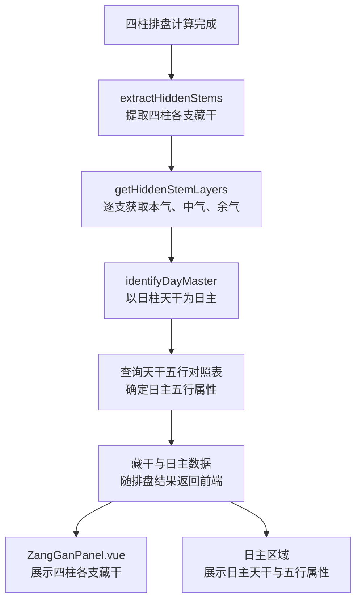
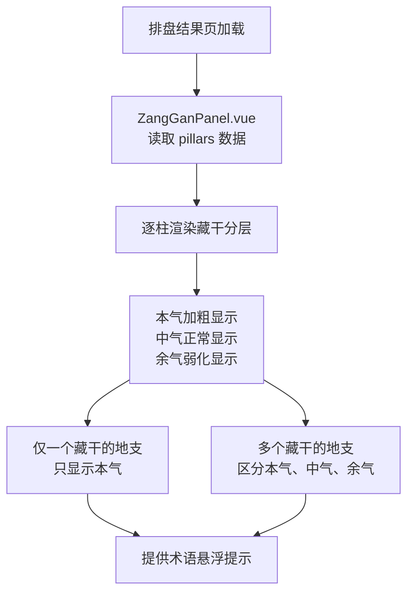
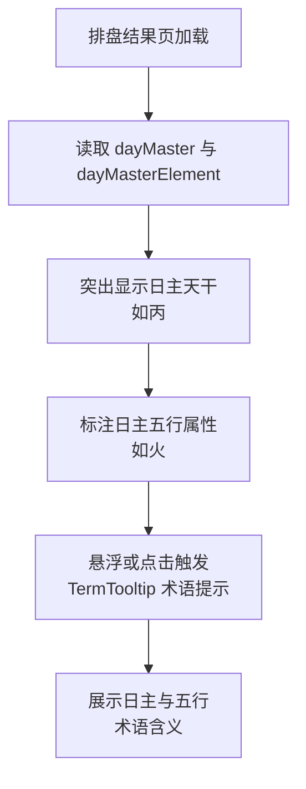
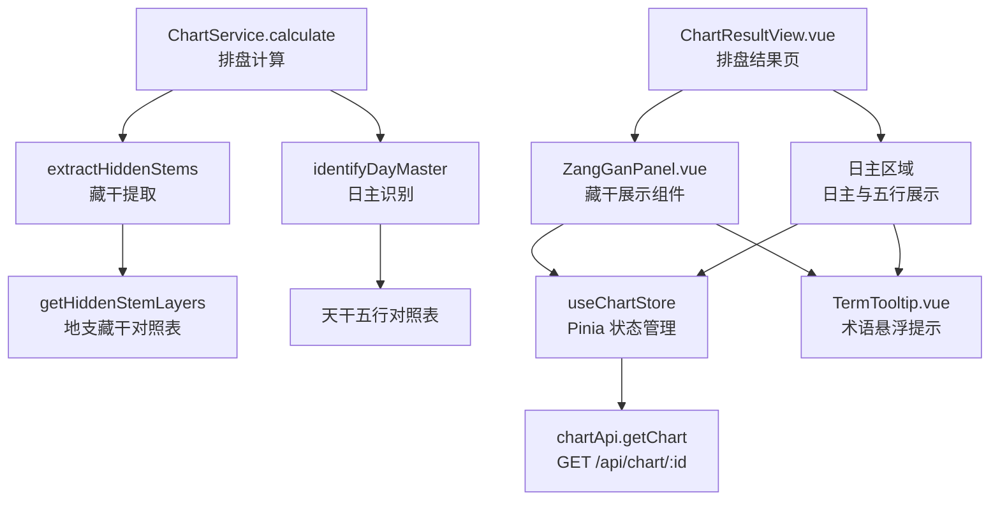

# 藏干与日主

> PRD Reference: docs/PRD/01. 八字排盘与历法模块/02. 藏干与日主/藏干与日主.md#藏干与日主

## 1. 业务流程

### 1.1 藏干提取与日主识别流程

**触发**：四柱排盘计算完成后，系统自动提取藏干并识别日主（作为 `ChartService.calculate()` 的内部步骤）。

**步骤**：

1. 四柱排盘计算完成（`calculateFourPillars()` 已返回四柱天干地支）。
2. 系统调用 `extractHiddenStems()`，逐一提取四柱各支的藏干。
3. 对每个地支，调用 `getHiddenStemLayers()` 获取本气、中气、余气三层藏干：
   - 本气（`mainQi`）：力量最强，所有地支均存在。
   - 中气（`middleQi`）：力量次于本气，部分地支存在。
   - 余气（`residualQi`）：力量最弱，少数地支存在。
4. 系统调用 `identifyDayMaster()`，以日柱天干为日主。
5. 根据《天干五行对照表》确定日主的五行属性（金/木/水/火/土）。
6. 藏干与日主数据随排盘结果一同返回前端。
7. 前端在排盘结果页的藏干区域展示四柱各支藏干，区分本气、中气、余气的主次关系；在日主区域展示日主天干与五行属性。

**预期结果**：用户在排盘结果页可查看每个地支的藏干分层与日主五行属性。



### 1.2 藏干展示交互

**触发**：用户在排盘结果页查看藏干信息。

**步骤**：

1. 排盘结果页加载后，`ZangGanPanel.vue` 组件从 `useChartStore` 中读取排盘结果的 `pillars` 数据。
2. 对每柱（年/月/日/时）的地支，渲染藏干分层展示：
   - 本气（主气）：加粗或突出显示，标注"本气"。
   - 中气：正常显示，标注"中气"。
   - 余气：较小字号或弱化显示，标注"余气"。
3. 对于仅有一个藏干的地支（如子仅藏癸），只显示本气，不显示中气与余气。
4. 对每柱地支的藏干，提供术语悬浮提示（`TermTooltip.vue`），展示藏干术语的含义。

**预期结果**：用户可清晰辨识各支藏干的主次关系，通过悬浮提示理解藏干术语。



### 1.3 日主与五行展示交互

**触发**：用户在排盘结果页查看日主信息。

**步骤**：

1. 排盘结果页加载后，日主区域从 `useChartStore` 中读取 `dayMaster`（日主天干）与 `dayMasterElement`（日主五行属性）。
2. 页面突出显示日主天干（如"丙"），并标注其五行属性（如"火"）。
3. 用户悬浮或点击日主五行属性时，`TermTooltip.vue` 展示日主与五行的术语含义。

**预期结果**：用户可直观识别日主及其五行属性，通过悬浮提示获取更深层理解。



## 2. 关键函数设计

### 2.1 extractHiddenStems

```typescript
function extractHiddenStems(pillars: FourPillars): HiddenStemResult[]
```

- **职责**：提取四柱各支的藏干数据，区分本气、中气、余气三层。
- **核心逻辑**：
  1. 遍历四柱（年/月/日/时），对每柱的地支调用 `getHiddenStemLayers()`。
  2. 根据地支藏干对照表，获取当前地支的藏干列表。
  3. 第一个藏干为本气（`mainQi`），力量最强。
  4. 第二个藏干为中气（`middleQi`），力量次于本气（若存在）。
  5. 第三个藏干为余气（`residualQi`），力量最弱（若存在）。
  6. 返回 `HiddenStemResult[]`，每项包含柱位、地支、藏干分层。
- **PRD 追溯**：藏干展示（区分藏干的主次关系） — FR-01

### 2.2 getHiddenStemLayers

```typescript
function getHiddenStemLayers(branch: string): HiddenStemLayers
```

- **职责**：根据地支查询其藏干列表，返回本气、中气、余气的分层结果。
- **核心逻辑**：
  1. 查询内置的地支藏干对照表（`code/backend/src/modules/chart/lib/zanggan.ts`）。
  2. 十二地支各有固定藏干组合：如寅（甲丙戊）本气为甲、中气为丙、余气为戊；子（癸）仅本气为癸。
  3. 返回 `HiddenStemLayers` 对象，`middleQi` 或 `residualQi` 为 `null` 表示该层不存在。
- **PRD 追溯**：藏干展示（区分藏干的主次关系） — FR-01

### 2.3 identifyDayMaster

```typescript
function identifyDayMaster(dayStem: string): DayMasterInfo
```

- **职责**：以日柱天干为日主，确定日主的五行属性。
- **核心逻辑**：
  1. 取日柱天干作为日主（`dayMaster`）。
  2. 查询天干五行对照表：甲乙→木、丙丁→火、戊己→土、庚辛→金、壬癸→水。
  3. 返回 `DayMasterInfo`，包含日主天干与五行属性。
- **PRD 追溯**：日主与五行展示 — FR-01

### 2.4 ZangGanPanel.vue 组件

```typescript
// 前端组件，从 useChartStore 读取排盘结果
// 无独立后端端点
```

- **职责**：在排盘结果页展示四柱各支的藏干分层。
- **核心逻辑**：
  1. 从 `useChartStore` 读取排盘结果的 `pillars` 数组。
  2. 对每柱渲染地支与藏干分层（本气加粗、中气正常、余气弱化）。
  3. 集成 `TermTooltip.vue` 为藏干术语提供悬浮提示。
- **PRD 追溯**：藏干展示 — FR-01, NFR-04

## 3. 组件架构



## 4. 数据来源

- 地支藏干对照表：`code/backend/src/modules/chart/lib/zanggan.ts`
- 天干五行对照表：`code/backend/src/modules/chart/lib/`（天干地支推算核心库）
- 藏干与日主数据随 `POST /api/chart/calculate` 响应返回，通过 `GET /api/chart/:id` 获取已保存结果
- 术语定义：`0.common/glossary.md`（藏干、本气、中气、余气、日主等术语）