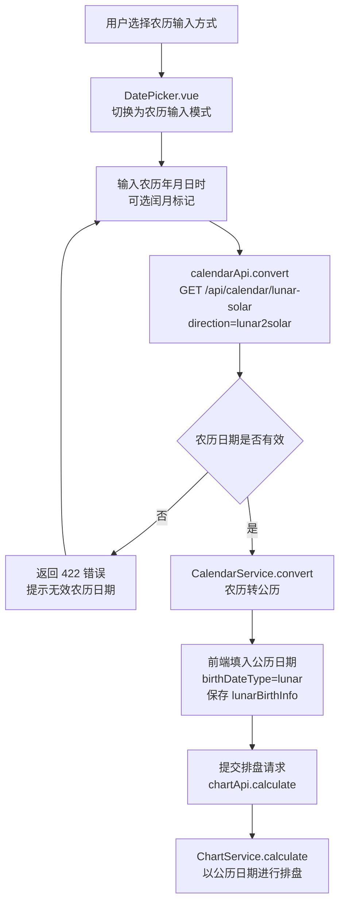
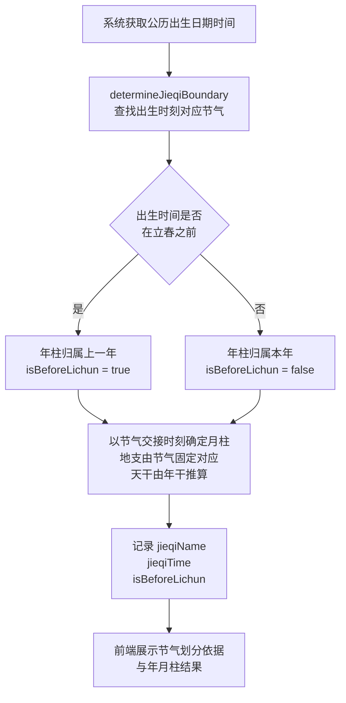
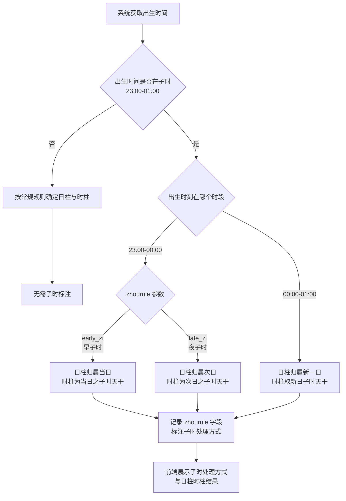
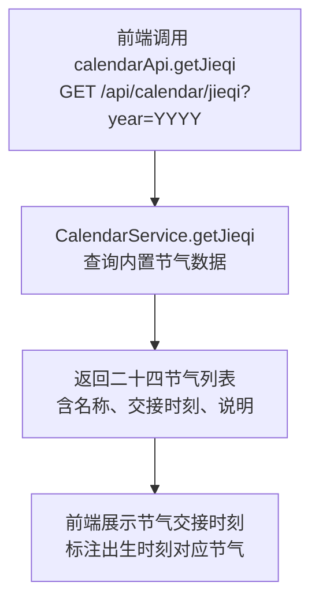
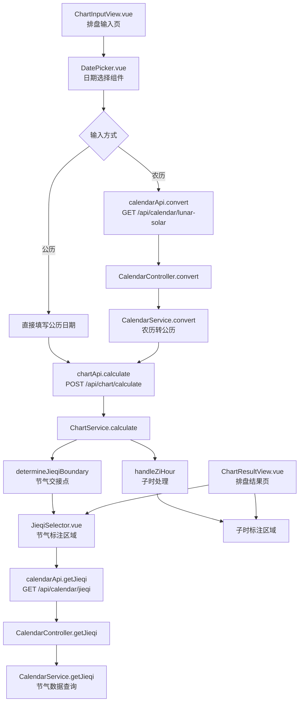

# 农历与节气

> PRD Reference: docs/PRD/01. 八字排盘与历法模块/03. 农历与节气/农历与节气.md#农历与节气

## 1. 业务流程

### 1.1 农历公历互转流程

**触发**：用户在排盘输入页选择农历输入方式后，输入农历年月日时并提交。

**步骤**：

1. 用户在排盘输入页选择"农历"输入方式，前端切换为农历日期输入组件（`DatePicker.vue` 农历模式）。
2. 用户输入农历年月日时，可选择闰月标记（`isLeapMonth`）。
3. 前端调用 `calendarApi.convert()` 发送 `GET /api/calendar/lunar-solar` 请求，`direction` 为 `"lunar2solar"`。
4. 后端 `CalendarService.convert()` 查询内置万年历数据库，将农历日期转换为公历日期。
5. 若农历日期无效（如闰月不存在），返回 422 错误提示。
6. 转换成功后，前端将公历日期填入 `birthDate` 字段，`birthDateType` 标记为 `"lunar"`，`lunarBirthInfo` 保存原始农历输入。
7. 前端调用 `chartApi.calculate()` 提交排盘请求，后端在计算前自动完成农历转公历。

**预期结果**：用户以农历方式输入出生日期后，系统自动转换为公历日期并完成排盘。



### 1.2 节气划分月柱流程

**触发**：排盘计算过程中，系统自动确定出生时刻对应的节气交接点，用于年柱与月柱的划分。

**步骤**：

1. 系统获取公历出生日期时间后，调用 `determineJieqiBoundary()` 查找出生时刻对应的节气交接时刻。
2. 判断出生时间是否在立春之前：
   - 若在立春之前，年柱天干地支取上一年，`isBeforeLichun = true`。
   - 若在立春之后（含立春时刻），年柱取本年，`isBeforeLichun = false`。
3. 根据出生时刻所处节气区间，确定月柱天干地支：
   - 月柱地支由节气固定对应（如立春后为寅月、惊蛰后为卯月等）。
   - 月柱天干由年柱天干推算（五虎遁法）。
4. 排盘结果中记录 `jieqiName`（节气名称）、`jieqiTime`（交接时刻）、`isBeforeLichun`（是否立春前）。
5. 前端在排盘结果页的节气标注区域展示节气划分依据与年月柱结果。

**预期结果**：年柱以立春为界、月柱以节气为界，排盘结果中标注节气划分依据。



### 1.3 早子时与夜子时处理流程

**触发**：排盘计算过程中，系统检测出生时间处于子时（23:00–01:00）时，根据用户选择的子时处理规则确定日柱归属。

**步骤**：

1. 系统获取出生时间后，调用 `handleZiHour()` 检测出生时刻是否在子时（23:00–01:00）。
2. 若出生时刻不在子时，按常规规则确定日柱与时柱。
3. 若出生时刻在子时：
   - **23:00–00:00 时段**：
     - 若 `zhourule` 为 `"early_zi"`（早子时），日柱归属当日，时柱为当日之子时天干。
     - 若 `zhourule` 为 `"late_zi"`（夜子时），日柱归属次日，时柱为次日之子时天干。
   - **00:00–01:00 时段**：日柱归属新一日，时柱取新日子时天干（早子时与夜子时规则一致）。
4. 排盘结果中记录 `zhourule` 字段，标注子时处理方式。
5. 前端在排盘结果页的子时标注区域展示子时处理方式与排盘结果。

**预期结果**：子时出生时间的日柱归属根据用户选择的规则正确处理，排盘结果中标注处理方式。



### 1.4 节气交接点查询

**触发**：用户在排盘输入页或排盘结果页查询指定年份的二十四节气交接时刻。

**步骤**：

1. 前端调用 `calendarApi.getJieqi()` 发送 `GET /api/calendar/jieqi?year=YYYY` 请求。
2. 后端 `CalendarService.getJieqi()` 查询内置节气数据，返回指定年份的二十四节气列表（含节气名称、交接时刻、说明）。
3. 前端在排盘结果页的节气标注区域展示出生时刻对应的节气名称与交接时刻。
4. 若年份参数为空，默认返回当前年份的节气数据。

**预期结果**：用户可查看指定年份的二十四节气交接时刻，排盘结果页标注出生时刻对应的节气。



## 2. 关键函数设计

### 2.1 CalendarService.convert

```typescript
function convert(params: LunarSolarConvertDto): ConvertedDate
```

- **职责**：公历与农历日期互转，支持农历闰月处理。
- **核心逻辑**：
  1. 根据 `direction` 参数确定转换方向（`"lunar2solar"` 或 `"solar2lunar"`）。
  2. 查询内置万年历数据库（`code/backend/src/modules/calendar/lib/`）。
  3. 农历转公历时：验证农历年月日有效性，处理闰月（`isLeapMonth` 参数）；转换结果在 1900–2100 年范围内误差率为零。
  4. 公历转农历时：返回农历年月日及闰月标记。
  5. 返回转换后的日期。
- **PRD 追溯**：农历公历互转 — FR-10

### 2.2 CalendarService.getJieqi

```typescript
function getJieqi(year: number): JieqiList
```

- **职责**：查询指定年份的二十四节气交接时刻。
- **核心逻辑**：
  1. 若 `year` 为空，默认使用当前年份。
  2. 校验年份范围（1900–2100），超出范围返回 422 错误。
  3. 从内置节气数据中计算指定年份的二十四节气交接时刻（精确到分钟级）。
  4. 返回 `JieqiList`，包含每个节气的名称、交接时刻与说明。
- **PRD 追溯**：节气划分月柱 — FR-10

### 2.3 determineJieqiBoundary

```typescript
function determineJieqiBoundary(solarDate: Date): JieqiInfo
```

- **职责**：确定出生时刻对应的节气交接点，用于年柱与月柱划分。
- **核心逻辑**：
  1. 根据出生公历日期，在二十四节气数据中查找出生时刻前后最近的节气交接点。
  2. 确定出生时刻所处的节气区间，返回当前节气名称与交接时刻。
  3. 判断出生时间是否在立春之前（`isBeforeLichun`），用于年柱归属判定。
- **PRD 追溯**：节气划分月柱 — FR-10

### 2.4 handleZiHour

```typescript
function handleZiHour(solarDate: Date, zhourule: string): ZiHourResult
```

- **职责**：根据子时处理规则确定日柱归属与时柱取法。
- **核心逻辑**：
  1. 判断出生时间是否在子时（23:00–01:00）。
  2. 23:00–00:00 时段：`zhourule` 为 `"early_zi"` 时日柱归属当日，为 `"late_zi"` 时日柱归属次日。
  3. 00:00–01:00 时段：日柱归属新一日，与 `zhourule` 无关。
  4. 返回 `ZiHourResult`，包含日柱归属标注与子时处理方式。
- **PRD 追溯**：早子时与夜子时处理 — FR-10

## 3. 组件架构



## 4. 数据来源

- 农历数据库与节气计算逻辑：`code/backend/src/modules/calendar/lib/`
- 万年历数据：内置静态数据库，覆盖 1900–2100 年范围，公历与农历互转误差率为零（URS NFR-02）
- 节气交接点精确到分钟级（URS NFR-02）
- 早子时夜子时处理逻辑：`code/backend/src/modules/chart/lib/zhourule.ts`