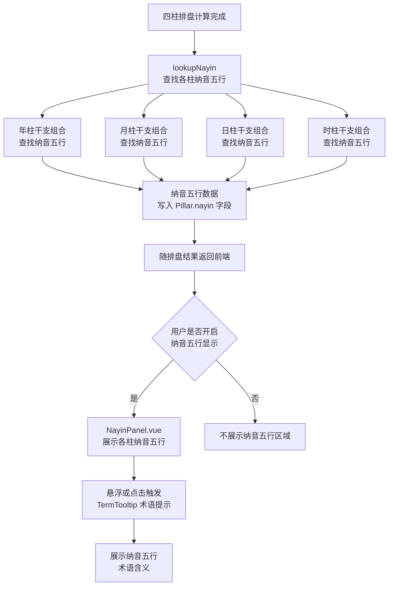
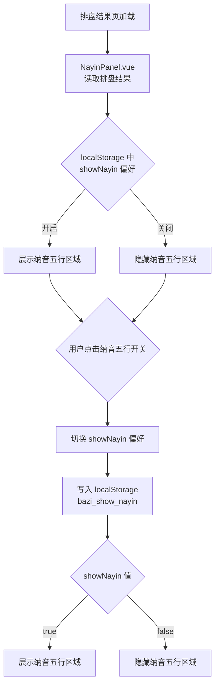
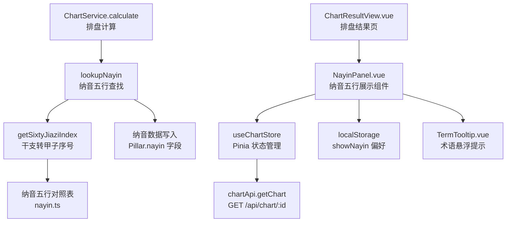

# 纳音五行

> PRD Reference: docs/PRD/01. 八字排盘与历法模块/04. 纳音五行/纳音五行.md#纳音五行

## 1. 业务流程

### 1.1 纳音五行计算与展示流程

**触发**：四柱排盘计算完成后，系统根据各柱干支组合查找纳音五行，用户可选择开启或关闭纳音五行显示。

**步骤**：

1. 四柱排盘计算完成（`calculateFourPillars()` 已返回四柱天干地支）。
2. 系统调用 `lookupNayin()`，对每柱干支组合查找纳音五行：
   - 年柱干支组合（如庚午）→ 纳音五行（路旁土）。
   - 月柱干支组合 → 纳音五行。
   - 日柱干支组合 → 纳音五行。
   - 时柱干支组合 → 纳音五行。
3. 纳音五行数据写入各柱的 `nayin` 字段，随排盘结果返回前端。
4. 前端 `NayinPanel.vue` 组件根据用户偏好决定是否展示纳音五行：
   - 用户选择开启纳音五行显示时，在每柱下方展示纳音五行属性（如"路旁土"）。
   - 用户选择关闭时，不展示纳音五行区域。
5. 用户悬浮或点击纳音五行名称时，`TermTooltip.vue` 展示纳音五行术语含义的悬浮提示。

**预期结果**：用户可选择是否查看各柱的纳音五行属性，并通过悬浮提示理解纳音含义。



### 1.2 纳音五行显示切换

**触发**：用户在排盘结果页切换纳音五行显示开关。

**步骤**：

1. 排盘结果页加载后，`NayinPanel.vue` 组件从 `useChartStore` 中读取排盘结果。
2. 组件检查用户偏好设置（本地存储 `showNayin` 标记，默认关闭）。
3. 若用户点击纳音五行开关：
   - 切换 `showNayin` 偏好标记。
   - 将偏好写入 localStorage（`bazi_show_nayin`）。
   - 根据切换后的状态，显示或隐藏纳音五行区域。
4. 纳音五行数据始终存在于排盘结果中，显示开关仅控制前端展示。

**预期结果**：用户可随时切换纳音五行的显示与隐藏，偏好持久化到本地存储。



## 2. 关键函数设计

### 2.1 lookupNayin

```typescript
function lookupNayin(stem: string, branch: string): string
```

- **职责**：根据天干地支组合查找对应的纳音五行属性。
- **核心逻辑**：
  1. 将天干地支组合映射为六十甲子序号（如庚午 → 第7甲子）。
  2. 查询内置纳音五行对照表（`code/backend/src/modules/chart/lib/nayin.ts`），按甲子序号获取纳音五行名称（如"海中金"、"炉中火"、"路旁土"等）。
  3. 返回纳音五行名称字符串。
- **PRD 追溯**：纳音五行显示 — FR-09

### 2.2 NayinPanel.vue 组件

```typescript
// 前端组件，从 useChartStore 读取排盘结果
// 无独立后端端点
```

- **职责**：在排盘结果页展示四柱各柱的纳音五行属性，支持显示/隐藏切换。
- **核心逻辑**：
  1. 从 `useChartStore` 读取排盘结果的 `pillars` 数组，提取各柱的 `nayin` 字段。
  2. 从 localStorage 读取 `bazi_show_nayin` 偏好（默认 `false`）。
  3. 根据偏好状态控制纳音五行区域的显示/隐藏。
  4. 用户点击切换开关时，更新偏好并写入 localStorage。
  5. 集成 `TermTooltip.vue` 为纳音五行术语提供悬浮提示。
- **PRD 追溯**：纳音五行显示（用户可选择开启或关闭） — FR-09, NFR-04

### 2.3 getSixtyJiaziIndex

```typescript
function getSixtyJiaziIndex(stem: string, branch: string): number
```

- **职责**：将天干地支组合转换为六十甲子序号。
- **核心逻辑**：
  1. 天干有 10 个（甲乙丙丁戊己庚辛壬癸），地支有 12 个（子丑寅卯辰巳午未申酉戌亥）。
  2. 六十甲子按天干地支组合顺序排列，甲子为第1号，乙丑为第2号，……，癸亥为第60号。
  3. 计算公式：`index = (stemIndex * 6 + branchIndex / 2) % 60 + 1`（干支必须阴阳属性一致才为合法甲子）。
  4. 若干支阴阳不一致（如甲丑），返回错误（非法甲子组合）。
- **PRD 追溯**：纳音五行显示 — FR-09

## 3. 组件架构



## 4. 数据来源

- 纳音五行对照表：`code/backend/src/modules/chart/lib/nayin.ts`（六十甲子与纳音五行的完整对照）
- 纳音五行数据随 `POST /api/chart/calculate` 响应返回，通过 `GET /api/chart/:id` 获取已保存结果
- 术语定义：`0.common/glossary.md`（纳音术语定义）