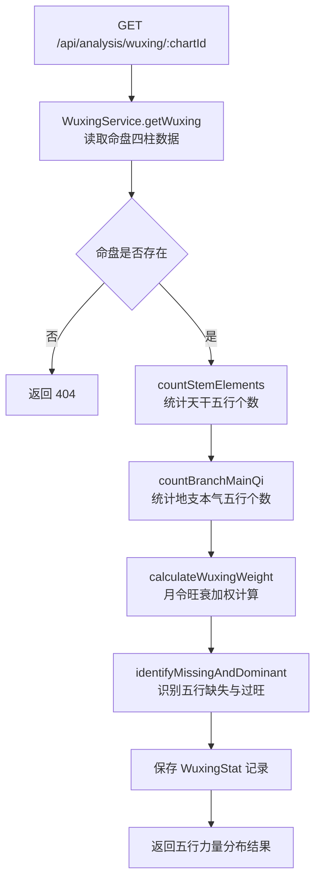
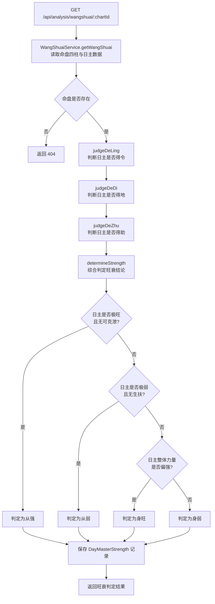
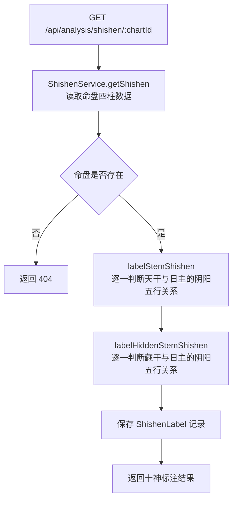
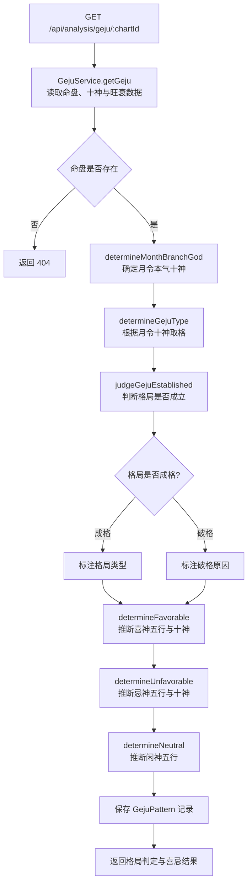

# API 设计 — 02. 五行与十神分析模块

## 概述

本模块提供四组 REST API，分别支撑五行力量统计、日主旺衰判定、十神标注、格局判定与喜忌四个子模块的前后端交互。四个端点均以 `chartId` 为入参，读取模块 01 的 Chart 与 Pillar 数据后进行计算分析，计算结果缓存至模块 02 的数据表。

所有端点遵循 `code-structure.md §4` 的路径与处理器约定，错误响应遵循 ADR-003（RFC7807 `application/problem+json`）。

## 1. 子模块 API 汇总

### 1.1 五行力量统计

| 方法 | 路径 | PRD 业务功能 | 说明 |
|------|------|-------------|------|
| GET | `/api/analysis/wuxing/:chartId` | 查看天干五行个数统计 | 统计四柱天干与地支本气五行分布，进行月令旺衰加权，识别缺失与过旺 |

### 1.2 日主旺衰判定

| 方法 | 路径 | PRD 业务功能 | 说明 |
|------|------|-------------|------|
| GET | `/api/analysis/wangshuai/:chartId` | 查看月令是否生扶日主（得令判断） | 综合得令、得地、得助三方面判定日主旺衰结论 |

### 1.3 十神标注

| 方法 | 路径 | PRD 业务功能 | 说明 |
|------|------|-------------|------|
| GET | `/api/analysis/shishen/:chartId` | 查看四柱天干十神标注 | 以日干为基准，逐一标注四柱天干与藏干的十神关系 |

### 1.4 格局判定与喜忌

| 方法 | 路径 | PRD 业务功能 | 说明 |
|------|------|-------------|------|
| GET | `/api/analysis/geju/:chartId` | 查看月令十神取格结果 | 由月令十神取格，判定格局类型与成败，给出喜忌初步论断 |

## 2. 端点详情

### 2.1 GET /api/analysis/wuxing/:chartId

**处理器**：`WuxingController.getWuxing()`
**服务**：`WuxingService`
**PRD 追溯**：查看天干五行个数统计、查看地支本气五行个数统计、查看月令旺衰加权后的五行力量分布、查看五行缺失标注、查看五行过旺标注

#### 请求

| 字段 | 类型 | 必填 | 约束 | 示例 |
|------|------|------|------|------|
| chartId | Int | 是 | 路径参数，有效命盘 ID | `1` |

#### 响应（200 OK）

| 字段 | 类型 | 说明 | 示例 |
|------|------|------|------|
| chartId | Int | 命盘 ID | `1` |
| metal | Float | 金的力量加权值 | `1.5` |
| wood | Float | 木的力量加权值 | `2.0` |
| water | Float | 水的力量加权值 | `0.0` |
| fire | Float | 火的力量加权值 | `3.5` |
| earth | Float | 土的力量加权值 | `1.8` |
| rawCounts | Object | 天干与地支本气五行原始个数统计 | 见下方 |
| rawCounts.stemCounts | Object | 天干五行个数 | `{"金":1,"木":2,"水":0,"火":1,"土":0}` |
| rawCounts.branchMainQiCounts | Object | 地支本气五行个数 | `{"金":0,"木":0,"水":1,"火":2,"土":1}` |
| missing | Array | 五行缺失列表 | `["水"]` |
| dominant | Array | 五行过旺列表 | `["火","土"]` |
| createdAt | String (ISO 8601) | 创建时间 | `"2024-01-01T00:00:00Z"` |

#### 错误响应

| HTTP 状态码 | 错误类型 | 说明 |
|------------|---------|------|
| 404 | `https://bazi.app/errors/chart-not-found` | 命盘 ID 不存在 |
| 500 | `https://bazi.app/errors/calculation-failed` | 五行统计计算内部错误 |

#### 流程图



---

### 2.2 GET /api/analysis/wangshuai/:chartId

**处理器**：`WangShuaiController.getWangShuai()`
**服务**：`WangShuaiService`
**PRD 追溯**：查看日主五行属性、查看月令是否生扶日主（得令判断）、查看日主在地支是否有根（得地判断）、查看日主在天干是否有助（得助判断）、查看日主旺衰结论（身旺、身弱、从强、从弱）

#### 请求

| 字段 | 类型 | 必填 | 约束 | 示例 |
|------|------|------|------|------|
| chartId | Int | 是 | 路径参数，有效命盘 ID | `1` |

#### 响应（200 OK）

| 字段 | 类型 | 说明 | 示例 |
|------|------|------|------|
| chartId | Int | 命盘 ID | `1` |
| dayMaster | String | 日主天干 | `"甲"` |
| dayMasterElement | String | 日主五行属性 | `"木"` |
| deLing | Object | 得令判定详情 | `{"result":true,"monthBranchElement":"火","relation":"生扶","description":"月令地支五行（火）生扶日主五行（木），日主得令"}` |
| deDi | Object | 得地判定详情 | `{"result":true,"branches":[{"position":"month","branch":"午","element":"火","isRoot":true}],"description":"日主在地支有根，得地"}` |
| deZhu | Object | 得助判定详情 | `{"result":false,"helpingStems":[],"description":"天干无同类或生扶日主者，不得助"}` |
| strength | String | 旺衰结论枚举 | `"strong"` |
| strengthLabel | String | 旺衰结论中文标签 | `"身旺"` |
| createdAt | String (ISO 8601) | 创建时间 | `"2024-01-01T00:00:00Z"` |

#### 错误响应

| HTTP 状态码 | 错误类型 | 说明 |
|------------|---------|------|
| 404 | `https://bazi.app/errors/chart-not-found` | 命盘 ID 不存在 |
| 422 | `https://bazi.app/errors/wuxing-not-calculated` | 五行统计尚未计算（需先调用五行统计接口） |
| 500 | `https://bazi.app/errors/calculation-failed` | 旺衰判定计算内部错误 |

#### 流程图



---

### 2.3 GET /api/analysis/shishen/:chartId

**处理器**：`ShishenController.getShishen()`
**服务**：`ShishenService`
**PRD 追溯**：查看四柱天干十神标注、查看地支藏干十神标注

#### 请求

| 字段 | 类型 | 必填 | 约束 | 示例 |
|------|------|------|------|------|
| chartId | Int | 是 | 路径参数，有效命盘 ID | `1` |

#### 响应（200 OK）

| 字段 | 类型 | 说明 | 示例 |
|------|------|------|------|
| chartId | Int | 命盘 ID | `1` |
| stemLabels | Object | 四柱天干十神标注 | `{"year":{"stem":"庚","god":"偏官"},"month":{"stem":"壬","god":"偏印"},"hour":{"stem":"戊","god":"食神"}}` |
| hiddenStemLabels | Object | 地支藏干十神标注 | 见 `00.database-design.md` 中 hiddenStemLabels JSON 结构定义 |
| createdAt | String (ISO 8601) | 创建时间 | `"2024-01-01T00:00:00Z"` |

#### 错误响应

| HTTP 状态码 | 错误类型 | 说明 |
|------------|---------|------|
| 404 | `https://bazi.app/errors/chart-not-found` | 命盘 ID 不存在 |
| 500 | `https://bazi.app/errors/calculation-failed` | 十神标注计算内部错误 |

#### 流程图



---

### 2.4 GET /api/analysis/geju/:chartId

**处理器**：`GejuController.getGeju()`
**服务**：`GejuService`
**PRD 追溯**：查看月令十神取格结果、查看格局类型判定、查看格局成败分析、查看喜神列表、查看忌神列表、查看闲神列表

#### 请求

| 字段 | 类型 | 必填 | 约束 | 示例 |
|------|------|------|------|------|
| chartId | Int | 是 | 路径参数，有效命盘 ID | `1` |

#### 响应（200 OK）

| 字段 | 类型 | 说明 | 示例 |
|------|------|------|------|
| chartId | Int | 命盘 ID | `1` |
| monthBranchGod | String | 月令本气十神 | `"正官"` |
| patternType | String | 格局类型 | `"正官格"` |
| isEstablished | Boolean | 格局是否成立 | `true` |
| breakReason | String? | 破格原因 | `null` |
| favorableElements | Array | 喜神五行列表 | `["水","木"]` |
| favorableGods | Array | 喜神十神列表 | `["正官","偏官"]` |
| unfavorableElements | Array | 忌神五行列表 | `["火","土"]` |
| unfavorableGods | Array | 忌神十神列表 | `["比肩","劫财"]` |
| neutralElements | Array | 闲神五行列表 | `["金"]` |
| createdAt | String (ISO 8601) | 创建时间 | `"2024-01-01T00:00:00Z"` |

#### 错误响应

| HTTP 状态码 | 错误类型 | 说明 |
|------------|---------|------|
| 404 | `https://bazi.app/errors/chart-not-found` | 命盘 ID 不存在 |
| 422 | `https://bazi.app/errors/wangshuai-not-calculated` | 旺衰判定尚未计算（需先调用旺衰判定接口） |
| 422 | `https://bazi.app/errors/shishen-not-calculated` | 十神标注尚未计算（需先调用十神标注接口） |
| 500 | `https://bazi.app/errors/calculation-failed` | 格局判定计算内部错误 |

#### 流程图



## 3. 数据模型映射

| 端点 | 读取表 | 写入表 | 说明 |
|------|--------|--------|------|
| `GET /api/analysis/wuxing/:chartId` | Chart, Pillar | WuxingStat | 读取排盘数据，计算并缓存五行统计 |
| `GET /api/analysis/wangshuai/:chartId` | Chart, Pillar, WuxingStat | DayMasterStrength | 读取排盘与五行数据，计算并缓存旺衰判定 |
| `GET /api/analysis/shishen/:chartId` | Chart, Pillar | ShishenLabel | 读取排盘数据，计算并缓存十神标注 |
| `GET /api/analysis/geju/:chartId` | Chart, Pillar, ShishenLabel, DayMasterStrength | GejuPattern | 读取十神与旺衰数据，计算并缓存格局判定 |

## 4. 错误处理总则

所有错误响应遵循 ADR-003（RFC7807 `application/problem+json`）：

```json
{
  "type": "https://bazi.app/errors/chart-not-found",
  "title": "命盘不存在",
  "status": 404,
  "detail": "chartId=999 对应的命盘记录不存在"
}
```

| HTTP 状态码 | 适用场景 |
|------------|---------|
| 404 | 命盘 ID 不存在 |
| 422 | 前置依赖数据尚未计算（旺衰需五行数据、格局需十神与旺衰数据） |
| 500 | 分析计算内部错误 |

## 5. 跨模块依赖

| 依赖方向 | 说明 |
|----------|------|
| 本模块 → 模块 01（八字排盘与历法） | 通过 `chartId` 引用 Chart + Pillar 数据进行五行与十神分析 |
| 模块 04（辨病与用神） → 本模块 | 辨病模块读取 WuxingStat、DayMasterStrength、ShishenLabel、GejuPattern 数据作为病机识别与用神推导的输入 |