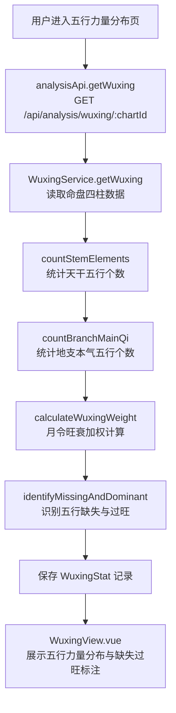
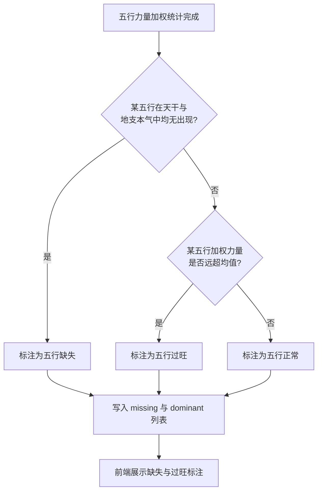
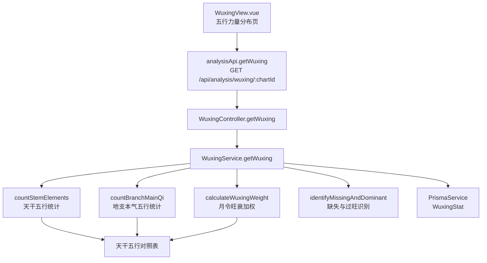

# 五行力量统计

> PRD Reference: docs/PRD/02. 五行与十神分析模块/01. 五行力量统计/五行力量统计.md#五行力量统计

## 1. 业务流程

### 1.1 五行力量统计主流程

**触发**：用户在五行力量分布页（`/analysis/wuxing`）查看命盘的五行分析。

**步骤**：

1. 用户进入五行力量分布页，前端从 `useAnalysisStore` 读取当前 `chartId`。
2. 前端调用 `analysisApi.getWuxing()` 发送 `GET /api/analysis/wuxing/:chartId` 请求。
3. 后端 `WuxingController.getWuxing()` 接收请求，`WuxingService.getWuxing()` 执行五行力量统计计算：
   - 调用 `countStemElements()` 统计四柱天干五行个数（金/木/水/火/土各出现几次）。
   - 调用 `countBranchMainQi()` 统计四柱地支本气五行个数。
   - 调用 `calculateWuxingWeight()` 以月令为基准进行五行旺衰加权计算（月令五行力量加权 1.5 倍）。
   - 调用 `identifyMissingAndDominant()` 识别五行缺失（天干与地支本气均无出现）与五行过旺（加权力量远超均值）。
4. 计算结果写入 `WuxingStat` 数据表，返回完整的五行力量分布结果。
5. 前端 `WuxingView.vue` 展示天干五行个数统计、地支本气五行个数统计、月令旺衰加权后的五行力量分布、五行缺失与过旺标注。

**预期结果**：用户可直观查看命盘的五行力量分布，识别五行缺失与过旺情况。



### 1.2 五行缺失与过旺识别流程

**触发**：五行力量加权统计完成后，系统自动识别缺失与过旺。

**步骤**：

1. 系统完成五行力量加权统计（`calculateWuxingWeight()` 已返回加权结果）。
2. 调用 `identifyMissingAndDominant()` 遍历金木水火土五行：
   - 若某五行在天干与地支本气中均无出现，标注该行为五行缺失。
   - 若某五行加权力量远超均值（超过均值 1.5 倍以上），标注该行为五行过旺。
   - 其余五行标注为正常。
3. 将缺失列表（`missing`）与过旺列表（`dominant`）写入 `WuxingStat` 记录。
4. 前端在五行力量分布页突出展示缺失与过旺标注。

**预期结果**：用户可识别命盘中五行缺失与过旺的病机信号，为后续辨病分析提供基础。



## 2. 关键函数设计

### 2.1 WuxingService.getWuxing

```typescript
async function getWuxing(chartId: number): Promise<WuxingResult>
```

- **职责**：接收命盘 ID，执行五行力量统计计算并持久化结果。
- **核心逻辑**：
  1. 按 `chartId` 查询 `Chart` 表及关联 `Pillar` 记录，验证命盘存在。
  2. 调用 `countStemElements()` 统计四柱天干五行个数。
  3. 调用 `countBranchMainQi()` 统计四柱地支本气五行个数。
  4. 调用 `calculateWuxingWeight()` 进行月令旺衰加权计算。
  5. 调用 `identifyMissingAndDominant()` 识别五行缺失与过旺。
  6. 将计算结果写入 `WuxingStat` 表（若已存在则更新）。
  7. 返回完整的五行力量分布结果。
- **PRD 追溯**：查看天干五行个数统计、查看地支本气五行个数统计、查看月令旺衰加权后的五行力量分布、查看五行缺失标注、查看五行过旺标注 — FR-02

### 2.2 countStemElements

```typescript
function countStemElements(pillars: Pillar[]): ElementCounts
```

- **职责**：统计四柱天干的五行个数分布。
- **核心逻辑**：
  1. 遍历四柱（年/月/日/时），对每柱的 `heavenlyStem`（天干）查询天干五行对照表（甲乙→木、丙丁→火、戊己→土、庚辛→金、壬癸→水）。
  2. 累计金/木/水/火/土各行的天干出现次数。
  3. 返回 `ElementCounts`，包含各五行个数与总计。
- **PRD 追溯**：查看天干五行个数统计 — FR-02

### 2.3 countBranchMainQi

```typescript
function countBranchMainQi(pillars: Pillar[]): ElementCounts
```

- **职责**：统计四柱地支本气的五行个数分布。
- **核心逻辑**：
  1. 遍历四柱，对每柱的 `earthlyBranch`（地支）获取其藏干中的本气（`mainQi`）。
  2. 查询本气天干的五行属性。
  3. 累计金/木/水/火/土各行的地支本气出现次数。
  4. 返回 `ElementCounts`，包含各五行个数与总计。
- **PRD 追溯**：查看地支本气五行个数统计 — FR-02

### 2.4 calculateWuxingWeight

```typescript
function calculateWuxingWeight(stemCounts: ElementCounts, branchCounts: ElementCounts, monthBranch: string): WuxingWeightResult
```

- **职责**：以月令为基准进行五行旺衰加权计算。
- **核心逻辑**：
  1. 将天干五行个数与地支本气五行个数合并为原始力量值。
  2. 确定月令地支（月柱地支）的五行属性。
  3. 对月令五行进行加权（力量值乘以 1.5 倍），体现"月令为旺衰基准"的传统命理规则。
  4. 归一化各五行力量值（各五行力量值 / 总力量值），使结果为相对比例。
  5. 返回 `WuxingWeightResult`，包含加权后的五行力量值。
- **PRD 追溯**：查看月令旺衰加权后的五行力量分布 — FR-02

### 2.5 identifyMissingAndDominant

```typescript
function identifyMissingAndDominant(weights: WuxingWeightResult, stemCounts: ElementCounts, branchCounts: ElementCounts): MissingAndDominantResult
```

- **职责**：识别五行缺失与五行过旺。
- **核心逻辑**：
  1. 遍历金/木/水/火/土五行，对每行检查天干与地支本气中是否均无出现——若均无，标记为缺失。
  2. 计算五行力量均值，对每行检查加权力量是否超过均值 1.5 倍——若超过，标记为过旺。
  3. 返回缺失列表（`missing`）与过旺列表（`dominant`）。
- **PRD 追溯**：查看五行缺失标注、查看五行过旺标注 — FR-02

## 3. 组件架构



## 4. 数据来源

- 天干五行对照表：`code/backend/src/modules/analysis/lib/wuxing-calculator.ts`
- 藏干数据：通过 `chartId` 引用模块 01 的 `Pillar.hiddenStems` 字段
- 术语定义：`0.common/glossary.md`（五行、月令、身旺、身弱等术语）