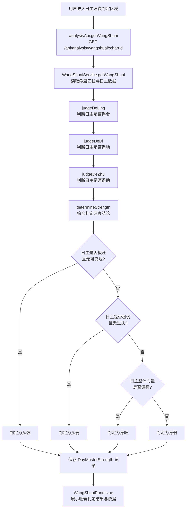
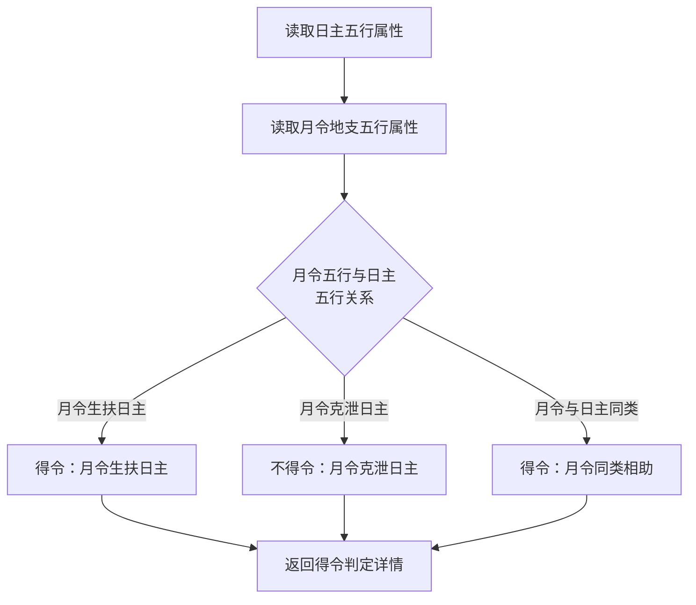
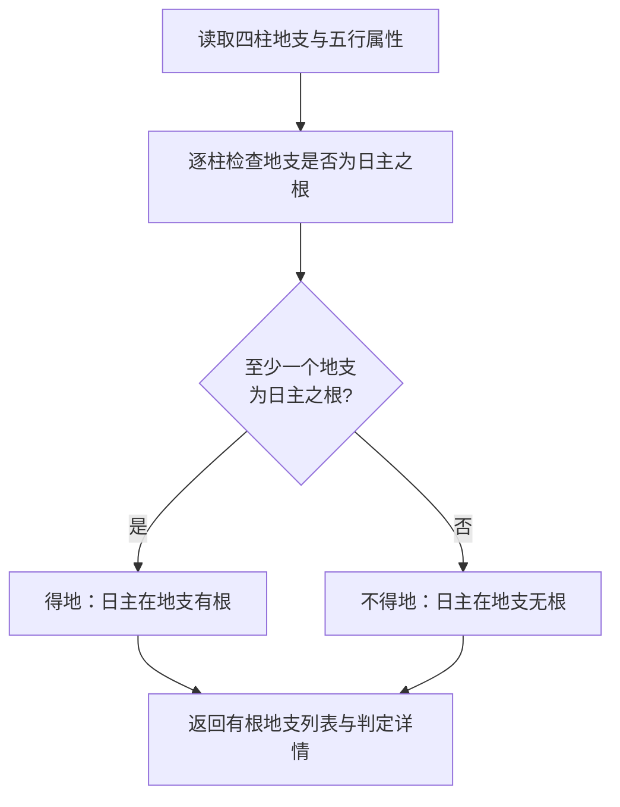
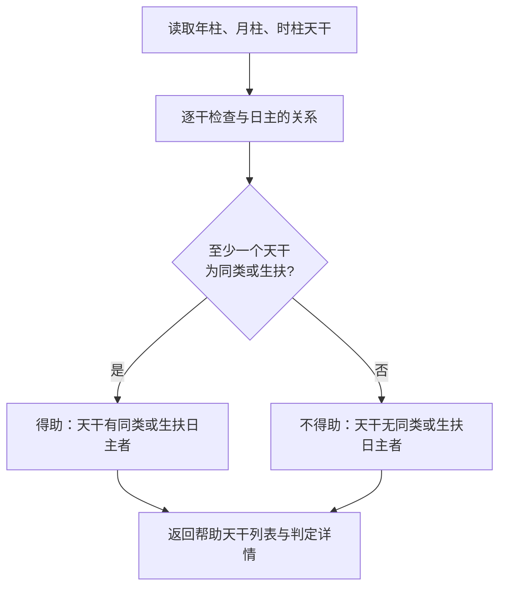
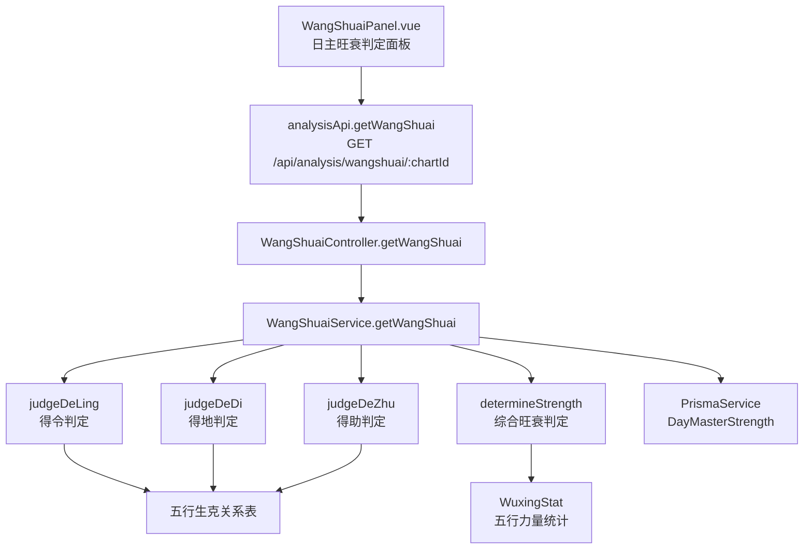

# 日主旺衰判定

> PRD Reference: docs/PRD/02. 五行与十神分析模块/02. 日主旺衰判定/日主旺衰判定.md#日主旺衰判定

## 1. 业务流程

### 1.1 日主旺衰判定主流程

**触发**：用户在日主旺衰判定页（`/analysis/wuxing`，内嵌旺衰面板）查看命盘的日主旺衰分析。

**步骤**：

1. 用户进入日主旺衰判定区域，前端从 `useAnalysisStore` 读取当前 `chartId`。
2. 前端调用 `analysisApi.getWangShuai()` 发送 `GET /api/analysis/wangshuai/:chartId` 请求。
3. 后端 `WangShuaiController.getWangShuai()` 接收请求，`WangShuaiService.getWangShuai()` 执行日主旺衰判定计算：
   - 调用 `judgeDeLing()` 判断日主是否得令（月令是否生扶日主）。
   - 调用 `judgeDeDi()` 判断日主是否得地（地支是否为日主之根）。
   - 调用 `judgeDeZhu()` 判断日主是否得助（天干是否有同类或生扶日主）。
   - 调用 `determineStrength()` 综合得令、得地、得助三方面判定日主旺衰结论。
4. 计算结果写入 `DayMasterStrength` 数据表，返回完整的旺衰判定结果。
5. 前端 `WangShuaiPanel.vue` 展示日主五行属性、得令/得地/得助判定依据、旺衰结论（身旺/身弱/从强/从弱）。

**预期结果**：用户可查看日主旺衰的判定过程与结论，理解得令、得地、得助的逐项判定依据。



### 1.2 得令判定流程

**触发**：作为旺衰判定的第一步，系统自动执行得令判定。

**步骤**：

1. 系统读取日主五行属性（`dayMasterElement`）与月令地支（月柱地支）的五行属性。
2. 调用 `judgeDeLing()` 查询月令地支五行与日主五行的生克关系：
   - 月令地支五行生扶日主五行（如月令为火、日主为木，火生木）→ 得令。
   - 月令地支五行克泄日主五行（如月令为金、日主为木，金克木）→ 不得令。
   - 月令地支五行与日主五行同类（如月令为木、日主为木）→ 得令（同类相助）。
3. 返回得令判定结果，包含月令地支五行、与日主的关系、判定描述。

**预期结果**：得令判定结果包含具体判定依据（月令五行与日主五行的生克关系），便于用户理解。



### 1.3 得地判定流程

**触发**：作为旺衰判定的第二步，系统自动执行得地判定。

**步骤**：

1. 系统读取四柱地支及其五行属性。
2. 调用 `judgeDeDi()` 逐一检查各柱地支是否为日主之根：
   - 地支五行与日主五行同类 → 该支为日主之根。
   - 地支五行生扶日主五行 → 该支为日主之偏根（生扶根）。
   - 其余地支不为日主之根。
3. 若至少有一个地支为日主之根或偏根，判定为得地；否则不得地。
4. 返回得地判定结果，包含有根的地支列表与判定描述。

**预期结果**：得地判定结果清晰展示日主在哪些地支有根，便于用户理解得地依据。



### 1.4 得助判定流程

**触发**：作为旺衰判定的第三步，系统自动执行得助判定。

**步骤**：

1. 系统读取四柱天干（年柱、月柱、时柱天干，排除日柱天干即日主本身）。
2. 调用 `judgeDeZhu()` 逐一检查各天干与日主的关系：
   - 天干与日主同类（同为比肩或劫财）→ 提供帮助。
   - 天干生扶日主（为印星）→ 提供帮助。
   - 其余天干不提供帮助。
3. 若至少有一个天干提供帮助，判定为得助；否则不得助。
4. 返回得助判定结果，包含提供帮助的天干列表与判定描述。

**预期结果**：得助判定结果展示哪些天干帮助日主，便于用户理解得助依据。



## 2. 关键函数设计

### 2.1 WangShuaiService.getWangShuai

```typescript
async function getWangShuai(chartId: number): Promise<WangShuaiResult>
```

- **职责**：接收命盘 ID，执行日主旺衰判定计算并持久化结果。
- **核心逻辑**：
  1. 按 `chartId` 查询 `Chart` 表及关联 `Pillar` 记录，验证命盘存在。
  2. 读取日主天干及其五行属性。
  3. 调用 `judgeDeLing()` 判断得令。
  4. 调用 `judgeDeDi()` 判断得地。
  5. 调用 `judgeDeZhu()` 判断得助。
  6. 调用 `determineStrength()` 综合判定旺衰结论。
  7. 将计算结果写入 `DayMasterStrength` 表（若已存在则更新）。
  8. 返回完整的旺衰判定结果。
- **PRD 追溯**：查看日主五行属性、查看月令是否生扶日主（得令判断）、查看日主在地支是否有根（得地判断）、查看日主在天干是否有助（得助判断）、查看日主旺衰结论 — FR-02

### 2.2 judgeDeLing

```typescript
function judgeDeLing(dayMasterElement: string, monthBranch: string): DeLingResult
```

- **职责**：判断日主是否得令（月令是否生扶日主）。
- **核心逻辑**：
  1. 查询月令地支（月柱地支）的五行属性。
  2. 判断月令五行与日主五行的生克关系：
     - 月令五行生扶日主五行（火生木、木生火、火生土、土生金、金生水、水生木）→ 得令。
     - 月令五行与日主五行同类 → 得令（同类相助）。
     - 月令五行克泄日主五行 → 不得令。
  3. 返回得令判定结果，包含月令地支五行、生克关系、判定描述。
- **PRD 追溯**：查看月令是否生扶日主（得令判断） — FR-02

### 2.3 judgeDeDi

```typescript
function judgeDeDi(dayMasterElement: string, pillars: Pillar[]): DeDiResult
```

- **职责**：判断日主是否得地（地支是否为日主之根）。
- **核心逻辑**：
  1. 遍历四柱地支（年/月/日/时），查询各支的五行属性。
  2. 对每个地支检查：
     - 地支五行与日主五行同类 → 为日主之根。
     - 地支五行生扶日主五行 → 为日主之偏根。
     - 其余 → 不为日主之根。
  3. 若至少有一个地支为日主之根或偏根，判定为得地。
  4. 返回得地判定结果，包含有根的地支列表与判定描述。
- **PRD 追溯**：查看日主在地支是否有根（得地判断） — FR-02

### 2.4 judgeDeZhu

```typescript
function judgeDeZhu(dayMasterElement: string, pillars: Pillar[]): DeZhuResult
```

- **职责**：判断日主是否得助（天干是否有同类或生扶日主）。
- **核心逻辑**：
  1. 读取年柱、月柱、时柱天干（排除日柱天干即日主本身）。
  2. 对每个天干检查其与日主的关系：
     - 天干五行与日主五行同类 → 提供帮助（比肩/劫财）。
     - 天干五行生扶日主五行 → 提供帮助（印星）。
     - 其余 → 不提供帮助。
  3. 若至少有一个天干提供帮助，判定为得助。
  4. 返回得助判定结果，包含提供帮助的天干列表与判定描述。
- **PRD 追溯**：查看日主在天干是否有助（得助判断） — FR-02

### 2.5 determineStrength

```typescript
function determineStrength(deLing: boolean, deDi: boolean, deZhu: boolean, wuxingStat: WuxingStat): StrengthResult
```

- **职责**：综合得令、得地、得助三方面判定日主旺衰结论。
- **核心逻辑**：
  1. 判断日主是否极旺（得令 + 得地 + 得助 且 五行统计中日主五行力量远超均值）→ 从强。
  2. 判断日主是否极弱（不得令 + 不得地 + 不得助 且 五行统计中日主五行力量远低于均值）→ 从弱。
  3. 若非极旺极弱，根据得令、得地、得助的综合情况：
     - 得令 + 得地/得助至少一项 → 身旺。
     - 不得令 + 不得地 + 不得助 → 身弱。
     - 其余情况根据五行力量综合判定（偏强→身旺，偏弱→身弱）。
  4. 返回旺衰结论枚举值与中文标签。
- **PRD 追溯**：查看日主旺衰结论（身旺、身弱、从强、从弱） — FR-02

## 3. 组件架构



## 4. 数据来源

- 五行生克关系表：`code/backend/src/modules/analysis/lib/wuxing-calculator.ts`
- 得令得地得助判定逻辑：`code/backend/src/modules/analysis/lib/wangshuai-judge.ts`
- 排盘数据：通过 `chartId` 引用模块 01 的 Chart + Pillar 数据
- 五行力量统计：引用本模块 `WuxingStat` 数据作为旺衰判定的辅助输入
- 术语定义：`0.common/glossary.md`（日主、身旺、身弱、从强、从弱、月令等术语）