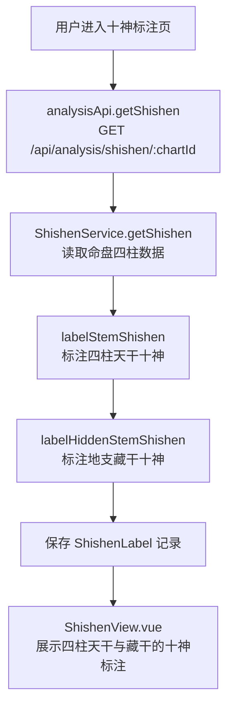
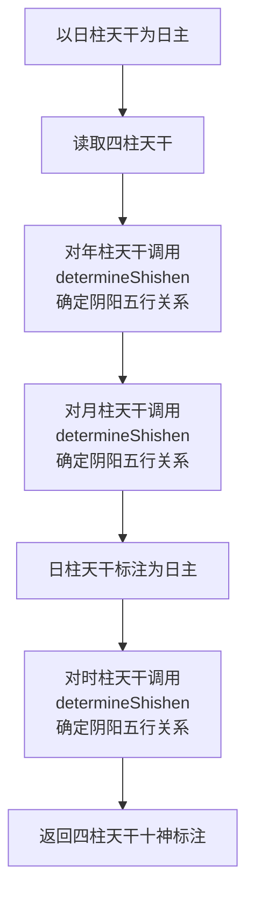
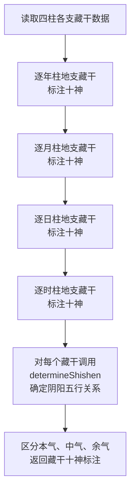
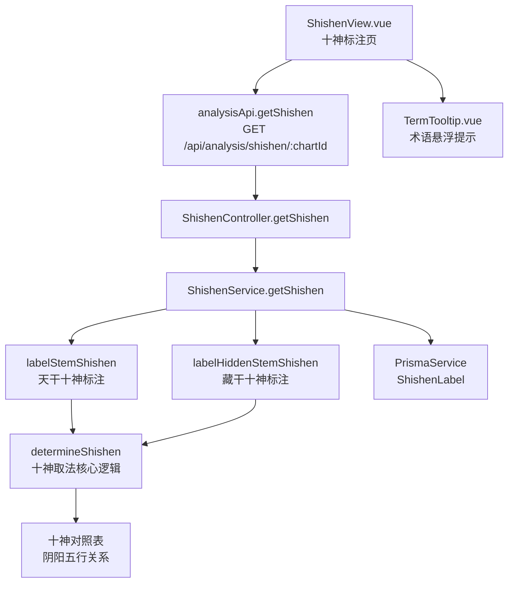

# 十神标注

> PRD Reference: docs/PRD/02. 五行与十神分析模块/03. 十神标注/十神标注.md#十神标注

## 1. 业务流程

### 1.1 十神标注主流程

**触发**：用户在十神标注页（`/analysis/shishen`）查看命盘的十神标注。

**步骤**：

1. 用户进入十神标注页，前端从 `useAnalysisStore` 读取当前 `chartId`。
2. 前端调用 `analysisApi.getShishen()` 发送 `GET /api/analysis/shishen/:chartId` 请求。
3. 后端 `ShishenController.getShishen()` 接收请求，`ShishenService.getShishen()` 执行十神标注计算：
   - 调用 `labelStemShishen()` 以日干为基准，逐一判断四柱天干与日主的阴阳五行关系，标注十神名称。
   - 调用 `labelHiddenStemShishen()` 逐一判断四柱地支藏干与日主的阴阳五行关系，标注十神名称。
4. 计算结果写入 `ShishenLabel` 数据表，返回完整的十神标注结果。
5. 前端 `ShishenView.vue` 展示四柱天干与藏干的十神标注结果。

**预期结果**：用户可查看四柱天干与藏干的十神关系标注，理解各天干与日主的生克关系。



### 1.2 天干十神标注流程

**触发**：十神标注的第一步，系统自动执行天干十神标注。

**步骤**：

1. 系统以日柱天干为日主（`dayMaster`），读取四柱天干（年柱天干、月柱天干、日柱天干、时柱天干）。
2. 对每个天干（日柱天干除外），调用 `determineShishen()` 判断其与日主的阴阳五行关系：
   - 确定该天干的五行属性与阴阳属性。
   - 确定该天干与日主五行的生克关系（生、克、同、泄、耗）。
   - 结合阴阳异同，确定十神名称（正官、偏官、正印、偏印、比肩、劫财、食神、伤官、正财、偏财）。
3. 日柱天干标注为"日主"。
4. 返回四柱天干十神标注结果。

**预期结果**：每个非日主天干都标注了对应的十神名称。



### 1.3 藏干十神标注流程

**触发**：十神标注的第二步，系统自动执行藏干十神标注。

**步骤**：

1. 系统读取四柱各支的藏干数据（本气、中气、余气）。
2. 对每个地支的每个藏干，调用 `determineShishen()` 判断其与日主的阴阳五行关系：
   - 本气藏干：力量最强，十神标注优先级最高。
   - 中气藏干：力量次之，十神标注次之。
   - 余气藏干：力量最弱，十神标注最低。
3. 对无中气或无余气的地支，对应字段标注为 `null`。
4. 返回地支藏干十神标注结果。

**预期结果**：每个地支的藏干都标注了对应的十神名称，区分本气、中气、余气的层次。



## 2. 关键函数设计

### 2.1 ShishenService.getShishen

```typescript
async function getShishen(chartId: number): Promise<ShishenResult>
```

- **职责**：接收命盘 ID，执行十神标注计算并持久化结果。
- **核心逻辑**：
  1. 按 `chartId` 查询 `Chart` 表及关联 `Pillar` 记录，验证命盘存在。
  2. 读取日主天干及其五行属性。
  3. 调用 `labelStemShishen()` 标注四柱天干十神。
  4. 调用 `labelHiddenStemShishen()` 标注地支藏干十神。
  5. 将计算结果写入 `ShishenLabel` 表（若已存在则更新）。
  6. 返回完整的十神标注结果。
- **PRD 追溯**：查看四柱天干十神标注、查看地支藏干十神标注 — FR-02

### 2.2 labelStemShishen

```typescript
function labelStemShishen(dayMaster: string, pillars: Pillar[]): StemLabelResult
```

- **职责**：以日干为基准，逐一标注四柱天干的十神名称。
- **核心逻辑**：
  1. 取日柱天干为日主，标注为 `"日主"`。
  2. 对年柱、月柱、时柱天干，分别调用 `determineShishen()` 计算十神名称。
  3. 返回 `StemLabelResult`，包含各柱位天干与十神名称。
- **PRD 追溯**：查看四柱天干十神标注 — FR-02

### 2.3 labelHiddenStemShishen

```typescript
function labelHiddenStemShishen(dayMaster: string, pillars: Pillar[]): HiddenStemLabelResult
```

- **职责**：以日干为基准，逐一标注四柱地支藏干的十神名称。
- **核心逻辑**：
  1. 遍历四柱，对每柱地支的藏干数据（本气、中气、余气）逐一处理。
  2. 对每个非空藏干，调用 `determineShishen()` 计算十神名称。
  3. 本气藏干标注优先级最高，中气次之，余气最低。
  4. 对无中气或无余气的地支，对应字段标注为 `null`。
  5. 返回 `HiddenStemLabelResult`，包含各柱位地支藏干与十神名称。
- **PRD 追溯**：查看地支藏干十神标注 — FR-02

### 2.4 determineShishen

```typescript
function determineShishen(dayMaster: string, targetStem: string): ShishenName
```

- **职责**：根据日主天干与目标天干的阴阳五行关系，确定十神名称。
- **核心逻辑**：
  1. 查询日主天干的五行属性与阴阳属性（如甲为阳木、乙为阴木）。
  2. 查询目标天干的五行属性与阴阳属性。
  3. 根据五行生克关系确定十神大类：
     - 同我者（五行相同）：比肩/劫财。
     - 我生者（日主生目标）：食神/伤官。
     - 我克者（日主克目标）：正财/偏财。
     - 克我者（目标克日主）：正官/偏官。
     - 生我者（目标生日主）：正印/偏印。
  4. 根据阴阳异同确定十神正偏：
     - 阴阳相同（同阳或同阴）：偏（偏官、偏印、偏财、劫财）。
     - 阴阳相异（一阳一阴）：正（正官、正印、正财、比肩为特例：同类同阴阳为比肩，同类异阴阳为劫财）。
  5. 返回十神名称字符串。
- **PRD 追溯**：十神取法核心逻辑 — FR-02

### 2.5 ShishenView.vue 组件

```typescript
// 前端组件，从 useAnalysisStore 读取十神标注数据
```

- **职责**：在十神标注页展示四柱天干与藏干的十神标注结果。
- **核心逻辑**：
  1. 从 `useAnalysisStore` 读取十神标注数据。
  2. 四柱天干区域：对年柱、月柱、日柱（日主）、时柱分别展示天干与十神名称。
  3. 藏干区域：对每柱地支的藏干分层展示本气、中气、余气的十神名称。
  4. 集成 `TermTooltip.vue` 为十神术语提供悬浮提示。
- **PRD 追溯**：查看四柱天干十神标注、查看地支藏干十神标注 — FR-02, NFR-04

## 3. 组件架构



## 4. 数据来源

- 十神取法核心逻辑：`code/backend/src/modules/analysis/lib/shishen-calculator.ts`
- 天干五行对照表与阴阳属性表：`code/backend/src/modules/analysis/lib/wuxing-calculator.ts`
- 排盘数据：通过 `chartId` 引用模块 01 的 Chart + Pillar 数据
- 藏干数据：引用模块 01 的 `Pillar.hiddenStems` 字段
- 术语定义：`0.common/glossary.md`（十神、日主、比肩、劫财等术语）