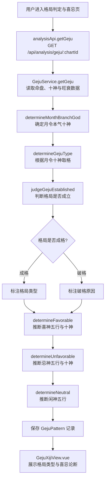
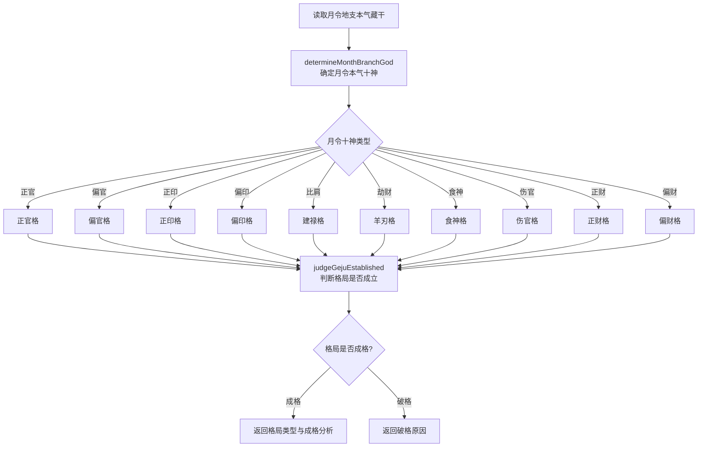
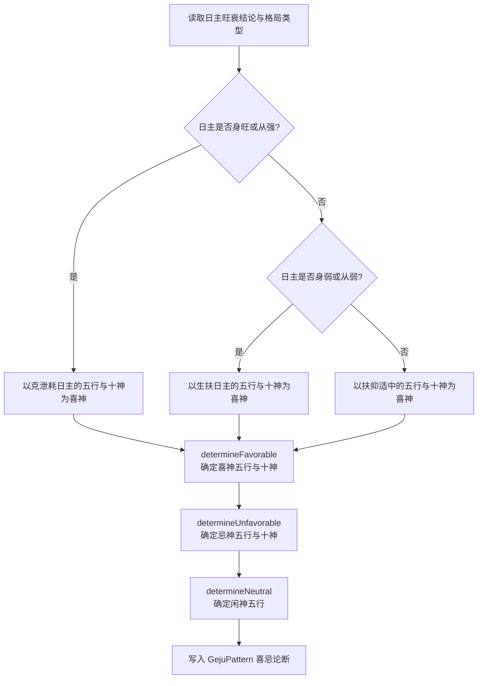
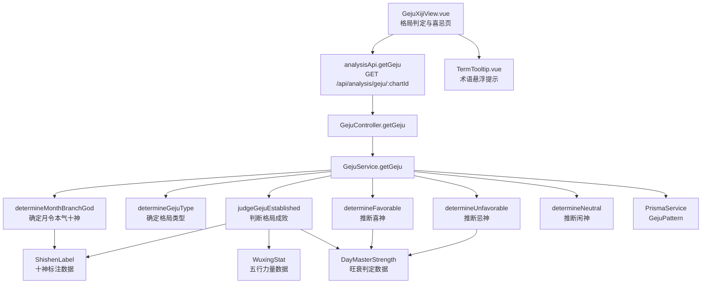

# 格局判定与喜忌

> PRD Reference: docs/PRD/02. 五行与十神分析模块/04. 格局判定与喜忌/格局判定与喜忌.md#格局判定与喜忌

## 1. 业务流程

### 1.1 格局判定主流程

**触发**：用户在格局判定与喜忌页（`/analysis/geju`）查看命盘的格局类型与喜忌论断。

**步骤**：

1. 用户进入格局判定与喜忌页，前端从 `useAnalysisStore` 读取当前 `chartId`。
2. 前端调用 `analysisApi.getGeju()` 发送 `GET /api/analysis/geju/:chartId` 请求。
3. 后端 `GejuController.getGeju()` 接收请求，`GejuService.getGeju()` 执行格局判定与喜忌推导：
   - 调用 `determineMonthBranchGod()` 确定月令本气十神（取格依据）。
   - 调用 `determineGejuType()` 根据月令十神确定格局类型（正官格、偏官格、食神格等）。
   - 调用 `judgeGejuEstablished()` 判断格局是否成立（成格或破格）。
   - 调用 `determineFavorable()` 推断喜神五行与十神。
   - 调用 `determineUnfavorable()` 推断忌神五行与十神。
   - 调用 `determineNeutral()` 推断闲神五行。
4. 计算结果写入 `GejuPattern` 数据表，返回完整的格局判定与喜忌论断。
5. 前端 `GejuXijiView.vue` 展示月令十神取格结果、格局类型与成败分析、喜忌初步论断。

**预期结果**：用户可查看命盘的格局类型、成败分析、喜忌五行与十神的初步论断。



### 1.2 格局判定详细流程

**触发**：作为格局判定的核心步骤，系统根据月令十神确定取格类型。

**步骤**：

1. 系统读取月令地支（月柱地支）的本气藏干。
2. 调用 `determineMonthBranchGod()` 确定月令本气十神：以日主为基准，判断月令本气藏干与日主的阴阳五行关系，得出月令十神名称。
3. 根据月令十神确定格局类型：
   - 月令十神为正官 → 正官格。
   - 月令十神为偏官（七杀）→ 偏官格。
   - 月令十神为正印 → 正印格。
   - 月令十神为偏印 → 偏印格。
   - 月令十神为比肩 → 建禄格（月令比肩非取正格）。
   - 月令十神为劫财 → 羊刃格（月令劫财非取正格）。
   - 月令十神为食神 → 食神格。
   - 月令十神为伤官 → 伤官格。
   - 月令十神为正财 → 正财格。
   - 月令十神为偏财 → 偏财格。
4. 调用 `judgeGejuEstablished()` 判断格局是否成立：
   - 成格条件：月令本气十神不受冲克、无破格之物。
   - 破格原因：月令被冲、用神受克、忌神当权等。
5. 返回格局类型与成败分析。

**预期结果**：用户可清晰了解命盘的格局类型与成败分析，理解取格依据。



### 1.3 喜忌初步论断流程

**触发**：格局判定与日主旺衰判定完成后，系统自动推断喜忌。

**步骤**：

1. 系统读取日主旺衰结论（`DayMasterStrength.strength`）与格局类型（`GejuPattern.patternType`）。
2. 根据日主旺衰确定喜忌方向：
   - **日主身旺或从强**：以克泄耗日主的五行与十神为喜神（官杀克、食伤泄、财星耗），以生扶日主的五行与十神为忌神（印星生、比劫扶）。
   - **日主身弱或从弱**：以生扶日主的五行与十神为喜神（印星生、比劫扶），以克泄耗日主的五行与十神为忌神（官杀克、食伤泄、财星耗）。
   - **日主中和**：以扶抑适中的五行与十神为喜神，以破坏格局平衡的五行与十神为忌神。
3. 调用 `determineFavorable()` 确定喜神五行与十神列表。
4. 调用 `determineUnfavorable()` 确定忌神五行与十神列表。
5. 调用 `determineNeutral()` 确定闲神五行列表。
6. 将喜忌论断结果写入 `GejuPattern` 记录。

**预期结果**：用户可查看命盘的喜神、忌神、闲神列表，理解喜忌推导的依据。



## 2. 关键函数设计

### 2.1 GejuService.getGeju

```typescript
async function getGeju(chartId: number): Promise<GejuResult>
```

- **职责**：接收命盘 ID，执行格局判定与喜忌推导计算并持久化结果。
- **核心逻辑**：
  1. 按 `chartId` 查询 `Chart` 表及关联 `Pillar` 记录，验证命盘存在。
  2. 读取十神标注数据（`ShishenLabel`）与旺衰判定数据（`DayMasterStrength`），若不存在则返回 422 错误。
  3. 调用 `determineMonthBranchGod()` 确定月令本气十神。
  4. 调用 `determineGejuType()` 根据月令十神确定格局类型。
  5. 调用 `judgeGejuEstablished()` 判断格局是否成立。
  6. 调用 `determineFavorable()` 推断喜神五行与十神。
  7. 调用 `determineUnfavorable()` 推断忌神五行与十神。
  8. 调用 `determineNeutral()` 推断闲神五行。
  9. 将计算结果写入 `GejuPattern` 表（若已存在则更新）。
  10. 返回完整的格局判定与喜忌论断。
- **PRD 追溯**：查看月令十神取格结果、查看格局类型判定、查看格局成败分析、查看喜神列表、查看忌神列表、查看闲神列表 — FR-02

### 2.2 determineMonthBranchGod

```typescript
function determineMonthBranchGod(dayMaster: string, monthBranch: string, hiddenStems: HiddenStemLayers): ShishenName
```

- **职责**：确定月令本气十神（取格依据）。
- **核心逻辑**：
  1. 读取月令地支（月柱地支）的本气藏干。
  2. 以日主天干为基准，调用 `determineShishen()` 判断月令本气藏干与日主的阴阳五行关系。
  3. 返回月令本气十神名称（如"正官"、"偏官"等）。
- **PRD 追溯**：查看月令十神取格结果 — FR-02

### 2.3 determineGejuType

```typescript
function determineGejuType(monthBranchGod: ShishenName): GejuType
```

- **职责**：根据月令十神确定格局类型。
- **核心逻辑**：
  1. 根据月令本气十神名称，映射到对应的格局类型：
     - 正官 → 正官格。
     - 偏官（七杀）→ 偏官格。
     - 正印 → 正印格。
     - 偏印 → 偏印格。
     - 比肩 → 建禄格。
     - 劫财 → 羊刃格。
     - 食神 → 食神格。
     - 伤官 → 伤官格。
     - 正财 → 正财格。
     - 偏财 → 偏财格。
  2. 返回格局类型字符串。
- **PRD 追溯**：查看格局类型判定 — FR-02

### 2.4 judgeGejuEstablished

```typescript
function judgeGejuEstablished(chartId: number, gejuType: GejuType, shishenLabels: ShishenLabel, wuxingStat: WuxingStat, dayMasterStrength: DayMasterStrength): GejuEstablishedResult
```

- **职责**：判断格局是否成立（成格或破格）。
- **核心逻辑**：
  1. 根据格局类型，确定成格条件与破格因素：
     - 正官格成格条件：正官不受冲克、无伤官破格。
     - 偏官格成格条件：七杀有制化、无食神制杀太过。
     - 食神格成格条件：食神不受枭印夺食、无偏印破格。
     - 其他格局类似，各有成格与破格规则。
  2. 检查命盘四柱天干与藏干中是否存在破格因素。
  3. 若存在破格因素，标记 `isEstablished = false` 并记录破格原因（`breakReason`）。
  4. 若无破格因素，标记 `isEstablished = true`。
  5. 返回格局成败分析结果。
- **PRD 追溯**：查看格局成败分析 — FR-02

### 2.5 determineFavorable

```typescript
function determineFavorable(strength: string, dayMasterElement: string): FavorableResult
```

- **职责**：根据日主旺衰结论推断喜神五行与十神。
- **核心逻辑**：
  1. 根据日主旺衰结论（`strength`）确定喜神方向：
     - 身旺或从强：喜神为克泄耗日主的五行与十神——官杀（克）、食伤（泄）、财星（耗）。
     - 身弱或从弱：喜神为生扶日主的五行与十神——印星（生）、比劫（扶）。
     - 中和：喜神为扶抑适中的五行与十神。
  2. 根据日主五行属性，映射到具体的喜神五行（如日主为木、身旺则喜金水火土中的克泄耗五行）。
  3. 映射到具体的喜神十神名称列表。
  4. 返回喜神五行列表与十神列表。
- **PRD 追溯**：查看喜神列表 — FR-02

### 2.6 determineUnfavorable

```typescript
function determineUnfavorable(strength: string, dayMasterElement: string): UnfavorableResult
```

- **职责**：根据日主旺衰结论推断忌神五行与十神。
- **核心逻辑**：
  1. 根据日主旺衰结论确定忌神方向：
     - 身旺或从强：忌神为生扶日主的五行与十神——印星（生）、比劫（扶）。
     - 身弱或从弱：忌神为克泄耗日主的五行与十神——官杀（克）、食伤（泄）、财星（耗）。
     - 中和：忌神为破坏格局平衡的五行与十神。
  2. 根据日主五行属性，映射到具体的忌神五行。
  3. 映射到具体的忌神十神名称列表。
  4. 返回忌神五行列表与十神列表。
- **PRD 追溯**：查看忌神列表 — FR-02

### 2.7 determineNeutral

```typescript
function determineNeutral(favorableElements: string[], unfavorableElements: string[]): string[]
```

- **职责**：推断闲神五行（既非喜神也非忌神的五行）。
- **核心逻辑**：
  1. 从金/木/水/火/土五行中，排除喜神五行与忌神五行。
  2. 剩余五行即为闲神五行。
  3. 返回闲神五行列表。
- **PRD 追溯**：查看闲神列表 — FR-02

### 2.8 GejuXijiView.vue 组件

```typescript
// 前端组件，从 useAnalysisStore 读取格局判定与喜忌数据
```

- **职责**：在格局判定与喜忌页展示格局类型、成败分析与喜忌论断。
- **核心逻辑**：
  1. 从 `useAnalysisStore` 读取格局判定数据。
  2. 格局类型区域：展示月令十神取格结果与格局类型。
  3. 格局成败区域：展示格局是否成立，若破格则展示破格原因。
  4. 喜忌论断区域：展示喜神、忌神、闲神的五行与十神列表。
  5. 集成 `TermTooltip.vue` 为格局与喜忌术语提供悬浮提示。
- **PRD 追溯**：查看格局类型判定、查看喜忌初步论断 — FR-02, NFR-04

## 3. 组件架构



## 4. 数据来源

- 格局取法与喜忌推导逻辑：`code/backend/src/modules/analysis/lib/geju-judge.ts`
- 十神取法核心逻辑：`code/backend/src/modules/analysis/lib/shishen-calculator.ts`
- 五行生克关系表：`code/backend/src/modules/analysis/lib/wuxing-calculator.ts`
- 排盘数据：通过 `chartId` 引用模块 01 的 Chart + Pillar 数据
- 十神标注数据：引用本模块 `ShishenLabel` 表
- 旺衰判定数据：引用本模块 `DayMasterStrength` 表
- 五行力量数据：引用本模块 `WuxingStat` 表
- 术语定义：`0.common/glossary.md`（格局、用神、喜神、忌神、仇神、闲神等术语）