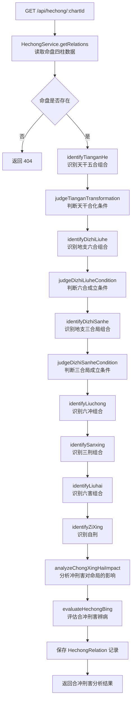

# API 设计 — 03. 合冲刑害分析模块

## 概述

本模块提供一组 REST API，支撑天干合化、地支合局、冲刑害分析与合冲刑害辨病四个子模块的前后端交互。根据 `code-structure.md §4`，四个子模块共用一个端点 `GET /api/hechong/:chartId`，该端点返回命盘的全量合冲刑害关系数据（含天干五合、地支六合三合、六冲三刑六害自刑识别结果与辨病判定），前端各子面板按需展示对应数据。

所有端点遵循 `code-structure.md §4` 的路径与处理器约定，错误响应遵循 ADR-003（RFC7807 `application/problem+json`）。

## 1. 子模块 API 汇总

### 1.1 天干合化

| 方法 | 路径 | PRD 业务功能 | 说明 |
|------|------|-------------|------|
| GET | `/api/hechong/:chartId` | 天干合化识别与展示 | 获取命盘全量合冲刑害数据，`tianganHe` 字段包含天干五合识别结果 |

### 1.2 地支合局

| 方法 | 路径 | PRD 业务功能 | 说明 |
|------|------|-------------|------|
| GET | `/api/hechong/:chartId` | 地支合局识别与展示 | 获取命盘全量合冲刑害数据，`dizhiLiuhe` + `dizhiSanhe` 字段包含地支六合与三合局识别结果 |

### 1.3 冲刑害分析

| 方法 | 路径 | PRD 业务功能 | 说明 |
|------|------|-------------|------|
| GET | `/api/hechong/:chartId` | 六冲分析、三刑分析、六害与自刑分析 | 获取命盘全量合冲刑害数据，`liuchong`、`sanxing`、`liuhai`、`ziXing` 字段包含冲刑害识别结果 |

### 1.4 合冲刑害辨病

| 方法 | 路径 | PRD 业务功能 | 说明 |
|------|------|-------------|------|
| GET | `/api/hechong/:chartId` | 合冲刑害辨病判定展示 | 获取命盘全量合冲刑害数据，`bingJudgments` 字段包含辨病判定结果 |

## 2. 端点详情

### 2.1 GET /api/hechong/:chartId

**处理器**：`HechongController.getRelations()`
**服务**：`HechongService`
**PRD 追溯**：查看天干五合组合列表、查看合化状态、查看合化成功组合的化出五行属性、查看合而不化组合的未化原因、查看地支六合组合列表、查看地支三合局组合列表、查看六合成立状态与力量等级、查看三合局是否三字齐全或半合局、查看六冲组合列表与冲力方向与受冲十神、查看三刑组合列表与刑力类型与受刑部位、查看六害组合列表与害力方向与受害十神、查看自刑列表与内部冲突影响、查看合冲刑害构成的病机清单、查看合绊用神病机的病位与病象、查看冲破格局病机的病位与病象、查看刑害伤喜神病机的病位与病象、查看未构成病机的合冲刑害关系列表

#### 请求

| 字段 | 类型 | 必填 | 约束 | 示例 |
|------|------|------|------|------|
| chartId | Int | 是 | 路径参数，有效命盘 ID | `1` |

#### 响应（200 OK）

| 字段 | 类型 | 说明 | 示例 |
|------|------|------|------|
| chartId | Int | 命盘 ID | `1` |
| tianganHe | Array | 天干五合识别结果 | 见 `00.database-design.md` 中 tianganHe JSON 结构定义 |
| dizhiLiuhe | Array | 地支六合识别结果 | 见 `00.database-design.md` 中 dizhiLiuhe JSON 结构定义 |
| dizhiSanhe | Array | 地支三合局识别结果 | 见 `00.database-design.md` 中 dizhiSanhe JSON 结构定义 |
| liuchong | Array | 六冲识别结果 | 见 `00.database-design.md` 中 liuchong JSON 结构定义 |
| sanxing | Array | 三刑识别结果 | 见 `00.database-design.md` 中 sanxing JSON 结构定义 |
| liuhai | Array | 六害识别结果 | 见 `00.database-design.md` 中 liuhai JSON 结构定义 |
| ziXing | Array | 自刑识别结果 | 见 `00.database-design.md` 中 ziXing JSON 结构定义 |
| bingJudgments | Array | 辨病判定结果 | 见 `00.database-design.md` 中 bingJudgments JSON 结构定义 |
| createdAt | String (ISO 8601) | 创建时间 | `"2024-01-01T00:00:00Z"` |

#### 错误响应

| HTTP 状态码 | 错误类型 | 说明 |
|------------|---------|------|
| 404 | `https://bazi.app/errors/chart-not-found` | 命盘 ID 不存在 |
| 422 | `https://bazi.app/errors/wuxing-not-calculated` | 五行统计尚未计算（需先调用五行统计接口） |
| 422 | `https://bazi.app/errors/shishen-not-calculated` | 十神标注尚未计算（辨病判定依赖十神数据） |
| 422 | `https://bazi.app/errors/geju-not-calculated` | 格局判定尚未计算（辨病判定依赖喜忌数据） |
| 500 | `https://bazi.app/errors/calculation-failed` | 合冲刑害分析计算内部错误 |

#### 流程图



## 3. 数据模型映射

| 端点 | 读取表 | 写入表 | 说明 |
|------|--------|--------|------|
| `GET /api/hechong/:chartId` | Chart, Pillar, WuxingStat, ShishenLabel, GejuPattern | HechongRelation | 读取排盘、五行、十神、格局数据，计算并缓存合冲刑害关系与辨病判定 |

## 4. 错误处理总则

所有错误响应遵循 ADR-003（RFC7807 `application/problem+json`）：

```json
{
  "type": "https://bazi.app/errors/chart-not-found",
  "title": "命盘不存在",
  "status": 404,
  "detail": "chartId=999 对应的命盘记录不存在"
}
```

| HTTP 状态码 | 适用场景 |
|------------|---------|
| 404 | 命盘 ID 不存在 |
| 422 | 前置依赖数据尚未计算（五行统计、十神标注、格局判定） |
| 500 | 合冲刑害分析计算内部错误 |

## 5. 跨模块依赖

| 依赖方向 | 说明 |
|----------|------|
| 本模块 → 模块 01（八字排盘与历法） | 通过 `chartId` 引用 Chart + Pillar 数据，读取四柱天干地支作为合冲刑害识别的输入 |
| 本模块 → 模块 02（五行与十神） | 通过 `chartId` 引用 WuxingStat（五行力量统计辅助合化条件判定）、ShishenLabel（十神标注辅助冲刑害受影响十神识别）、GejuPattern（格局与喜忌数据供辨病判定使用） |
| 模块 04（辨病与用神） → 本模块 | 辨病模块读取 HechongRelation 的 bingJudgments 数据作为八大病机中"合绊用神"、"冲破格局"、"刑害伤喜神"病机的输入 |
| 模块 06（大运流年） → 本模块 | 大运流年模块复用本模块的合冲刑害识别逻辑分析岁运冲合刑害 |