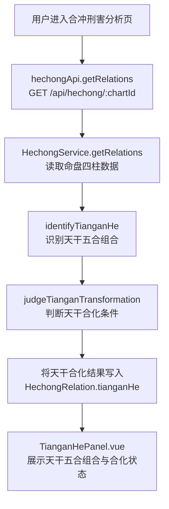
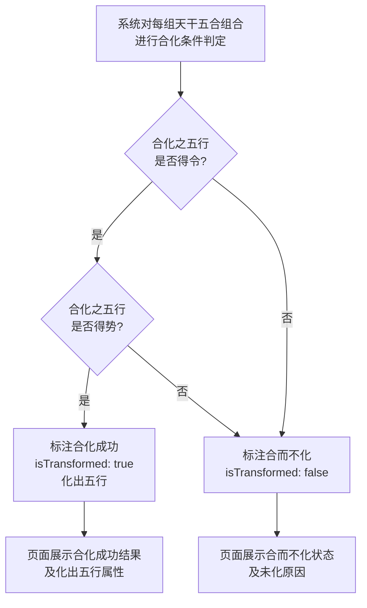
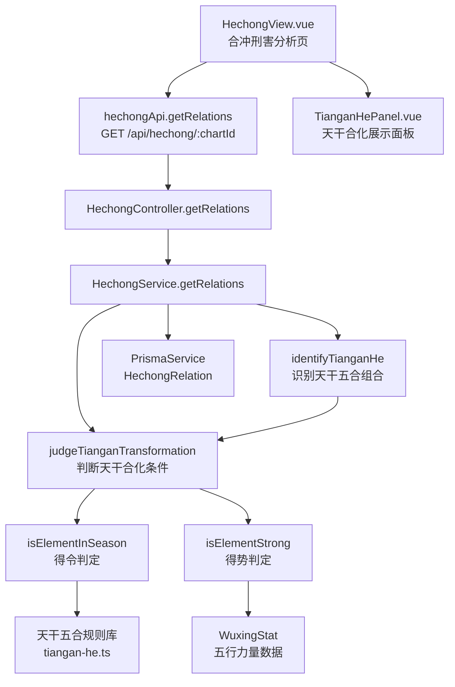

# 天干合化

> PRD Reference: docs/PRD/03. 合冲刑害分析模块/01. 天干合化/天干合化.md#天干合化

## 1. 业务流程

### 1.1 天干合化识别与判定主流程

**触发**：用户在合冲刑害分析页（`/hechong`）查看命盘的天干合化分析。

**步骤**：

1. 用户进入合冲刑害分析页，前端从 `useHechongStore` 读取当前 `chartId`。
2. 前端调用 `hechongApi.getRelations()` 发送 `GET /api/hechong/:chartId` 请求。
3. 后端 `HechongController.getRelations()` 接收请求，`HechongService.getRelations()` 执行合冲刑害分析计算，其中天干合化识别步骤：
   - 调用 `identifyTianganHe()` 从四柱天干中识别所有天干五合组合（甲己合、乙庚合、丙辛合、丁壬合、戊癸合）。
   - 调用 `judgeTianganTransformation()` 对每组五合组合判断合化是否成功。
4. 天干合化识别结果写入 `HechongRelation` 数据表的 `tianganHe` 字段。
5. 前端 `TianganHePanel.vue` 展示天干五合组合列表，每组标注合化状态（合化成功/合而不化）及化出五行属性。

**预期结果**：用户可查看命盘中所有天干五合组合及其合化状态与化出五行。



### 1.2 合化成功条件判定流程

**触发**：天干五合组合识别完成后，系统自动对每组五合组合判断合化是否成功。

**步骤**：

1. 系统对每组天干五合组合（如甲己合化土）进行合化条件判定。
2. 调用 `judgeTianganTransformation()` 依次检查：
   - 判断合化之五行是否得令（月令是否生扶该五行）：调用 `isElementInSeason()` 查询月令五行与合化五行的关系。
   - 若得令，进一步判断合化之五行是否得势（四柱中是否有足够力量生扶该五行）：调用 `isElementStrong()` 查询四柱五行分布。
   - 若得令且得势，判定合化成功，标注化出五行；若不满足任一条件，判定合而不化。
3. 合化成功组合标注 `isTransformed: true`、`transformCondition`（得令/得势条件）、`targetElement`（化出五行）。
4. 合而不化组合标注 `isTransformed: false`、`transformCondition: null`、`reason`（未化原因）。
5. 结果写入 `HechongRelation.tianganHe` 字段。

**预期结果**：用户可区分命盘中天干五合的合化成功与合而不化状态，并了解合化条件与未化原因。



## 2. 关键函数设计

### 2.1 HechongService.getRelations

```typescript
async function getRelations(chartId: number): Promise<HechongRelationResult>
```

- **职责**：接收命盘 ID，执行全量合冲刑害分析计算并持久化结果（天干合化为其中一部分）。
- **核心逻辑**：
  1. 按 `chartId` 查询 `Chart` 表及关联 `Pillar` 记录，验证命盘存在。
  2. 调用 `identifyTianganHe()` 识别天干五合组合。
  3. 调用 `judgeTianganTransformation()` 判断合化条件。
  4. 调用 `identifyDizhiLiuhe()` 识别地支六合组合。
  5. 调用 `judgeDizhiLiuheCondition()` 判断六合成立条件。
  6. 调用 `identifyDizhiSanhe()` 识别地支三合局组合。
  7. 调用 `judgeDizhiSanheCondition()` 判断三合局成立条件。
  8. 调用 `identifyLiuchong()` 识别六冲组合。
  9. 调用 `identifySanxing()` 识别三刑组合。
  10. 调用 `identifyLiuhai()` 识别六害组合。
  11. 调用 `identifyZiXing()` 识别自刑。
  12. 调用 `analyzeChongXingHaiImpact()` 分析冲刑害对命局的影响。
  13. 调用 `evaluateHechongBing()` 评估辨病判定。
  14. 将计算结果写入 `HechongRelation` 表（若已存在则更新）。
  15. 返回完整的合冲刑害分析结果。
- **PRD 追溯**：天干合化识别与展示、地支合局识别与展示、冲刑害分析与展示、合冲刑害辨病判定展示 — FR-06

### 2.2 identifyTianganHe

```typescript
function identifyTianganHe(pillars: Pillar[]): TianganHeResult[]
```

- **职责**：从四柱天干中识别所有天干五合组合。
- **核心逻辑**：
  1. 提取四柱天干及其柱位（年柱、月柱、日柱、时柱）。
  2. 遍历所有两两组合，查询天干五合规则表（甲己合化土、乙庚合化金、丙辛合化水、丁壬合化木、戊癸合化火）。
  3. 对每组匹配的五合组合，记录两天干及其柱位、组合名称、合化目标五行。
  4. 返回天干五合组合列表。
- **PRD 追溯**：查看天干五合组合列表 — FR-06

### 2.3 judgeTianganTransformation

```typescript
function judgeTianganHe(combinations: TianganHeResult[], wuxingStat: WuxingStat, monthBranch: string): TianganHeResult[]
```

- **职责**：对每组天干五合组合判断合化是否成功。
- **核心逻辑**：
  1. 遍历每组天干五合组合。
  2. 调用 `isElementInSeason(targetElement, monthBranch)` 判断合化之五行是否得令（月令是否生扶该五行）。
  3. 若得令，调用 `isElementStrong(targetElement, wuxingStat)` 判断合化之五行是否得势（四柱中是否有足够力量生扶该五行）。
  4. 得令且得势：标注 `isTransformed: true`，填充 `transformCondition` 与 `targetElement`。
  5. 不满足条件：标注 `isTransformed: false`，`transformCondition: null`，`reason` 注明未化原因（"合化之五行未得令" 或 "合化之五行得令但未得势"）。
  6. 返回带合化状态的五合组合列表。
- **PRD 追溯**：查看合化状态、查看合化成功组合的化出五行属性、查看合而不化组合的未化原因 — FR-06

### 2.4 isElementInSeason

```typescript
function isElementInSeason(element: string, monthBranch: string): boolean
```

- **职责**：判断某五行在月令是否得令（月令是否生扶该五行）。
- **核心逻辑**：
  1. 查询月令地支的本气五行属性。
  2. 判断月令五行与目标五行的生克关系：月令五行生扶目标五行或月令五行与目标五行为同类，则为得令。
  3. 返回得令判定结果。
- **PRD 追溯**：合化成功条件判定（得令判断） — FR-06

### 2.5 isElementStrong

```typescript
function isElementStrong(element: string, wuxingStat: WuxingStat): boolean
```

- **职责**：判断某五行在四柱中是否得势（是否有足够力量生扶该五行）。
- **核心逻辑**：
  1. 查询 `WuxingStat` 中目标五行的加权力量值。
  2. 计算生扶目标五行的五行力量之和（如目标为木，则生扶木的水的力量 + 木的自身力量）。
  3. 判断生扶力量是否超过总力量的均值（即是否得势）。
  4. 返回得势判定结果。
- **PRD 追溯**：合化成功条件判定（得势判断） — FR-06

## 3. 组件架构



## 4. 数据来源

- 天干五合规则库：`code/backend/src/modules/hechong/lib/tiangan-he.ts`
- 五行力量数据：通过 `chartId` 引用模块 02 的 `WuxingStat` 表
- 月令五行数据：通过 `chartId` 引用模块 01 的 `Pillar` 表（月柱地支）
- 术语定义：`0.common/glossary.md`（天干合化、合冲刑害等术语）