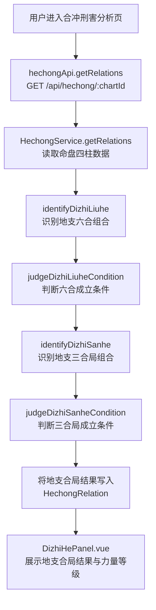
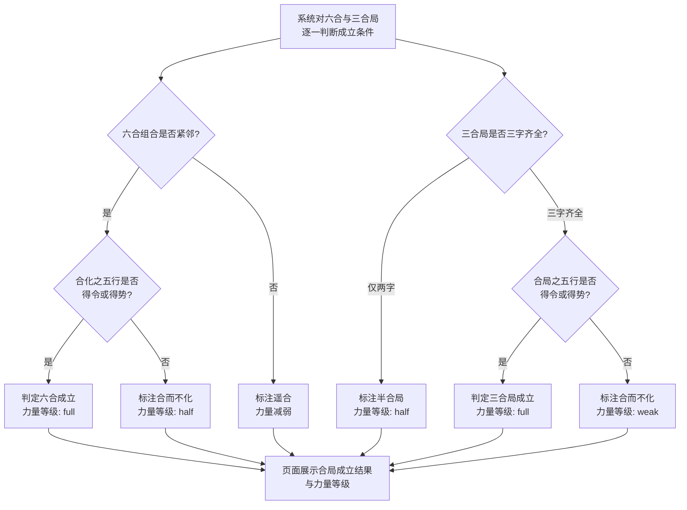
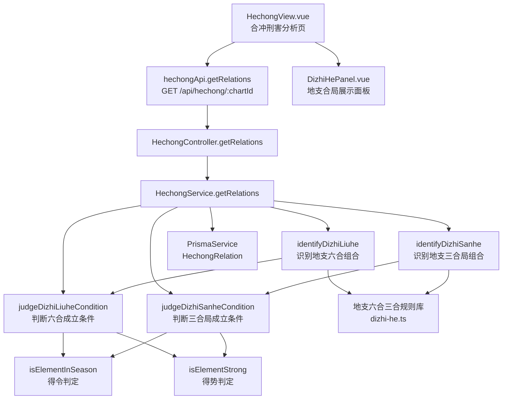

# 地支合局

> PRD Reference: docs/PRD/03. 合冲刑害分析模块/02. 地支合局/地支合局.md#地支合局

## 1. 业务流程

### 1.1 地支合局识别主流程

**触发**：用户在合冲刑害分析页（`/hechong`）查看命盘的地支合局分析。

**步骤**：

1. 用户进入合冲刑害分析页，前端从 `useHechongStore` 读取当前 `chartId`。
2. 前端调用 `hechongApi.getRelations()` 发送 `GET /api/hechong/:chartId` 请求。
3. 后端 `HechongController.getRelations()` 接收请求，`HechongService.getRelations()` 执行合冲刑害分析计算，其中地支合局识别步骤：
   - 调用 `identifyDizhiLiuhe()` 从四柱地支中识别所有地支六合组合。
   - 调用 `judgeDizhiLiuheCondition()` 对每组六合判断合局是否成立。
   - 调用 `identifyDizhiSanhe()` 从四柱地支中识别所有地支三合局组合。
   - 调用 `judgeDizhiSanheCondition()` 对每组三合局判断合局是否成立。
4. 地支合局识别结果写入 `HechongRelation` 数据表的 `dizhiLiuhe` 与 `dizhiSanhe` 字段。
5. 前端 `DizhiHePanel.vue` 展示地支六合组合列表与三合局组合列表，标注成立状态与力量等级。

**预期结果**：用户可查看命盘中所有地支六合与三合局组合及其成立状态与力量等级。



### 1.2 六合与三合局成立条件判定流程

**触发**：地支合局组合识别完成后，系统自动对每组六合与三合局判断成立条件。

**步骤**：

1. 系统对每组六合组合逐一判断成立条件：
   - 调用 `judgeDizhiLiuheCondition()` 判断六合两支是否紧邻（相邻柱位为紧邻，否则为遥合）。
   - 若紧邻，进一步判断合化之五行是否得令或得势：调用 `isElementInSeason()` 与 `isElementStrong()`。
   - 紧邻且得令/得势：六合成立，力量等级为 `"full"`。
   - 紧邻但不得令不得势：合而不化，力量等级为 `"half"`。
   - 非紧邻（遥合）：力量减弱，力量等级为 `"reduced"`，标注遥合状态。
2. 系统对每组三合局逐一判断成立条件：
   - 调用 `judgeDizhiSanheCondition()` 判断三合局是否三字齐全。
   - 三字齐全：进一步判断合局之五行是否得令或得势。
     - 得令/得势：三合局成立，力量等级为 `"full"`。
     - 不得令不得势：合而不化，力量等级为 `"weak"`。
   - 仅两字：标注半合局，力量等级为 `"half"`。
3. 判定结果写入 `HechongRelation` 对应字段。

**预期结果**：用户可区分命盘中地支六合与三合局的成立状态、力量等级以及遥合/半合/合而不化等中间状态。



## 2. 关键函数设计

### 2.1 identifyDizhiLiuhe

```typescript
function identifyDizhiLiuhe(pillars: Pillar[]): DizhiLiuheResult[]
```

- **职责**：从四柱地支中识别所有地支六合组合。
- **核心逻辑**：
  1. 提取四柱地支及其柱位。
  2. 遍历所有两两地支组合，查询地支六合规则表（子丑合土、寅亥合木、卯戌合火、辰酉合金、巳申合水、午未合土）。
  3. 对每组匹配的六合组合，记录两地支及其柱位、组合名称、合出五行。
  4. 返回地支六合组合列表。
- **PRD 追溯**：查看地支六合组合列表 — FR-06

### 2.2 judgeDizhiLiuheCondition

```typescript
function judgeDizhiLiuheCondition(combinations: DizhiLiuheResult[], wuxingStat: WuxingStat, pillars: Pillar[]): DizhiLiuheResult[]
```

- **职责**：对每组地支六合组合判断合局是否成立。
- **核心逻辑**：
  1. 遍历每组六合组合。
  2. 判断两支是否紧邻（柱位差为 1 则紧邻）。
  3. 若紧邻：调用 `isElementInSeason()` 与 `isElementStrong()` 判断合化五行是否得令或得势。
    - 得令或得势：六合成立，`isEstablished: true`，`strength: "full"`。
    - 不得令且不得势：合而不化，`isEstablished: false`，`strength: "half"`。
  4. 若非紧邻（遥合）：力量减弱，`isEstablished: false`，`isAdjacent: false`，`strength: "reduced"`。
  5. 返回带成立状态的六合组合列表。
- **PRD 追溯**：查看六合成立状态与力量等级 — FR-06

### 2.3 identifyDizhiSanhe

```typescript
function identifyDizhiSanhe(pillars: Pillar[]): DizhiSanheResult[]
```

- **职责**：从四柱地支中识别所有地支三合局组合。
- **核心逻辑**：
  1. 提取四柱地支及其柱位。
  2. 遍历所有三支组合（含两支），查询地支三合局规则表（申子辰合水局、亥卯未合木局、寅午戌合火局、巳酉丑合金局）。
  3. 对每组匹配的三合局：若三字齐全，标注 `isComplete: true`；若仅两字，标注 `isComplete: false`（半合局）。
  4. 返回地支三合局组合列表。
- **PRD 追溯**：查看地支三合局组合列表、查看三合局是否三字齐全或半合局 — FR-06

### 2.4 judgeDizhiSanheCondition

```typescript
function judgeDizhiSanheCondition(combinations: DizhiSanheResult[], wuxingStat: WuxingStat, monthBranch: string): DizhiSanheResult[]
```

- **职责**：对每组地支三合局组合判断合局是否成立。
- **核心逻辑**：
  1. 遍历每组三合局组合。
  2. 若三字齐全：调用 `isElementInSeason()` 与 `isElementStrong()` 判断合局之五行是否得令或得势。
    - 得令或得势：三合局成立，`isEstablished: true`，`strength: "full"`。
    - 不得令且不得势：合而不化，`isEstablished: false`，`strength: "weak"`。
  3. 若仅两字（半合局）：力量减弱，`isEstablished: false`，`strength: "half"`。
  4. 返回带成立状态的三合局组合列表。
- **PRD 追溯**：查看六合成立状态与力量等级、查看三合局是否三字齐全或半合局 — FR-06

## 3. 组件架构



## 4. 数据来源

- 地支六合三合规则库：`code/backend/src/modules/hechong/lib/dizhi-he.ts`
- 五行力量数据：通过 `chartId` 引用模块 02 的 `WuxingStat` 表
- 月令五行数据：通过 `chartId` 引用模块 01 的 `Pillar` 表（月柱地支）
- 术语定义：`0.common/glossary.md`（六合、三合局、遥合等术语）