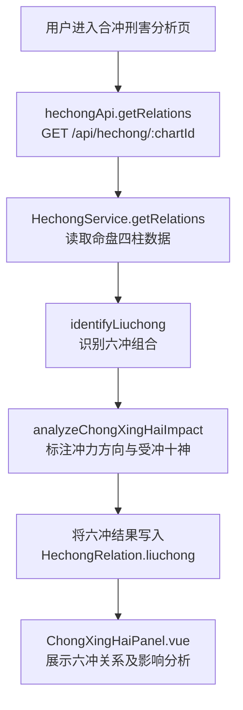
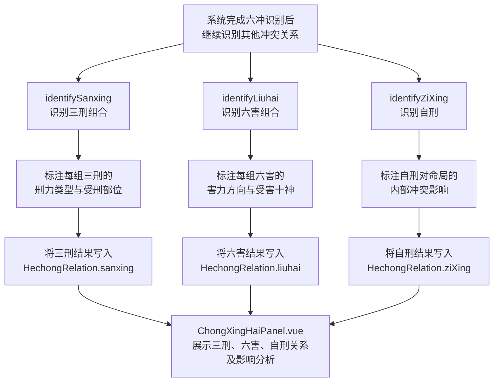
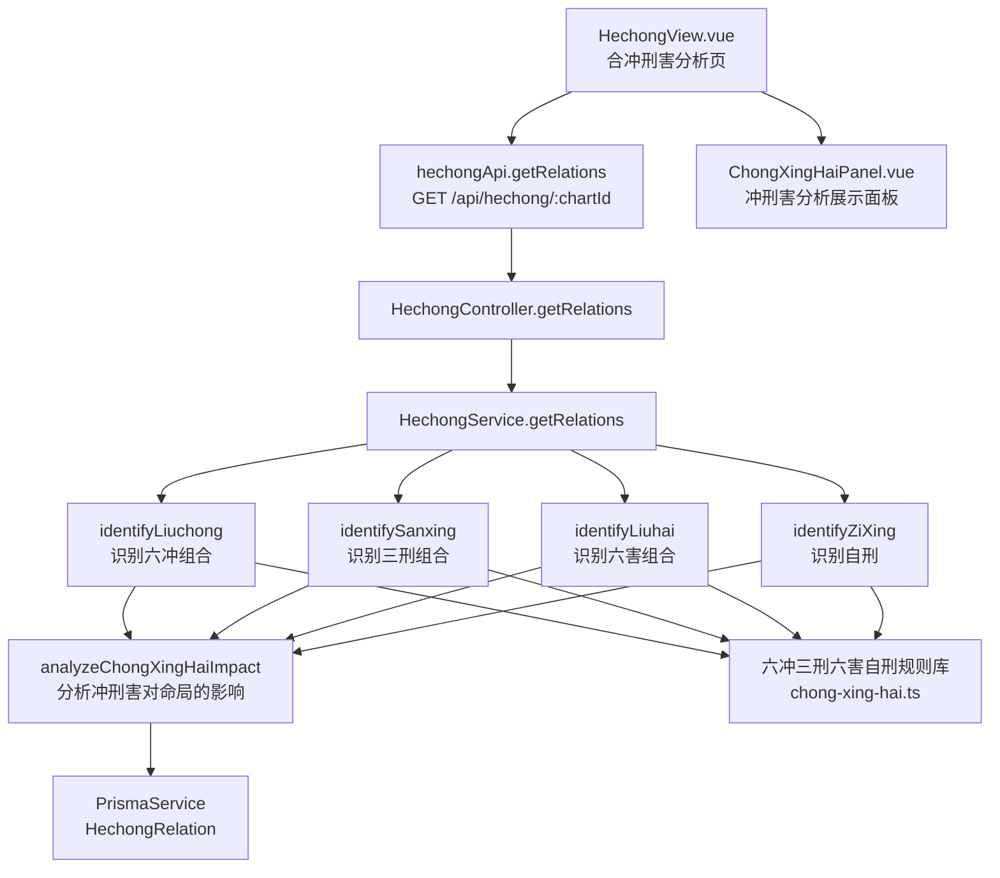

# 冲刑害分析

> PRD Reference: docs/PRD/03. 合冲刑害分析模块/03. 冲刑害分析/冲刑害分析.md#冲刑害分析

## 1. 业务流程

### 1.1 六冲识别与影响分析流程

**触发**：用户在合冲刑害分析页（`/hechong`）查看命盘的冲刑害分析。

**步骤**：

1. 用户进入合冲刑害分析页，前端从 `useHechongStore` 读取当前 `chartId`。
2. 前端调用 `hechongApi.getRelations()` 发送 `GET /api/hechong/:chartId` 请求。
3. 后端 `HechongController.getRelations()` 接收请求，`HechongService.getRelations()` 执行合冲刑害分析计算，其中六冲识别步骤：
   - 调用 `identifyLiuchong()` 从四柱地支中识别所有地支六冲组合（子午冲、丑未冲、寅申冲、卯酉冲、辰戌冲、巳亥冲）。
   - 调用 `analyzeChongXingHaiImpact()` 标注每对六冲的冲力方向与受冲十神。
   - 评估六冲对命局格局与五行平衡的影响。
4. 六冲识别结果写入 `HechongRelation` 数据表的 `liuchong` 字段。
5. 前端 `ChongXingHaiPanel.vue` 展示六冲关系及影响分析。

**预期结果**：用户可查看命盘中所有六冲组合及其冲力方向、受冲十神与对命局的影响。



### 1.2 三刑、六害与自刑识别流程

**触发**：六冲识别完成后，系统继续识别三刑、六害与自刑。

**步骤**：

1. 系统完成六冲识别后继续识别其他冲突关系：
   - 调用 `identifySanxing()` 识别四柱间所有地支三刑组合（寅巳申三刑、丑戌未三刑、子卯刑、辰辰自刑/午午自刑/酉酉自刑/亥亥自刑——自刑单独归类）。
   - 调用 `identifyLiuhai()` 识别四柱间所有地支六害组合（子未害、丑午害、寅巳害、卯辰害、申亥害、酉戌害）。
   - 调用 `identifyZiXing()` 识别四柱间所有地支自刑（辰辰自刑、午午自刑、酉酉自刑、亥亥自刑）。
2. 调用 `analyzeChongXingHaiImpact()` 对每组三刑标注刑力类型与受刑部位，对每组六害标注害力方向与受害十神，对每个自刑标注内部冲突影响。
3. 识别结果分别写入 `HechongRelation` 的 `sanxing`、`liuhai`、`ziXing` 字段。
4. 前端 `ChongXingHaiPanel.vue` 展示三刑、六害、自刑关系及影响分析。

**预期结果**：用户可查看命盘中所有三刑、六害与自刑组合及其影响分析。



## 2. 关键函数设计

### 2.1 identifyLiuchong

```typescript
function identifyLiuchong(pillars: Pillar[], shishenLabels: ShishenLabel): LiuchongResult[]
```

- **职责**：从四柱地支中识别所有地支六冲组合并标注冲力方向与受冲十神。
- **核心逻辑**：
  1. 提取四柱地支及其柱位。
  2. 遍历所有两两地支组合，查询六冲规则表（子午冲、丑未冲、寅申冲、卯酉冲、辰戌冲、巳亥冲）。
  3. 对每组匹配的六冲组合，记录两地支、柱位、组合名称。
  4. 调用 `determineChongDirection()` 判断冲力方向。
  5. 标注受冲十神：通过 `shishenLabels` 查询受冲地支对应天干的十神关系。
  6. 返回六冲组合列表。
- **PRD 追溯**：查看四柱间地支六冲组合列表、查看每对六冲的冲力方向、查看六冲受冲十神标注 — FR-06

### 2.2 identifySanxing

```typescript
function identifySanxing(pillars: Pillar[], shishenLabels: ShishenLabel): SanxingResult[]
```

- **职责**：从四柱地支中识别所有地支三刑组合并标注刑力类型与受刑部位。
- **核心逻辑**：
  1. 提取四柱地支及其柱位。
  2. 查询三刑规则表，识别寅巳申三刑（无恩之刑）、丑戌未三刑（持势之刑）、子卯刑（无礼之刑）等组合。
  3. 注意：辰辰、午午、酉酉、亥亥为自刑，归入 `identifyZiXing()` 处理，不在此处返回。
  4. 对每组匹配的三刑组合，记录地支列表、柱位列表、组合名称、刑力类型。
  5. 标注受刑部位（受刑地支所在柱位）。
  6. 返回三刑组合列表。
- **PRD 追溯**：查看四柱间地支三刑组合列表、查看每组三刑的刑力类型、查看三刑受刑部位标注 — FR-06

### 2.3 identifyLiuhai

```typescript
function identifyLiuhai(pillars: Pillar[], shishenLabels: ShishenLabel): LiuhaiResult[]
```

- **职责**：从四柱地支中识别所有地支六害组合并标注害力方向与受害十神。
- **核心逻辑**：
  1. 提取四柱地支及其柱位。
  2. 遍历所有两两地支组合，查询六害规则表（子未害、丑午害、寅巳害、卯辰害、申亥害、酉戌害）。
  3. 对每组匹配的六害组合，记录两地支、柱位、组合名称。
  4. 调用 `determineHaiDirection()` 判断害力方向。
  5. 标注受害十神：通过 `shishenLabels` 查询受害地支对应天干的十神关系。
  6. 返回六害组合列表。
- **PRD 追溯**：查看四柱间地支六害组合列表、查看每组六害的害力方向、查看每组六害的受害十神 — FR-06

### 2.4 identifyZiXing

```typescript
function identifyZiXing(pillars: Pillar[]): ZiXingResult[]
```

- **职责**：从四柱地支中识别所有地支自刑。
- **核心逻辑**：
  1. 提取四柱地支及其柱位。
  2. 检查是否存在辰辰、午午、酉酉、亥亥等自刑组合（同一地支在四柱中出现两次以上即构成自刑）。
  3. 对每个匹配的自刑，记录地支、柱位、组合名称。
  4. 标注自刑对命局性格与运势的内部冲突影响。
  5. 返回自刑列表。
- **PRD 追溯**：查看四柱间地支自刑列表、查看自刑对命局的内部冲突影响 — FR-06

### 2.5 analyzeChongXingHaiImpact

```typescript
function analyzeChongXingHaiImpact(liuchong: LiuchongResult[], sanxing: SanxingResult[], liuhai: LiuhaiResult[], ziXing: ZiXingResult[], gejuPattern: GejuPattern): ChongXingHaiImpactResult
```

- **职责**：分析冲刑害对命局格局与五行平衡的影响。
- **核心逻辑**：
  1. 遍历六冲结果，判断冲是否破坏格局核心十神：调用 `gejuPattern` 的格局类型与核心十神信息，若受冲十神为格局核心十神，标注冲破格局影响。
  2. 遍历三刑结果，评估刑力对命局运势的影响程度。
  3. 遍历六害结果，判断害是否伤及喜神或对命局产生不良影响。
  4. 遍历自刑结果，评估内部冲突对命局性格与运势的影响。
  5. 将影响分析结果写入各组合的 `impact` 字段。
  6. 返回冲刑害影响分析结果。
- **PRD 追溯**：查看六冲对命局格局与五行平衡的影响、查看三刑对命局的影响、查看六害对命局的影响、查看自刑的内部冲突影响 — FR-06

## 3. 组件架构



## 4. 数据来源

- 六冲三刑六害自刑规则库：`code/backend/src/modules/hechong/lib/chong-xing-hai.ts`
- 十神标注数据：通过 `chartId` 引用模块 02 的 `ShishenLabel` 表
- 格局与喜忌数据：通过 `chartId` 引用模块 02 的 `GejuPattern` 表
- 术语定义：`0.common/glossary.md`（六冲、三刑、六害、自刑等术语）