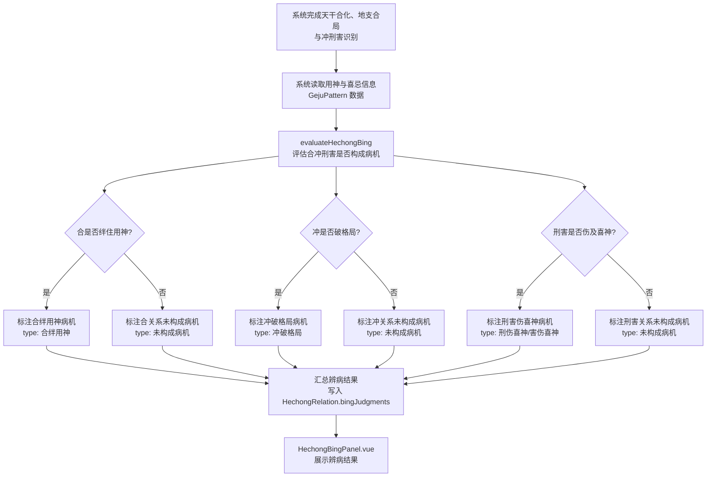
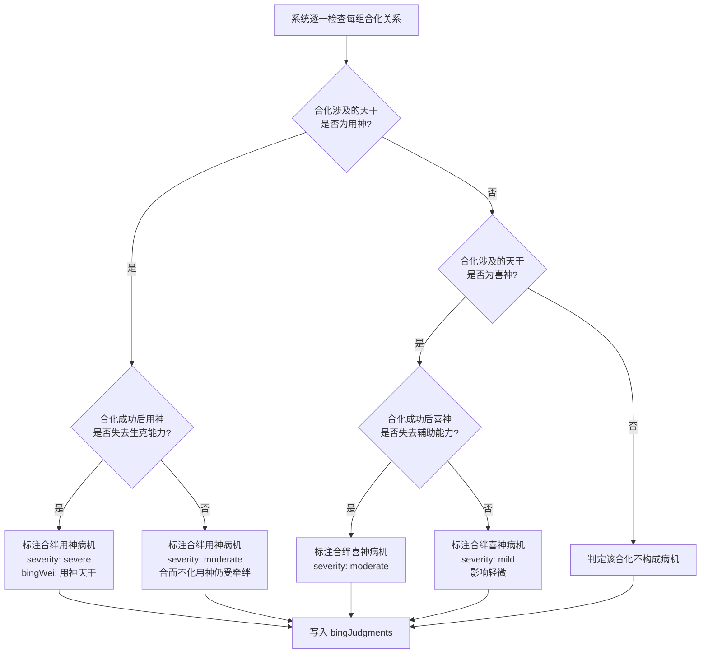
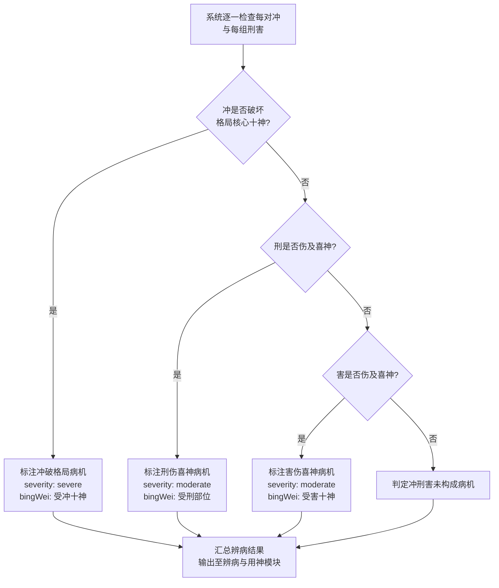
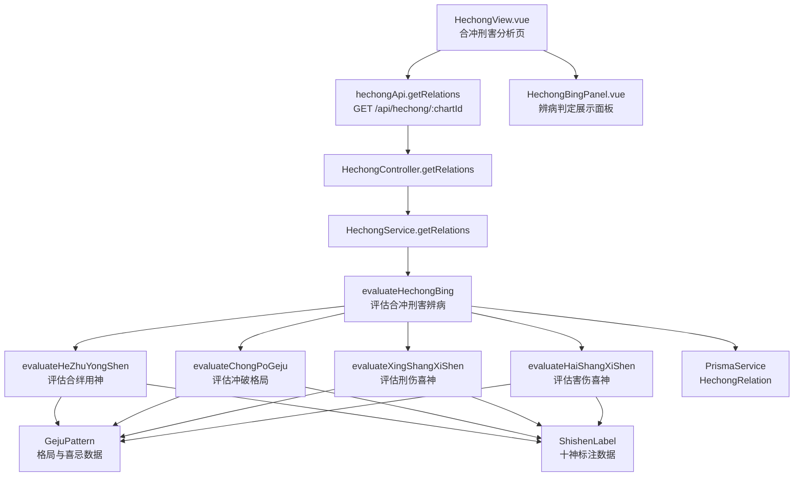

# 合冲刑害辨病

> PRD Reference: docs/PRD/03. 合冲刑害分析模块/04. 合冲刑害辨病/合冲刑害辨病.md#合冲刑害辨病

## 1. 业务流程

### 1.1 合冲刑害辨病主流程

**触发**：系统完成天干合化、地支合局与冲刑害识别后，自动从辨病视角评估合冲刑害是否构成病机。

**步骤**：

1. 系统完成天干合化、地支合局与冲刑害识别（模块 03 前三个子模块的计算结果已就绪）。
2. 系统读取用神与喜忌信息：通过 `chartId` 引用模块 02 的 `GejuPattern` 数据，获取格局类型、喜神列表与忌神列表。
3. 调用 `evaluateHechongBing()` 评估合冲刑害是否构成病机：
   - 逐一检查天干合化关系是否绊住用神或喜神。
   - 逐一检查六冲关系是否破格局。
   - 逐一检查刑害关系是否伤及喜神。
4. 构成病机的关系标注为辨病结果，未构成病机的关系标注为不影响病机。
5. 辨病结果写入 `HechongRelation` 数据表的 `bingJudgments` 字段。
6. 辨病结果汇入病机清单，供模块 04（辨病与用神）使用。
7. 前端 `HechongBingPanel.vue` 展示合冲刑害辨病结果，区分病机与非病机关系。

**预期结果**：用户可查看命盘中合冲刑害构成的病机清单、病位与病象，以及未构成病机的关系列表。



### 1.2 合绊用神详细判定流程

**触发**：辨病评估过程中，系统逐一检查每组合化关系是否绊住用神或喜神。

**步骤**：

1. 系统逐一检查每组合化关系（`tianganHe` 列表）。
2. 调用 `evaluateHeZhuYongShen()` 判断合化涉及的天干是否为用神：
   - 查询 `GejuPattern` 的 `favorableGods`（喜神十神列表），映射到对应天干。
   - 查询 `GejuPattern` 的 `favorableElements`（喜神五行列表），判断合化天干是否属于喜神五行。
   - 若合化涉及的天干为用神，进一步判断合化成功后用神是否失去原有生克能力。
     - 若合化成功且用神失去能力：标注合绊用神病机，严重程度 `"severe"`，病位为用神天干，病象描述用神被绊后的影响。
     - 若合而不化但用神仍受牵绊：标注合绊用神病机，严重程度 `"moderate"`，病位为用神天干，病象描述轻微影响。
   - 若合化涉及的天干为喜神（非用神），判断合化成功后喜神是否失去辅助用神的能力：
     - 若合化成功且喜神失去能力：标注合绊喜神病机，严重程度 `"moderate"`。
     - 若合而不化但喜神仍受牵绊：标注合绊喜神病机，严重程度 `"mild"`。
   - 若合化涉及的天干既非用神也非喜神：判定该合化不构成病机。

**预期结果**：用户可查看命盘中每组合化关系的辨病判定结果，区分合绊用神、合绊喜神与不构成病机三种情况。



### 1.3 冲破格局与刑害伤喜神判定流程

**触发**：辨病评估过程中，系统逐一检查每对冲与每组刑害。

**步骤**：

1. 系统逐一检查每对冲（`liuchong` 列表）是否破格局：
   - 调用 `evaluateChongPoGeju()` 判断冲是否破坏格局核心十神。
   - 查询 `GejuPattern` 的格局类型与核心十神信息。
   - 若受冲十神为格局核心十神：标注冲破格局病机，严重程度 `"severe"`，病位为受冲十神，病象描述格局被冲破后的影响。
   - 若受冲十神非格局核心十神：检查冲是否伤及喜神。
     - 若冲伤及喜神：标注冲破格局病机，严重程度 `"moderate"`，病位为受害喜神。
     - 若冲未伤及喜神：判定冲关系未构成病机。
2. 系统逐一检查每组刑（`sanxing` 列表）是否伤及喜神：
   - 调用 `evaluateXingShangXiShen()` 判断刑是否伤及喜神。
   - 查询 `GejuPattern` 的喜神五行与十神信息。
   - 若刑伤及喜神：标注刑伤喜神病机，严重程度 `"moderate"`，病位为受刑部位，病象描述刑力伤及喜神后的影响。
   - 若刑未伤及喜神：判定刑关系未构成病机。
3. 系统逐一检查每组害（`liuhai` 列表）是否伤及喜神：
   - 调用 `evaluateHaiShangXiShen()` 判断害是否伤及喜神。
   - 若害伤及喜神：标注害伤喜神病机，严重程度 `"moderate"`，病位为受害十神，病象描述害力伤及喜神后的影响。
   - 若害未伤及喜神：判定害关系未构成病机。
4. 汇总辨病结果并输出至辨病与用神模块。

**预期结果**：用户可查看命盘中冲破格局、刑伤喜神、害伤喜神的病机判定结果，以及未构成病机的冲刑害关系列表。



## 2. 关键函数设计

### 2.1 evaluateHechongBing

```typescript
function evaluateHechongBing(tianganHe: TianganHeResult[], liuchong: LiuchongResult[], sanxing: SanxingResult[], liuhai: LiuhaiResult[], ziXing: ZiXingResult[], gejuPattern: GejuPattern, shishenLabels: ShishenLabel, dayMasterStrength: DayMasterStrength): BingJudgmentResult[]
```

- **职责**：从辨病视角评估合冲刑害是否构成病机，生成辨病判定结果列表。
- **核心逻辑**：
  1. 遍历 `tianganHe` 列表，调用 `evaluateHeZhuYongShen()` 判断每组合化是否绊住用神或喜神。
  2. 遍历 `liuchong` 列表，调用 `evaluateChongPoGeju()` 判断每对冲是否破格局。
  3. 遍历 `sanxing` 列表，调用 `evaluateXingShangXiShen()` 判断每组刑是否伤及喜神。
  4. 遍历 `liuhai` 列表，调用 `evaluateHaiShangXiShen()` 判断每组害是否伤及喜神。
  5. 遍历 `ziXing` 列表，评估自刑是否构成内部冲突病机。
  6. 将构成病机的关系收集为辨病结果列表，未构成病机的关系也记录但标注 `"未构成病机"`。
  7. 返回辨病判定结果列表。
- **PRD 追溯**：查看合冲刑害构成的病机清单、查看合绊用神病机的病位与病象、查看冲破格局病机的病位与病象、查看刑害伤喜神病机的病位与病象、查看未构成病机的合冲刑害关系列表 — FR-06, FR-07

### 2.2 evaluateHeZhuYongShen

```typescript
function evaluateHeZhuYongShen(tianganHe: TianganHeResult[], gejuPattern: GejuPattern, shishenLabels: ShishenLabel): BingJudgmentResult[]
```

- **职责**：评估天干合化关系是否绊住用神或喜神。
- **核心逻辑**：
  1. 查询 `GejuPattern` 的 `favorableGods`（喜神十神列表）与 `favorableElements`（喜神五行列表），推断用神与喜神对应的天干。
  2. 遍历每组天干五合组合。
  3. 判断合化涉及的天干是否为用神：
    - 若为用神且合化成功：标注合绊用神病机，`severity: "severe"`，`bingWei` 为用神天干，`bingXiang` 描述用神被绊后的影响。
    - 若为用神且合而不化：标注合绊用神病机，`severity: "moderate"`，`bingXiang` 描述轻微牵绊影响。
  4. 判断合化涉及的天干是否为喜神（非用神）：
    - 若为喜神且合化成功：标注合绊喜神病机，`severity: "moderate"`。
    - 若为喜神且合而不化：标注合绊喜神病机，`severity: "mild"`。
  5. 既非用神也非喜神的合化关系：标注为未构成病机。
  6. 返回辨病判定结果列表。
- **PRD 追溯**：查看合绊用神病机的病位与病象 — FR-06, FR-07

### 2.3 evaluateChongPoGeju

```typescript
function evaluateChongPoGeju(liuchong: LiuchongResult[], gejuPattern: GejuPattern, shishenLabels: ShishenLabel): BingJudgmentResult[]
```

- **职责**：评估六冲关系是否破格局。
- **核心逻辑**：
  1. 查询 `GejuPattern` 的 `patternType`（格局类型）与 `isEstablished`（格局是否成立）。
  2. 遍历每组六冲组合。
  3. 查询受冲十神是否为格局核心十神（如正官格中的正官被冲）。
  4. 若受冲十神为格局核心十神：标注冲破格局病机，`severity: "severe"`，`bingWei` 为受冲十神，`bingXiang` 描述格局被冲破后的影响。
  5. 若受冲十神为喜神但非格局核心：标注冲伤喜神病机，`severity: "moderate"`。
  6. 若受冲十神既非格局核心也非喜神：标注为未构成病机。
  7. 返回辨病判定结果列表。
- **PRD 追溯**：查看冲破格局病机的病位与病象 — FR-06, FR-07

### 2.4 evaluateXingShangXiShen

```typescript
function evaluateXingShangXiShen(sanxing: SanxingResult[], gejuPattern: GejuPattern, shishenLabels: ShishenLabel): BingJudgmentResult[]
```

- **职责**：评估三刑关系是否伤及喜神。
- **核心逻辑**：
  1. 查询 `GejuPattern` 的喜神五行与十神信息。
  2. 遍历每组三刑组合。
  3. 判断受刑部位涉及的天干或地支本气是否属于喜神。
  4. 若刑伤及喜神：标注刑伤喜神病机，`severity: "moderate"`，`bingWei` 为受刑部位，`bingXiang` 描述刑力伤及喜神后的影响。
  5. 若刑未伤及喜神：标注为未构成病机。
  6. 返回辨病判定结果列表。
- **PRD 追溯**：查看刑害伤喜神病机的病位与病象 — FR-06, FR-07

### 2.5 evaluateHaiShangXiShen

```typescript
function evaluateHaiShangXiShen(liuhai: LiuhaiResult[], gejuPattern: GejuPattern, shishenLabels: ShishenLabel): BingJudgmentResult[]
```

- **职责**：评估六害关系是否伤及喜神。
- **核心逻辑**：
  1. 查询 `GejuPattern` 的喜神五行与十神信息。
  2. 遍历每组六害组合。
  3. 判断受害十神是否属于喜神。
  4. 若害伤及喜神：标注害伤喜神病机，`severity: "moderate"`，`bingWei` 为受害十神，`bingXiang` 描述害力伤及喜神后的影响。
  5. 若害未伤及喜神：标注为未构成病机。
  6. 返回辨病判定结果列表。
- **PRD 追溯**：查看刑害伤喜神病机的病位与病象 — FR-06, FR-07

## 3. 组件架构



## 4. 数据来源

- 辨病视角判定逻辑：`code/backend/src/modules/hechong/lib/hechong-bing.ts`
- 天干合化识别结果：`HechongRelation.tianganHe`（本模块子模块 01 计算）
- 地支合局识别结果：`HechongRelation.dizhiLiuhe` + `dizhiSanhe`（本模块子模块 02 计算）
- 冲刑害识别结果：`HechongRelation.liuchong` + `sanxing` + `liuhai` + `ziXing`（本模块子模块 03 计算）
- 格局与喜忌数据：通过 `chartId` 引用模块 02 的 `GejuPattern` 表
- 十神标注数据：通过 `chartId` 引用模块 02 的 `ShishenLabel` 表
- 日主旺衰数据：通过 `chartId` 引用模块 02 的 `DayMasterStrength` 表
- 术语定义：`0.common/glossary.md`（合绊用神、冲破格局、病机、病象等术语）