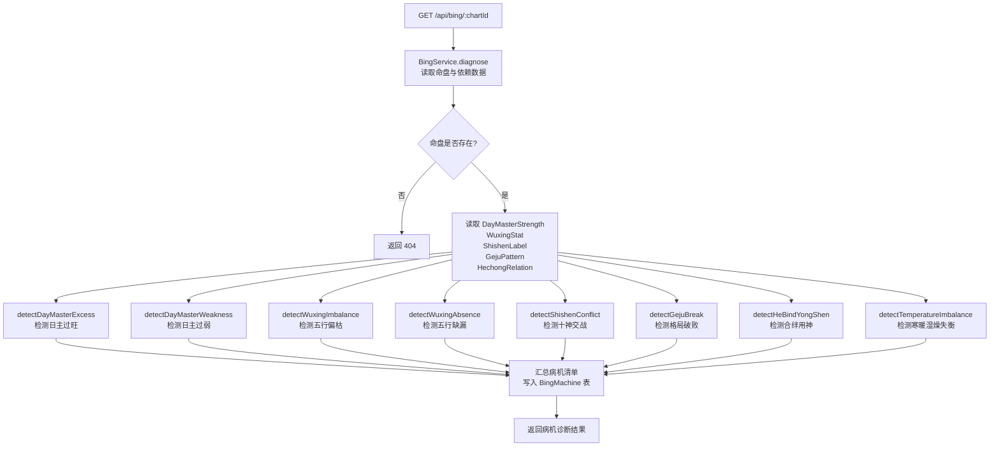
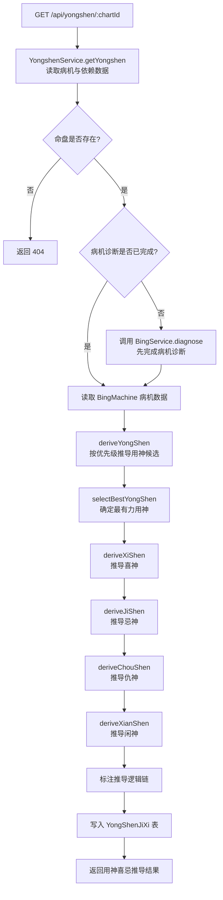
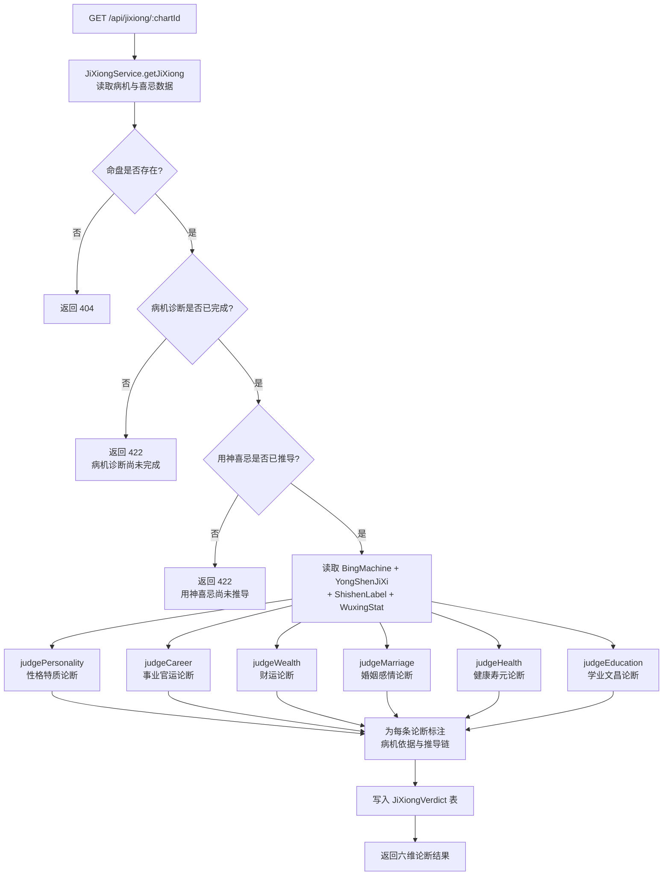

# API 设计 — 04. 辨病与用神模块

## 概述

本模块提供三组 REST API，支撑识病诊断、用神喜忌推导与断吉凶三个子模块的前后端交互。岁运药效评估子模块的 API 由模块 06（大运流年模块）的 `GET /api/dayun/:chartId` 端点承载，该端点返回的大运流年数据中包含药效评估字段（由本模块的 `YaoXiaoEvaluator` 计算注入），前端通过 `dayunApi.getDayun()` + `bingApi.getYongshen()` 联合获取数据。

根据 `code-structure.md §4` 与 `§5.5`，本模块的三个端点分别为识病诊断、用神喜忌推导和断吉凶，岁运药效评估的药效计算逻辑位于本模块但 API 入口属于模块 06。

所有端点遵循 `code-structure.md §4` 的路径与处理器约定，错误响应遵循 ADR-003（RFC7807 `application/problem+json`）。

## 1. 子模块 API 汇总

### 1.1 识病诊断

| 方法 | 路径 | PRD 业务功能 | 说明 |
|------|------|-------------|------|
| GET | `/api/bing/:chartId` | 病机诊断总览、日主过旺过弱诊断、五行偏枯缺漏诊断、十神交战诊断、格局破败诊断、合绊用神诊断、寒暖湿燥失衡诊断 | 获取命盘全量病机诊断数据，包含八大病机类型逐项检测结果 |

### 1.2 用神喜忌推导

| 方法 | 路径 | PRD 业务功能 | 说明 |
|------|------|-------------|------|
| GET | `/api/yongshen/:chartId` | 用神推导、喜忌仇闲列表、推导逻辑链详情 | 获取命盘用神喜忌推导数据，包含用神、喜神、忌神、仇神、闲神及推导逻辑链 |

### 1.3 断吉凶

| 方法 | 路径 | PRD 业务功能 | 说明 |
|------|------|-------------|------|
| GET | `/api/jixiong/:chartId` | 六维论断总览、性格特质论断、事业官运论断、财运论断、婚姻感情论断、健康寿元论断、学业文昌论断 | 获取命盘六维吉凶论断数据，每维度关联病机依据与用神推导链 |

### 1.4 岁运药效评估

| 方法 | 路径 | PRD 业务功能 | 说明 |
|------|------|-------------|------|
| GET | `/api/dayun/:chartId` | 岁运药效总览、大运药效详情、流年药效详情、运势时间线 | 大运流年数据中包含药效评估字段，由本模块 `YaoXiaoEvaluator` 计算注入；API 入口属于模块 06 |

> 岁运药效评估的后端计算逻辑位于本模块（`code/backend/src/modules/bing/lib/yaoxiao-evaluator.ts`），但 REST API 入口由模块 06 的 `DayunController.getDayun()` 承载。本节仅描述药效评估的计算逻辑与数据流，API 详情见模块 06 的 TDD。

## 2. 端点详情

### 2.1 GET /api/bing/:chartId

**处理器**：`BingController.diagnose()`
**服务**：`BingService`
**PRD 追溯**：查看八大病机类型逐项检测状态、查看已识别病机的病名列表、查看各病机的严重程度标注、查看病机清单汇总、查看日主过旺病机的病名病位病象严重程度、查看日主过弱病机的病名病位病象严重程度、查看五行偏枯病机的病名病位病象严重程度、查看五行缺漏病机的病名病位病象严重程度、查看十神交战病机的病名病位病象严重程度、查看格局破败病机的病名病位病象严重程度、查看合绊用神病机的病名病位病象严重程度、查看寒暖湿燥失衡病机的病名病位病象严重程度

#### 请求

| 字段 | 类型 | 必填 | 约束 | 示例 |
|------|------|------|------|------|
| chartId | Int | 是 | 路径参数，有效命盘 ID | `1` |

#### 响应（200 OK）

| 字段 | 类型 | 说明 | 示例 |
|------|------|------|------|
| chartId | Int | 命盘 ID | `1` |
| diseases | Array | 八大病机检测结果列表 | 见 `00.database-design.md` 中 diseases JSON 结构定义 |
| dayMasterExcess | Object? | 日主过旺病机详情（为 null 表示未检测到此病机） | 见 JSON 结构定义 |
| dayMasterWeakness | Object? | 日主过弱病机详情 | 见 JSON 结构定义 |
| wuxingImbalance | Object? | 五行偏枯病机详情 | 见 JSON 结构定义 |
| wuxingAbsence | Object? | 五行缺漏病机详情 | 见 JSON 结构定义 |
| shishenConflict | Object? | 十神交战病机详情 | 见 JSON 结构定义 |
| gejuBreak | Object? | 格局破败病机详情 | 见 JSON 结构定义 |
| heBindYongShen | Object? | 合绊用神病机详情 | 见 JSON 结构定义 |
| temperatureImbalance | Object? | 寒暖湿燥失衡病机详情 | 见 JSON 结构定义 |
| createdAt | String (ISO 8601) | 创建时间 | `"2024-01-01T00:00:00Z"` |

#### 错误响应

| HTTP 状态码 | 错误类型 | 说明 |
|------------|---------|------|
| 404 | `https://bazi.app/errors/chart-not-found` | 命盘 ID 不存在 |
| 422 | `https://bazi.app/errors/wuxing-not-calculated` | 五行统计尚未计算（需先调用五行统计接口） |
| 422 | `https://bazi.app/errors/wangshuai-not-calculated` | 日主旺衰判定尚未计算（辨病诊断依赖旺衰数据） |
| 422 | `https://bazi.app/errors/shishen-not-calculated` | 十神标注尚未计算（辨病诊断依赖十神数据） |
| 422 | `https://bazi.app/errors/geju-not-calculated` | 格局判定尚未计算（辨病诊断依赖格局数据） |
| 422 | `https://bazi.app/errors/hechong-not-calculated` | 合冲刑害分析尚未计算（辨病诊断依赖合冲刑害数据） |
| 500 | `https://bazi.app/errors/diagnosis-failed` | 病机诊断计算内部错误 |

#### 流程图



### 2.2 GET /api/yongshen/:chartId

**处理器**：`YongshenController.getYongshen()`
**服务**：`YongshenService`
**PRD 追溯**：查看命局用神及其五行与十神属性、查看用神的推导逻辑链、查看用神在四柱中的分布位置、查看喜神列表及其五行与十神属性、查看忌神列表及其五行与十神属性、查看仇神列表及其五行与十神属性、查看闲神列表及其五行与十神属性、查看每项喜忌的推导逻辑、查看从病机到用神的完整推导链、查看从用神到喜神的辅助推导逻辑、查看从病机到忌神的对抗推导逻辑、查看从忌神到仇神的间接推导逻辑、查看闲神的判定依据

#### 请求

| 字段 | 类型 | 必填 | 约束 | 示例 |
|------|------|------|------|------|
| chartId | Int | 是 | 路径参数，有效命盘 ID | `1` |

#### 响应（200 OK）

| 字段 | 类型 | 说明 | 示例 |
|------|------|------|------|
| chartId | Int | 命盘 ID | `1` |
| yongShen | Object | 用神详情 | 见 `00.database-design.md` 中 yongShen JSON 结构定义 |
| xiShen | Array | 喜神列表 | 见 `00.database-design.md` 中 xiShen JSON 结构定义 |
| jiShen | Array | 忌神列表 | 见 `00.database-design.md` 中 jiShen JSON 结构定义 |
| chouShen | Array | 仇神列表 | 见 `00.database-design.md` 中 chouShen JSON 结构定义 |
| xianShen | Array | 闲神列表 | 见 `00.database-design.md` 中 xianShen JSON 结构定义 |
| derivationChains | Array | 推导逻辑链列表 | 见 `00.database-design.md` 中 derivationChains JSON 结构定义 |
| createdAt | String (ISO 8601) | 创建时间 | `"2024-01-01T00:00:00Z"` |

#### 错误响应

| HTTP 状态码 | 错误类型 | 说明 |
|------------|---------|------|
| 404 | `https://bazi.app/errors/chart-not-found` | 命盘 ID 不存在 |
| 422 | `https://bazi.app/errors/bing-not-diagnosed` | 病机诊断尚未完成（用神推导依赖病机数据） |
| 500 | `https://bazi.app/errors/yongshen-calculation-failed` | 用神推导计算内部错误 |

#### 流程图



### 2.3 GET /api/jixiong/:chartId

**处理器**：`JiXiongController.getJiXiong()`
**服务**：`JiXiongService`
**PRD 追溯**：查看性格特质论断结果、查看事业官运论断结果、查看财运论断结果、查看婚姻感情论断结果、查看健康寿元论断结果、查看学业文昌论断结果、查看性格特质论断的病机依据、查看事业官运论断的病机依据、查看财运论断的病机依据、查看婚姻感情论断的病机依据、查看健康寿元论断的病机依据、查看学业文昌论断的病机依据

#### 请求

| 字段 | 类型 | 必填 | 约束 | 示例 |
|------|------|------|------|------|
| chartId | Int | 是 | 路径参数，有效命盘 ID | `1` |

#### 响应（200 OK）

| 字段 | 类型 | 说明 | 示例 |
|------|------|------|------|
| chartId | Int | 命盘 ID | `1` |
| personality | Object | 性格特质论断 | 见 `00.database-design.md` 中 personality JSON 结构定义 |
| career | Object | 事业官运论断 | 见 `00.database-design.md` 中 career JSON 结构定义 |
| wealth | Object | 财运论断 | 见 `00.database-design.md` 中 wealth JSON 结构定义 |
| marriage | Object | 婚姻感情论断 | 见 `00.database-design.md` 中 marriage JSON 结构定义 |
| health | Object | 健康寿元论断 | 见 `00.database-design.md` 中 health JSON 结构定义 |
| education | Object | 学业文昌论断 | 见 `00.database-design.md` 中 education JSON 结构定义 |
| createdAt | String (ISO 8601) | 创建时间 | `"2024-01-01T00:00:00Z"` |

#### 错误响应

| HTTP 状态码 | 错误类型 | 说明 |
|------------|---------|------|
| 404 | `https://bazi.app/errors/chart-not-found` | 命盘 ID 不存在 |
| 422 | `https://bazi.app/errors/bing-not-diagnosed` | 病机诊断尚未完成（断吉凶依赖病机数据） |
| 422 | `https://bazi.app/errors/yongshen-not-calculated` | 用神喜忌尚未推导（断吉凶依赖用神数据） |
| 500 | `https://bazi.app/errors/jixiong-calculation-failed` | 吉凶论断计算内部错误 |

#### 流程图



## 3. 数据模型映射

| 端点 | 读取表 | 写入表 | 说明 |
|------|--------|--------|------|
| `GET /api/bing/:chartId` | Chart, Pillar, DayMasterStrength, WuxingStat, ShishenLabel, GejuPattern, HechongRelation | BingMachine | 读取排盘、五行、十神、格局、合冲刑害数据，计算并缓存病机诊断结果 |
| `GET /api/yongshen/:chartId` | Chart, BingMachine, ShishenLabel, WuxingStat, DayMasterStrength, GejuPattern | YongShenJiXi | 读取病机诊断与依赖数据，计算并缓存用神喜忌推导结果 |
| `GET /api/jixiong/:chartId` | Chart, BingMachine, YongShenJiXi, ShishenLabel, WuxingStat, DayMasterStrength, ShenshaLabel | JiXiongVerdict | 读取病机诊断、用神喜忌与依赖数据，计算并缓存六维论断结果 |

## 4. 错误处理总则

所有错误响应遵循 ADR-003（RFC7807 `application/problem+json`）：

```json
{
  "type": "https://bazi.app/errors/chart-not-found",
  "title": "命盘不存在",
  "status": 404,
  "detail": "chartId=999 对应的命盘记录不存在"
}
```

| HTTP 状态码 | 适用场景 |
|------------|----------|
| 404 | 命盘 ID 不存在 |
| 422 | 前置依赖数据尚未计算（五行统计、日主旺衰、十神标注、格局判定、合冲刑害、病机诊断、用神喜忌） |
| 500 | 辨病/用神/论断计算内部错误 |

## 5. 跨模块依赖

| 依赖方向 | 说明 |
|----------|------|
| 本模块 → 模块 01（八字排盘与历法） | 通过 `chartId` 引用 Chart + Pillar 数据，读取四柱天干地支作为辨病与论断的基础输入 |
| 本模块 → 模块 02（五行与十神） | 通过 `chartId` 引用 DayMasterStrength（日主旺衰判定）、WuxingStat（五行力量统计）、ShishenLabel（十神标注）、GejuPattern（格局与喜忌） |
| 本模块 → 模块 03（合冲刑害） | 通过 `chartId` 引用 HechongRelation 的 bingJudgments 数据，作为合绊用神病机识别的输入 |
| 本模块 → 模块 05（神煞标注） | 通过 `chartId` 引用 ShenshaLabel 数据，学业文昌论断读取文昌等学业神煞 |
| 模块 06（大运流年） → 本模块 | 大运流年模块调用本模块 `YaoXiaoEvaluator` 计算岁运药效，并在 `GET /api/dayun/:chartId` 端点返回药效评估字段 |
| 模块 07（论断报告） → 本模块 | 论断报告模块引用本模块的病机诊断、用神喜忌与六维论断数据作为报告章节数据来源 |
| 模块 08（命盘历史与比较） → 本模块 | 合盘分析引用本模块的辨病与用神推导结果进行五行互补与冲克关系比较 |