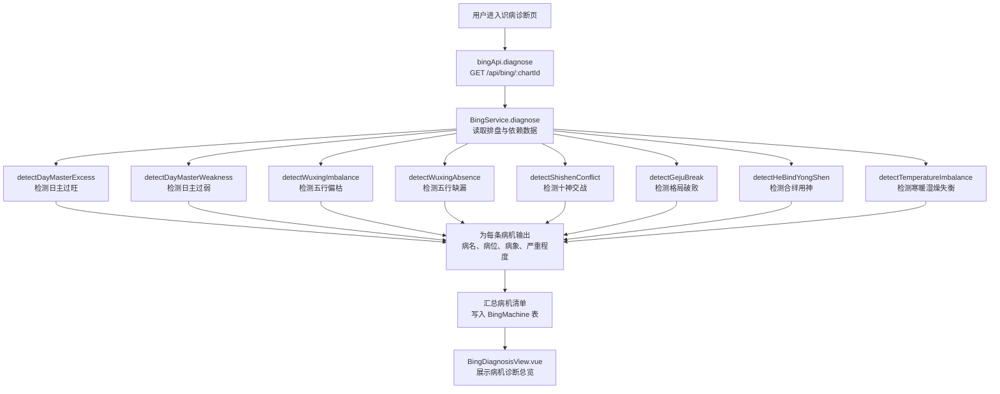
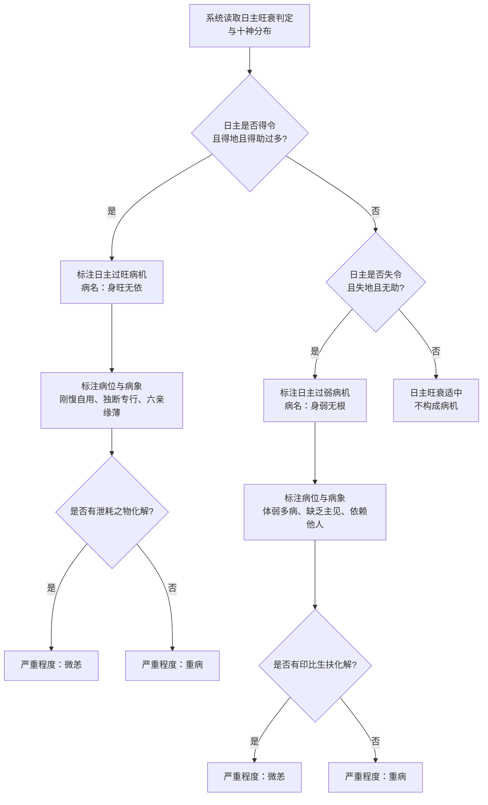
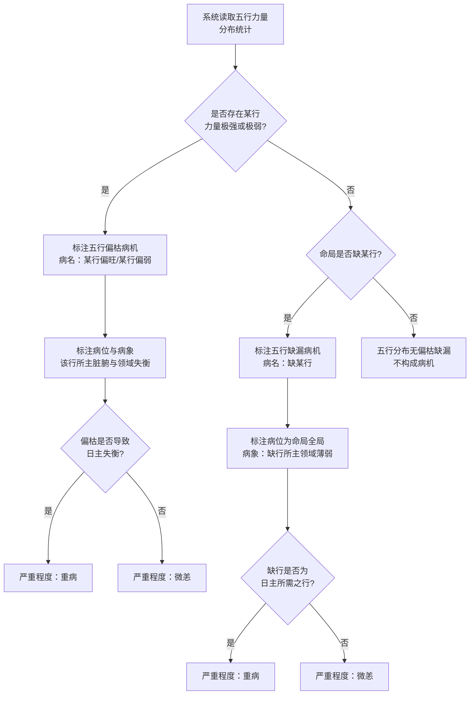
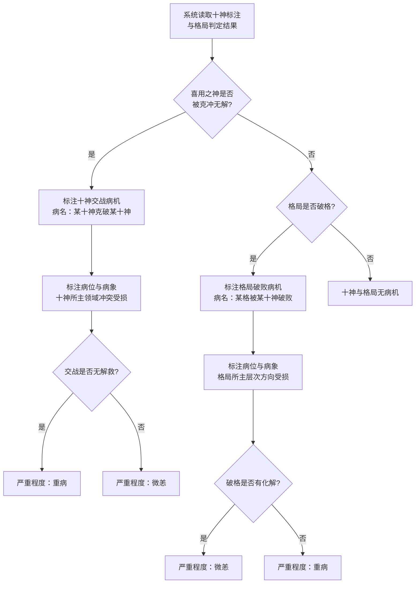
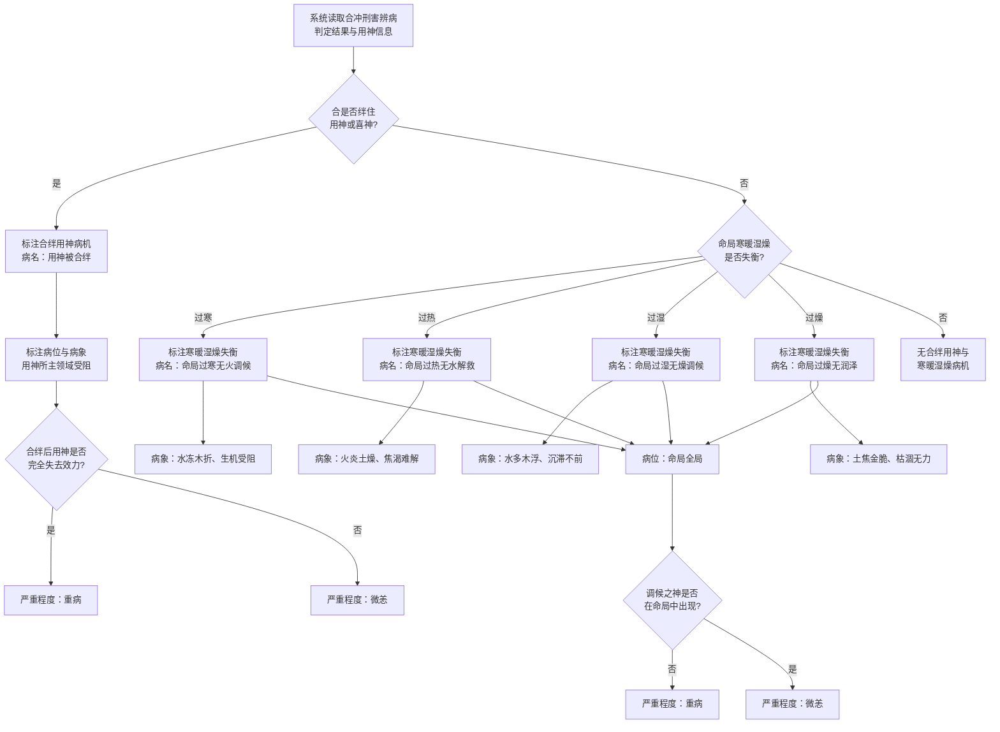
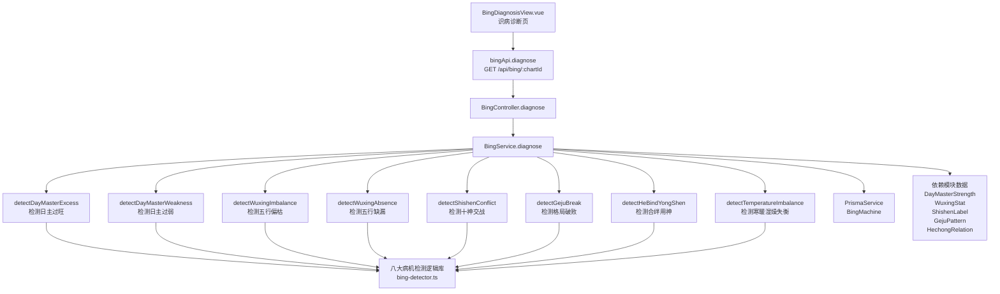

# 识病诊断

> PRD Reference: docs/PRD/04. 辨病与用神模块/01. 识病诊断/识病诊断.md#识病诊断

## 1. 业务流程

### 1.1 八大病机逐项诊断主流程

**触发**：用户在识病诊断页（`/bing`）查看命盘的病机诊断结果。

**步骤**：

1. 用户进入识病诊断页，前端从 `useBingStore` 读取当前 `chartId`。
2. 前端调用 `bingApi.diagnose()` 发送 `GET /api/bing/:chartId` 请求。
3. 后端 `BingController.diagnose()` 接收请求，`BingService.diagnose()` 执行病机诊断计算：
   - 调用 `detectDayMasterExcess()` 检测日主过旺病机。
   - 调用 `detectDayMasterWeakness()` 检测日主过弱病机。
   - 调用 `detectWuxingImbalance()` 检测五行偏枯病机。
   - 调用 `detectWuxingAbsence()` 检测五行缺漏病机。
   - 调用 `detectShishenConflict()` 检测十神交战病机。
   - 调用 `detectGejuBreak()` 检测格局破败病机。
   - 调用 `detectHeBindYongShen()` 检测合绊用神病机。
   - 调用 `detectTemperatureImbalance()` 检测寒暖湿燥失衡病机。
4. 为每条检测到的病机输出病名、病位、病象与严重程度。
5. 系统汇总病机清单，写入 `BingMachine` 数据表。
6. 前端 `BingDiagnosisView.vue` 展示八大病机检测状态、病名列表与严重程度标注。

**预期结果**：用户可查看命盘中所有病机的检测结果、病名、病位、病象与严重程度。



### 1.2 日主过旺与过弱诊断流程

**触发**：系统在八大病机逐项诊断中检测日主过旺与过弱。

**步骤**：

1. `detectDayMasterExcess()` 读取 `DayMasterStrength` 表中日主旺衰判定结果与 `ShishenLabel` 表中十神分布。
2. 若日主得令且得地且得助过多（旺衰判定为"身旺"或"从强"），判定日主过旺：
   - 标注病名为"身旺无依"。
   - 标注病位为日主及参与帮扶的比劫与印星所在柱位。
   - 标注病象为刚愎自用、独断专行、六亲缘薄。
   - 调用 `checkRelief()` 判断是否有泄耗之物化解：有则严重程度为"微恙"，无则为"重病"。
3. 若不构成过旺，`detectDayMasterWeakness()` 继续检测日主过弱：
   - 若日主失令且失地且无助（旺衰判定为"身弱"或"从弱"），判定日主过弱。
   - 标注病名为"身弱无根"。
   - 标注病位为日主及参与克泄的官杀与财星所在柱位。
   - 标注病象为体弱多病、缺乏主见、依赖他人。
   - 调用 `checkSupport()` 判断是否有印比生扶化解：有则严重程度为"微恙"，无则为"重病"。
4. 若日主旺衰适中，不构成过旺或过弱病机。

**预期结果**：日主过旺/过弱病机被正确识别，病名、病位、病象与严重程度标注完整。



### 1.3 五行偏枯与缺漏诊断流程

**触发**：系统在八大病机逐项诊断中检测五行偏枯与缺漏。

**步骤**：

1. `detectWuxingImbalance()` 读取 `WuxingStat` 表中五行力量分布统计。
2. 若存在某一行力量极强或极弱（超过阈值），判定五行偏枯：
   - 标注病名为"某行偏旺"或"某行偏弱"。
   - 标注病位为该行天干与地支本气所在柱位。
   - 标注病象为该行所主脏腑与人生领域失衡。
   - 调用 `isAffectingDayMaster()` 判断偏枯是否导致日主失衡：是则严重程度为"重病"，否则为"微恙"。
3. 若无偏枯，`detectWuxingAbsence()` 继续检测五行缺漏：
   - 若命局缺某一行，判定五行缺漏。
   - 标注病名为"缺某行"。
   - 标注病位为命局全局。
   - 标注病象为缺行所主的人生领域薄弱。
   - 调用 `isNeededByDayMaster()` 判断缺行是否为日主所需之行：是则严重程度为"重病"，否则为"微恙"。
4. 若五行分布均匀无偏枯缺漏，不构成病机。

**预期结果**：五行偏枯与缺漏病机被正确识别，严重程度有据可依。



### 1.4 十神交战与格局破败诊断流程

**触发**：系统在八大病机逐项诊断中检测十神交战与格局破败。

**步骤**：

1. `detectShishenConflict()` 读取 `ShishenLabel` 表中十神标注与 `GejuPattern` 表中格局判定结果。
2. 若存在喜用之神被克冲无解，判定十神交战：
   - 标注病名为"某十神克破某十神"。
   - 标注病位为参与克冲的十神所在柱位。
   - 标注病象为该十神所主的人生领域冲突受损。
   - 调用 `hasRelief()` 判断交战是否有解救：无解则严重程度为"重病"，有解则为"微恙"。
3. 若无交战，`detectGejuBreak()` 继续检测格局破败：
   - 若格局为"破格"，判定格局破败。
   - 标注病名为"某格被某十神破败"。
   - 标注病位为破格十神所在柱位。
   - 标注病象为格局所主的人生层次与方向受损。
   - 调用 `hasRepair()` 判断破格是否有化解：有则严重程度为"微恙"，无则为"重病"。
4. 若格局成格且无交战，不构成病机。

**预期结果**：十神交战与格局破败病机被正确识别，病机依据可追溯至十神分布与格局判定。



### 1.5 合绊用神与寒暖湿燥失衡诊断流程

**触发**：系统在八大病机逐项诊断中检测合绊用神与寒暖湿燥失衡。

**步骤**：

1. `detectHeBindYongShen()` 读取模块 03 的 `HechongRelation` 表中辨病判定结果与模块 02 的 `GejuPattern` 表中用神信息。
2. 若合绊住用神或喜神，判定合绊用神：
   - 标注病名为"用神被合绊"。
   - 标注病位为参与合绊的天干或地支所在柱位。
   - 标注病象为用神所主的人生领域受阻或迟滞。
   - 调用 `isYongShenCompletelyBlocked()` 判断合绊后用神是否完全失去效力：是则严重程度为"重病"，否则为"微恙"。
3. 若无合绊用神，`detectTemperatureImbalance()` 继续检测寒暖湿燥失衡：
   - 读取 `WuxingStat` 中火水五行力量对比。
   - 过寒（水多火少）则判定"命局过寒无火调候"，病象为水冻木折、生机受阻。
   - 过热（火多水少）则判定"命局过热无水解救"，病象为火炎土燥、焦渴难解。
   - 过湿（水多土少）则判定"命局过湿无燥调候"，病象为水多木浮、沉滞不前。
   - 过燥（土多水少）则判定"命局过燥无润泽"，病象为土焦金脆、枯涸无力。
   - 标注病位为命局全局。
   - 调用 `hasAdjustmentGod()` 判断调候之神是否在命局中出现：未出现则严重程度为"重病"，出现则为"微恙"。
4. 若无合绊用神与寒暖湿燥失衡，不构成病机。

**预期结果**：合绊用神与寒暖湿燥失衡病机被正确识别，严重程度与化解可能关联清晰。



## 2. 关键函数设计

### 2.1 BingService.diagnose

```typescript
async function diagnose(chartId: number): Promise<BingMachineResult>
```

- **职责**：接收命盘 ID，执行八大病机类型逐项检测，输出病机清单并持久化。
- **核心逻辑**：
  1. 按 `chartId` 查询 `Chart` 表及关联数据，验证命盘存在。
  2. 查询 `DayMasterStrength` 表获取日主旺衰判定。
  3. 查询 `WuxingStat` 表获取五行力量分布。
  4. 查询 `ShishenLabel` 表获取十神标注。
  5. 查询 `GejuPattern` 表获取格局与喜忌。
  6. 查询 `HechongRelation` 表获取合冲刑害辨病判定。
  7. 依次调用八大病机检测函数（见下方）。
  8. 为每条病机标注病名、病位、病象、严重程度。
  9. 汇总病机清单，写入 `BingMachine` 表（若已存在则更新）。
  10. 返回病机诊断结果。
- **PRD 追溯**：病机诊断总览页、八大病机逐项诊断 — FR-07

### 2.2 detectDayMasterExcess

```typescript
function detectDayMasterExcess(strength: DayMasterStrength, shishen: ShishenLabel[]): DiseaseItem | null
```

- **职责**：检测日主过旺病机。
- **核心逻辑**：
  1. 判断日主旺衰判定是否为"身旺"或"从强"。
  2. 若是，标注病名"身旺无依"，病位为日主及参与帮扶的比劫与印星所在柱位。
  3. 病象为"刚愎自用、独断专行、六亲缘薄"。
  4. 调用 `checkRelief()` 判断是否有泄耗之物化解：有则为"微恙"，无则为"重病"。
  5. 返回 `DiseaseItem` 或 `null`。
- **PRD 追溯**：日主过旺过弱诊断页 — FR-07

### 2.3 detectDayMasterWeakness

```typescript
function detectDayMasterWeakness(strength: DayMasterStrength, shishen: ShishenLabel[]): DiseaseItem | null
```

- **职责**：检测日主过弱病机。
- **核心逻辑**：
  1. 判断日主旺衰判定是否为"身弱"或"从弱"。
  2. 若是，标注病名"身弱无根"，病位为日主及参与克泄的官杀与财星所在柱位。
  3. 病象为"体弱多病、缺乏主见、依赖他人"。
  4. 调用 `checkSupport()` 判断是否有印比生扶化解。
  5. 返回 `DiseaseItem` 或 `null`。
- **PRD 追溯**：日主过旺过弱诊断页 — FR-07

### 2.4 detectWuxingImbalance

```typescript
function detectWuxingImbalance(wuxingStat: WuxingStat, strength: DayMasterStrength): DiseaseItem | null
```

- **职责**：检测五行偏枯病机。
- **核心逻辑**：
  1. 遍历五行力量分布，识别力量极强或极弱的行。
  2. 若存在，标注病名"某行偏旺"或"某行偏弱"。
  3. 调用 `isAffectingDayMaster()` 判断偏枯是否导致日主失衡。
  4. 返回 `DiseaseItem` 或 `null`。
- **PRD 追溯**：五行偏枯缺漏诊断页 — FR-07

### 2.5 detectWuxingAbsence

```typescript
function detectWuxingAbsence(wuxingStat: WuxingStat, strength: DayMasterStrength): DiseaseItem | null
```

- **职责**：检测五行缺漏病机。
- **核心逻辑**：
  1. 遍历五行力量分布，识别力量为零的行。
  2. 若存在缺行，标注病名"缺某行"，病位为命局全局。
  3. 调用 `isNeededByDayMaster()` 判断缺行是否为日主所需之行。
  4. 返回 `DiseaseItem` 或 `null`。
- **PRD 追溯**：五行偏枯缺漏诊断页 — FR-07

### 2.6 detectShishenConflict

```typescript
function detectShishenConflict(shishen: ShishenLabel[], geju: GejuPattern): DiseaseItem | null
```

- **职责**：检测十神交战病机。
- **核心逻辑**：
  1. 从十神标注中识别喜用之神被克冲的情况。
  2. 若存在喜用之神被克冲无解，标注病名"某十神克破某十神"。
  3. 调用 `hasRelief()` 判断交战是否有解救。
  4. 返回 `DiseaseItem` 或 `null`。
- **PRD 追溯**：十神交战诊断页 — FR-07

### 2.7 detectGejuBreak

```typescript
function detectGejuBreak(geju: GejuPattern): DiseaseItem | null
```

- **职责**：检测格局破败病机。
- **核心逻辑**：
  1. 读取格局判定结果，判断格局是否为"破格"。
  2. 若是，标注病名"某格被某十神破败"，病位为破格十神所在柱位。
  3. 调用 `hasRepair()` 判断破格是否有化解。
  4. 返回 `DiseaseItem` 或 `null`。
- **PRD 追溯**：格局破败诊断页 — FR-07

### 2.8 detectHeBindYongShen

```typescript
function detectHeBindYongShen(hechongBing: BingJudgment[], geju: GejuPattern): DiseaseItem | null
```

- **职责**：检测合绊用神病机。
- **核心逻辑**：
  1. 从合冲刑害辨病判定结果中筛选类型为"合绊用神"或"合绊喜神"的病机。
  2. 若存在，标注病名"用神被合绊"，病位为参与合绊的天干或地支所在柱位。
  3. 调用 `isYongShenCompletelyBlocked()` 判断合绊后用神是否完全失去效力。
  4. 返回 `DiseaseItem` 或 `null`。
- **PRD 追溯**：合绊用神诊断页 — FR-07

### 2.9 detectTemperatureImbalance

```typescript
function detectTemperatureImbalance(wuxingStat: WuxingStat): DiseaseItem | null
```

- **职责**：检测寒暖湿燥失衡病机。
- **核心逻辑**：
  1. 对比火水五行力量，判断命局偏寒、偏热、偏湿、偏燥。
  2. 标注对应病名与病象。
  3. 调用 `hasAdjustmentGod()` 判断调候之神是否在命局中出现。
  4. 返回 `DiseaseItem` 或 `null`。
- **PRD 追溯**：寒暖湿燥失衡诊断页 — FR-07

### 2.10 checkRelief / checkSupport / hasRelief / hasRepair / isYongShenCompletelyBlocked / hasAdjustmentGod

```typescript
function checkRelief(strength: DayMasterStrength, shishen: ShishenLabel[]): boolean
function checkSupport(strength: DayMasterStrength, shishen: ShishenLabel[]): boolean
function hasRelief(conflictShishen: ShishenLabel[], geju: GejuPattern): boolean
function hasRepair(geju: GejuPattern): boolean
function isYongShenCompletelyBlocked(hechongBing: BingJudgment[]): boolean
function hasAdjustmentGod(wuxingStat: WuxingStat, targetElement: string): boolean
```

- **职责**：上述函数分别为判断泄耗化解、生扶化解、交战解救、破格化解、用神完全失效、调候之神是否出现的辅助判断。
- **核心逻辑**：各自根据命局数据（十神分布、格局信息、五行力量、合冲刑害数据）进行布尔判定，返回是否有化解手段或是否满足条件。
- **PRD 追溯**：八大病机严重程度判定 — FR-07

## 3. 组件架构



## 4. 数据来源

- 八大病机检测逻辑：`code/backend/src/modules/bing/lib/bing-detector.ts`
- 日主旺衰数据：通过 `chartId` 引用模块 02 的 `DayMasterStrength` 表
- 五行力量数据：通过 `chartId` 引用模块 02 的 `WuxingStat` 表
- 十神标注数据：通过 `chartId` 引用模块 02 的 `ShishenLabel` 表
- 格局判定数据：通过 `chartId` 引用模块 02 的 `GejuPattern` 表
- 合冲刑害辨病数据：通过 `chartId` 引用模块 03 的 `HechongRelation` 表
- 术语定义：`0.common/glossary.md`（病机、病象、用神等术语）