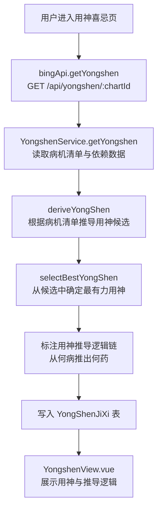
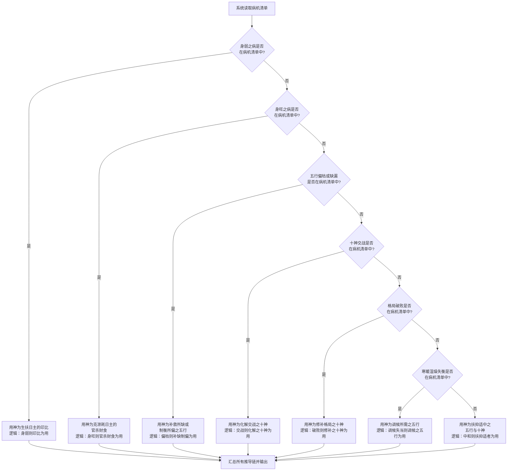
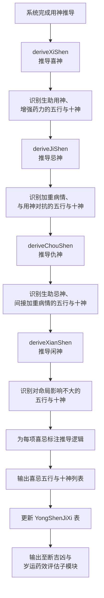
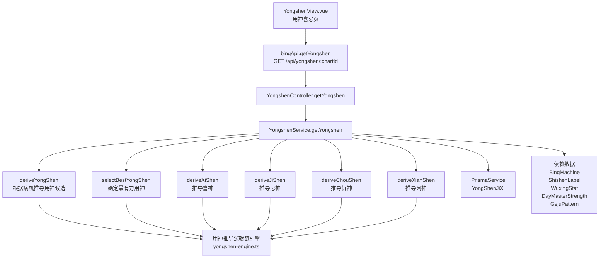

# 用神喜忌推导

> PRD Reference: docs/PRD/04. 辨病与用神模块/02. 用神喜忌推导/用神喜忌推导.md#用神喜忌推导

## 1. 业务流程

### 1.1 用神推导主流程

**触发**：用户在用神喜忌页（`/yongshen`）查看命盘的用神推导结果。

**步骤**：

1. 用户进入用神喜忌页，前端从 `useBingStore` 读取当前 `chartId`。
2. 前端调用 `bingApi.getYongshen()` 发送 `GET /api/yongshen/:chartId` 请求。
3. 后端 `YongshenController.getYongshen()` 接收请求，`YongshenService.getYongshen()` 执行用神推导：
   - 调用 `deriveYongShen()` 根据病机清单推导用神候选。
   - 调用 `selectBestYongShen()` 从候选中确定最有力的一位用神。
   - 标注用神的推导逻辑链（从何病推出何药）。
4. 用神推导结果写入 `YongShenJiXi` 数据表。
5. 前端 `YongshenView.vue` 展示用神及其推导逻辑链。

**预期结果**：用户可查看命盘的用神及其五行与十神属性、推导逻辑链和在四柱中的分布位置。



### 1.2 用神推导逻辑链流程

**触发**：系统根据病机清单推导用神。

**步骤**：

1. 读取病机清单，按优先级依次匹配：
   - 身弱病机在列 → 用神为生扶日主的印比，标注逻辑"身弱则印比为用"。
   - 身旺病机在列 → 用神为克泄耗日主的官杀财食，标注逻辑"身旺则官杀财食为用"。
   - 五行偏枯或缺漏病机在列 → 用神为补救所缺或制衡所偏之五行，标注逻辑"偏枯则补缺制偏为用"。
   - 十神交战病机在列 → 用神为化解交战之十神，标注逻辑"交战则化解之十神为用"。
   - 格局破败病机在列 → 用神为修补格局之十神，标注逻辑"破败则修补之十神为用"。
   - 寒暖湿燥失衡病机在列 → 用神为调候所需之五行，标注逻辑"调候失当则调候之五行为用"。
   - 无上述病机 → 用神为扶抑适中之五行与十神，标注逻辑"中和则扶抑适者为用"。
2. 将推导链完整标注并输出至用神喜忌推导结果。

**预期结果**：用神推导有明确的病机依据和逻辑链可追溯。



### 1.3 喜忌仇闲推导流程

**触发**：系统完成用神推导后，自动推导喜神、忌神、仇神、闲神。

**步骤**：

1. 用神确定后，调用 `deriveXiShen()` 推导喜神：识别生助用神、增强药力的五行与十神为喜神。
2. 调用 `deriveJiShen()` 推导忌神：识别加重病情、与用神对抗的五行与十神为忌神。
3. 调用 `deriveChouShen()` 推导仇神：识别生助忌神、间接加重病情的五行与十神为仇神。
4. 调用 `deriveXianShen()` 推导闲神：识别对命局影响不大的五行与十神为闲神。
5. 为每项喜忌标注推导逻辑（从何病推出何药或何忌）。
6. 输出完整的喜忌五行与十神列表。
7. 将结果更新至 `YongShenJiXi` 数据表。
8. 结果输出至断吉凶与岁运药效评估子模块。

**预期结果**：喜忌仇闲五类十神与五行完整，每项都有推导逻辑可追溯。



## 2. 关键函数设计

### 2.1 YongshenService.getYongshen

```typescript
async function getYongshen(chartId: number): Promise<YongShenJiXiResult>
```

- **职责**：接收命盘 ID，根据病机清单推导用神、喜神、忌神、仇神、闲神，并持久化结果。
- **核心逻辑**：
  1. 按 `chartId` 查询 `BingMachine` 表获取病机清单。
  2. 若病机清单不存在，先调用 `BingService.diagnose()` 生成病机诊断。
  3. 调用 `deriveYongShen()` 按优先级匹配病机推导用神候选。
  4. 调用 `selectBestYongShen()` 从候选中确定最有力的一位用神。
  5. 调用 `deriveXiShen()` 推导喜神。
  6. 调用 `deriveJiShen()` 推导忌神。
  7. 调用 `deriveChouShen()` 推导仇神。
  8. 调用 `deriveXianShen()` 推导闲神。
  9. 为每项标注推导逻辑链。
  10. 写入 `YongShenJiXi` 表（若已存在则更新）。
  11. 返回用神喜忌推导结果。
- **PRD 追溯**：用神推导页、喜忌仇闲列表页、推导逻辑链详情页 — FR-07

### 2.2 deriveYongShen

```typescript
function deriveYongShen(diseases: DiseaseItem[], shishen: ShishenLabel[], wuxingStat: WuxingStat, strength: DayMasterStrength, geju: GejuPattern): YongShenCandidate[]
```

- **职责**：根据病机清单，按优先级推导用神候选列表。
- **核心逻辑**：
  1. 按优先级遍历病机清单：身弱 → 身旺 → 五行偏枯缺漏 → 十神交战 → 格局破败 → 合绊用神 → 寒暖湿燥失衡 → 中和。
  2. 对每种病机类型，根据病机推导对应的用神候选（五行与十神）。
  3. 返回候选列表。
- **PRD 追溯**：用神推导逻辑链详情 — FR-07

### 2.3 selectBestYongShen

```typescript
function selectBestYongShen(candidates: YongShenCandidate[], wuxingStat: WuxingStat, shishen: ShishenLabel[]): YongShenItem
```

- **职责**：从用神候选中确定最有力的一位用神。
- **核心逻辑**：
  1. 评估每位候选在命局中的力量（参考五行力量统计与十神分布）。
  2. 选择力量最强且最能治病的候选作为用神。
  3. 返回确定的用神。
- **PRD 追溯**：用神推导页 — FR-07

### 2.4 deriveXiShen / deriveJiShen / deriveChouShen / deriveXianShen

```typescript
function deriveXiShen(yongShen: YongShenItem, shishen: ShishenLabel[], wuxingStat: WuxingStat): XiShenItem[]
function deriveJiShen(diseases: DiseaseItem[], yongShen: YongShenItem, shishen: ShishenLabel[]): JiShenItem[]
function deriveChouShen(jiShen: JiShenItem[], shishen: ShishenLabel[]): ChouShenItem[]
function deriveXianShen(yongShen: YongShenItem, xiShen: XiShenItem[], jiShen: JiShenItem[], chouShen: ChouShenItem[], shishen: ShishenLabel[]): XianShenItem[]
```

- **职责**：分别推导喜神（生助用神）、忌神（对抗用神、加重病情）、仇神（生助忌神）、闲神（对命局影响不大）。
- **核心逻辑**：
  - `deriveXiShen`：根据用神五行属性，识别生助用神的五行与十神。
  - `deriveJiShen`：根据病机与用神，识别克泄用神的五行与十神。
  - `deriveChouShen`：根据忌神五行属性，识别生助忌神的五行与十神。
  - `deriveXianShen`：排除用神、喜神、忌神、仇神后，剩余对命局影响不大的五行与十神。
- **PRD 追溯**：喜忌仇闲列表页 — FR-07

## 3. 组件架构



## 4. 数据来源

- 用神推导逻辑链引擎：`code/backend/src/modules/bing/lib/yongshen-engine.ts`
- 病机诊断数据：通过 `chartId` 引用本模块 `BingMachine` 表
- 十神标注数据：通过 `chartId` 引用模块 02 的 `ShishenLabel` 表
- 五行力量数据：通过 `chartId` 引用模块 02 的 `WuxingStat` 表
- 日主旺衰数据：通过 `chartId` 引用模块 02 的 `DayMasterStrength` 表
- 格局判定数据：通过 `chartId` 引用模块 02 的 `GejuPattern` 表
- 术语定义：`0.common/glossary.md`（用神、喜神、忌神、仇神、闲神等术语）