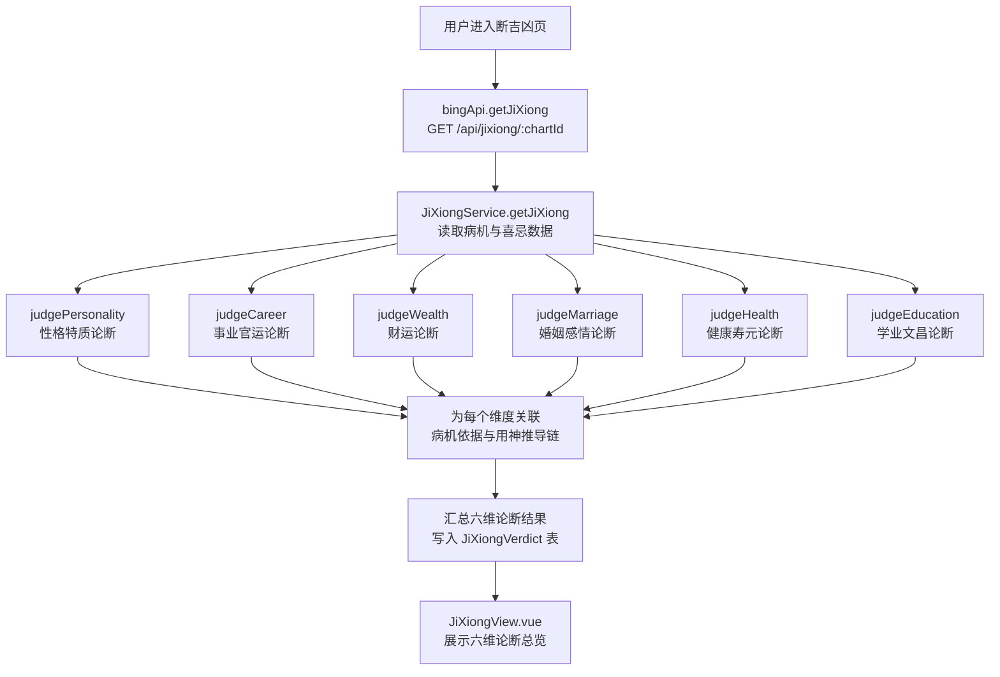
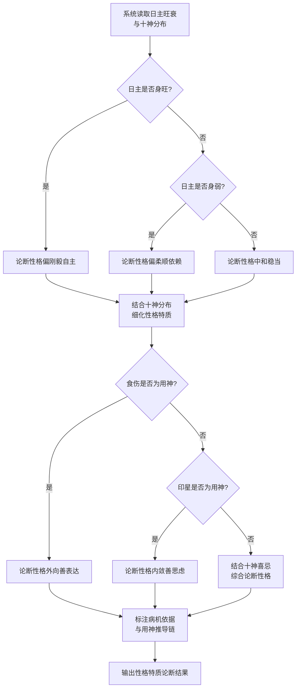
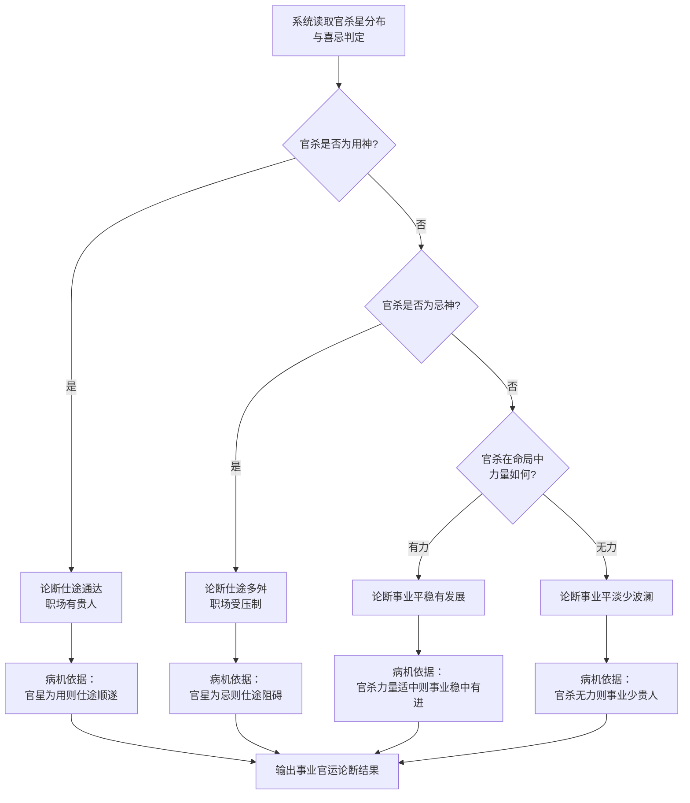
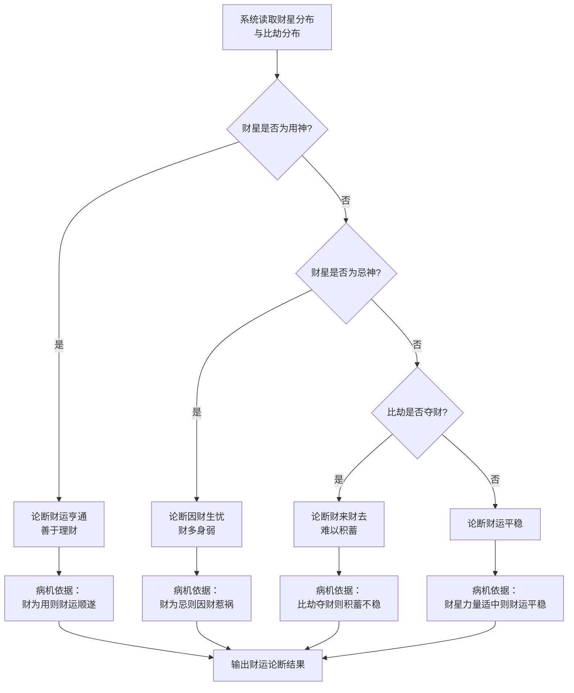
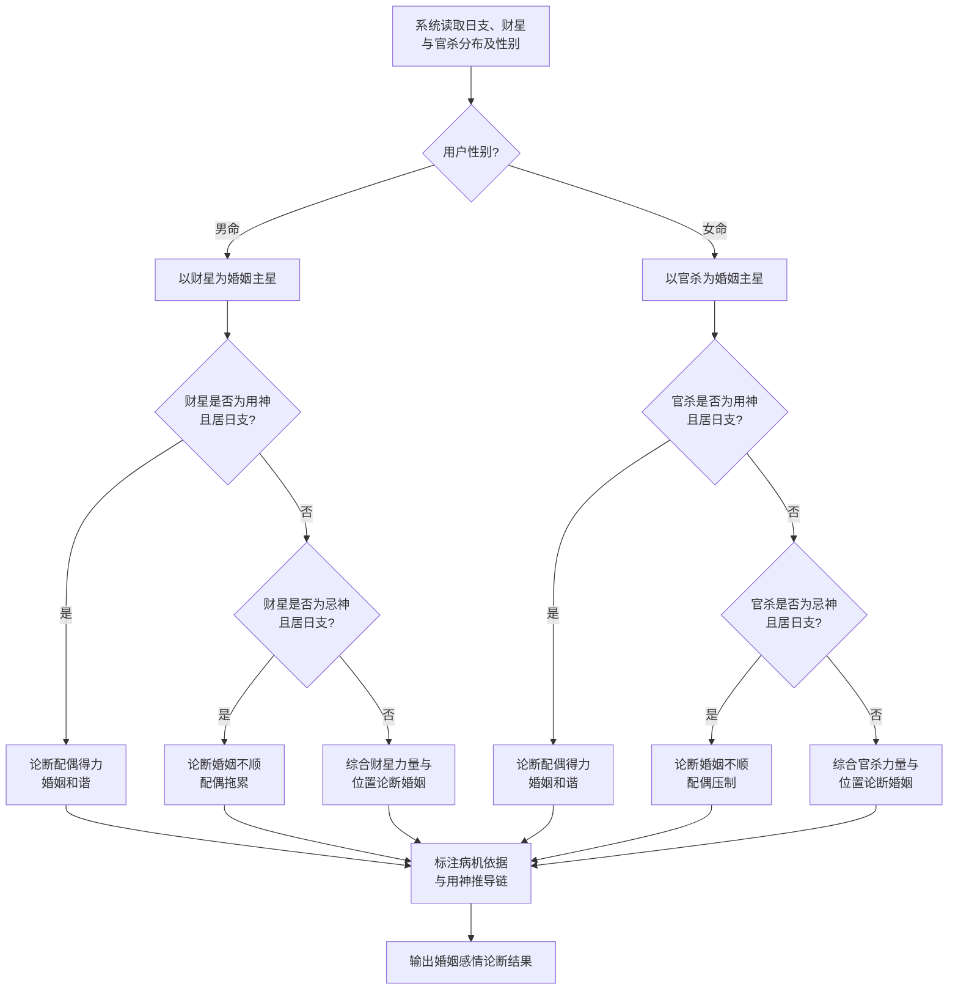
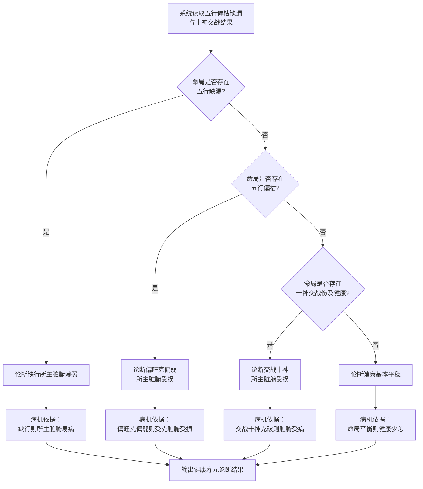
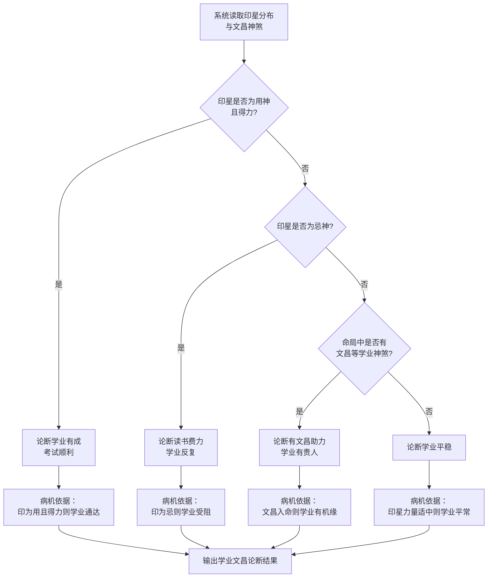
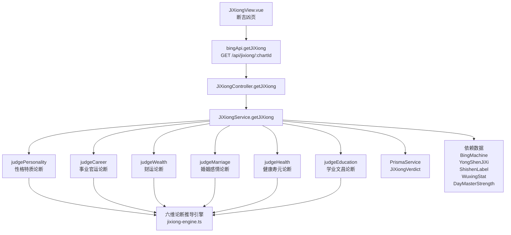

# 断吉凶

> PRD Reference: docs/PRD/04. 辨病与用神模块/03. 断吉凶/断吉凶.md#断吉凶

## 1. 业务流程

### 1.1 六维论断主流程

**触发**：用户在断吉凶页（`/jixiong`）查看命盘的六大人生维度论断结果。

**步骤**：

1. 用户进入断吉凶页，前端从 `useBingStore` 读取当前 `chartId`。
2. 前端调用 `bingApi.getJiXiong()` 发送 `GET /api/jixiong/:chartId` 请求。
3. 后端 `JiXiongController.getJiXiong()` 接收请求，`JiXiongService.getJiXiong()` 执行六维论断：
   - 调用 `judgePersonality()` 对性格特质维度进行论断。
   - 调用 `judgeCareer()` 对事业官运维度进行论断。
   - 调用 `judgeWealth()` 对财运维度进行论断。
   - 调用 `judgeMarriage()` 对婚姻感情维度进行论断。
   - 调用 `judgeHealth()` 对健康寿元维度进行论断。
   - 调用 `judgeEducation()` 对学业文昌维度进行论断。
4. 为每个维度关联病机依据与用神推导链。
5. 汇总六维论断结果，写入 `JiXiongVerdict` 数据表。
6. 前端 `JiXiongView.vue` 展示六维论断总览。

**预期结果**：用户可查看六大人生维度的论断结果、病机依据与用神推导链。



### 1.2 性格特质论断流程

**触发**：系统在六维论断中对性格特质维度进行论断。

**步骤**：

1. `judgePersonality()` 读取日主旺衰与十神分布。
2. 日主身旺 → 论断性格偏刚毅自主；日主身弱 → 论断性格偏柔顺依赖；适中 → 论断性格中和稳当。
3. 结合十神分布细化性格特质：食伤为用神 → 外向善表达；印星为用神 → 内敛善思虑；其他 → 综合十神喜忌论断。
4. 标注病机依据与用神推导链。
5. 输出性格特质论断结果。

**预期结果**：性格特质论断有明确的病机依据和用神推导链。



### 1.3 事业官运论断流程

**触发**：系统在六维论断中对事业官运维度进行论断。

**步骤**：

1. `judgeCareer()` 读取官杀星分布与喜忌判定。
2. 官杀为用神 → 论断仕途通达、职场有贵人，标注病机依据"官星为用则仕途顺遂"。
3. 官杀为忌神 → 论断仕途多舛、职场受压制，标注病机依据"官星为忌则仕途阻碍"。
4. 官杀力量适中 → 论断事业平稳有发展或平淡少波澜。
5. 标注病机依据与用神推导链。

**预期结果**：事业官运论断有明确的病机依据。



### 1.4 财运论断流程

**触发**：系统在六维论断中对财运维度进行论断。

**步骤**：

1. `judgeWealth()` 读取财星分布与比劫分布。
2. 财星为用神 → 论断财运亨通、善于理财，标注病机依据"财为用则财运顺遂"。
3. 财星为忌神 → 论断因财生忧、财多身弱，标注病机依据"财为忌则因财惹祸"。
4. 比劫夺财 → 论断财来财去、难以积蓄。
5. 财星力量适中 → 论断财运平稳。

**预期结果**：财运论断有明确的病机依据。



### 1.5 婚姻感情论断流程

**触发**：系统在六维论断中对婚姻感情维度进行论断。

**步骤**：

1. `judgeMarriage()` 读取日支、财星与官杀分布及性别。
2. 男命以财星为婚姻主星，女命以官杀为婚姻主星。
3. 婚姻主星为用神且居日支 → 论断配偶得力、婚姻和谐。
4. 婚姻主星为忌神且居日支 → 论断婚姻不顺、配偶拖累（女命为配偶压制）。
5. 其他情况 → 综合婚姻主星力量与位置论断。
6. 标注病机依据与用神推导链。

**预期结果**：婚姻感情论断区分男女命，病机依据完整。



### 1.6 健康寿元论断流程

**触发**：系统在六维论断中对健康寿元维度进行论断。

**步骤**：

1. `judgeHealth()` 读取五行偏枯缺漏与十神交战结果。
2. 五行缺漏 → 论断缺行所主脏腑薄弱，标注病机依据"缺行则所主脏腑易病"。
3. 五行偏枯 → 论断偏旺之行克伐偏弱之行所主脏腑，标注病机依据"偏旺克偏弱则受克脏腑受损"。
4. 十神交战伤及健康 → 论断交战十神所主脏腑受损，标注病机依据"交战十神克破则脏腑受病"。
5. 命局平衡 → 论断健康基本平稳。

**预期结果**：健康寿元论断与五行偏枯缺漏病机关联清晰。



### 1.7 学业文昌论断流程

**触发**：系统在六维论断中对学业文昌维度进行论断。

**步骤**：

1. `judgeEducation()` 读取印星分布与文昌神煞。
2. 印星为用神且得力 → 论断学业有成、考试顺利，标注病机依据"印为用且得力则学业通达"。
3. 印星为忌神 → 论断读书费力、学业反复，标注病机依据"印为忌则学业受阻"。
4. 有文昌等学业神煞 → 论断有文昌助力、学业有贵人，标注病机依据"文昌入命则学业有机缘"。
5. 印星力量适中 → 论断学业平稳。

**预期结果**：学业文昌论断与印星喜忌和文昌神煞关联清晰。



## 2. 关键函数设计

### 2.1 JiXiongService.getJiXiong

```typescript
async function getJiXiong(chartId: number): Promise<JiXiongVerdictResult>
```

- **职责**：接收命盘 ID，对六大人生维度进行论断，每个维度关联病机依据与用神推导链，并持久化结果。
- **核心逻辑**：
  1. 按 `chartId` 查询 `BingMachine` 表获取病机清单。
  2. 查询 `YongShenJiXi` 表获取用神喜忌推导结果。
  3. 查询 `ShishenLabel` 表获取十神标注。
  4. 查询 `WuxingStat` 表获取五行力量统计。
  5. 查询 `DayMasterStrength` 表获取日主旺衰判定。
  6. 依次调用六维论断函数。
  7. 为每条论断标注病机依据与用神推导链。
  8. 汇总写入 `JiXiongVerdict` 表。
  9. 返回六维论断结果。
- **PRD 追溯**：六维论断总览页 — FR-07

### 2.2 judgePersonality

```typescript
function judgePersonality(strength: DayMasterStrength, shishen: ShishenLabel[], yongShen: YongShenItem, diseases: DiseaseItem[]): DimensionVerdict
```

- **职责**：对性格特质维度进行论断。
- **核心逻辑**：
  1. 根据日主旺衰判定性格基调（身旺偏刚毅/身弱偏柔顺/适中中和稳当）。
  2. 根据十神分布细化性格特质（食伤为用→外向善表达/印星为用→内敛善思虑/综合论断）。
  3. 标注病机依据与用神推导链。
  4. 返回性格特质维度论断。
- **PRD 追溯**：性格特质论断页 — FR-07

### 2.3 judgeCareer

```typescript
function judgeCareer(shishen: ShishenLabel[], yongShen: YongShenJiXi, diseases: DiseaseItem[]): DimensionVerdict
```

- **职责**：对事业官运维度进行论断。
- **核心逻辑**：
  1. 根据官杀星喜忌与力量判定事业官运论断。
  2. 官杀为用→仕途通达；官杀为忌→仕途多舛；官杀适中→平稳/平淡。
  3. 标注病机依据"官星为用/忌"。
- **PRD 追溯**：事业官运论断页 — FR-07

### 2.4 judgeWealth

```typescript
function judgeWealth(shishen: ShishenLabel[], yongShen: YongShenJiXi, diseases: DiseaseItem[]): DimensionVerdict
```

- **职责**：对财运维度进行论断。
- **核心逻辑**：
  1. 根据财星喜忌与比劫分布判定财运论断。
  2. 财为用→财运亨通；财为忌→因财生忧；比劫夺财→财来财去；适中→平稳。
  3. 标注病机依据。
- **PRD 追溯**：财运论断页 — FR-07

### 2.5 judgeMarriage

```typescript
function judgeMarriage(shishen: ShishenLabel[], yongShen: YongShenJiXi, diseases: DiseaseItem[], gender: string, pillars: Pillar[]): DimensionVerdict
```

- **职责**：对婚姻感情维度进行论断。
- **核心逻辑**：
  1. 根据性别确定婚姻主星（男命→财星，女命→官杀）。
  2. 根据婚姻主星喜忌与位置（日支）判定婚姻论断。
  3. 标注病机依据。
- **PRD 追溯**：婚姻感情论断页 — FR-07

### 2.6 judgeHealth

```typescript
function judgeHealth(wuxingStat: WuxingStat, shishen: ShishenLabel[], diseases: DiseaseItem[]): DimensionVerdict
```

- **职责**：对健康寿元维度进行论断。
- **核心逻辑**：
  1. 优先检查五行缺漏 → 脏腑薄弱论断。
  2. 其次检查五行偏枯 → 偏旺克偏弱论断。
  3. 再次检查十神交战 → 脏腑受损论断。
  4. 无上述病机 → 健康平稳。
  5. 标注病机依据。
- **PRD 追溯**：健康寿元论断页 — FR-07

### 2.7 judgeEducation

```typescript
function judgeEducation(shishen: ShishenLabel[], yongShen: YongShenJiXi, diseases: DiseaseItem[], shensha: ShenshaLabel[]): DimensionVerdict
```

- **职责**：对学业文昌维度进行论断。
- **核心逻辑**：
  1. 根据印星喜忌与力量判定学业论断。
  2. 印为用且得力→学业有成；印为忌→读书费力；有文昌神煞→有贵人；适中→平稳。
  3. 标注病机依据。
- **PRD 追溯**：学业文昌论断页 — FR-07

## 3. 组件架构



## 4. 数据来源

- 六维论断推导引擎：`code/backend/src/modules/bing/lib/jixiong-engine.ts`
- 病机诊断数据：通过 `chartId` 引用本模块 `BingMachine` 表
- 用神喜忌数据：通过 `chartId` 引用本模块 `YongShenJiXi` 表
- 十神标注数据：通过 `chartId` 引用模块 02 的 `ShishenLabel` 表
- 五行力量数据：通过 `chartId` 引用模块 02 的 `WuxingStat` 表
- 日主旺衰数据：通过 `chartId` 引用模块 02 的 `DayMasterStrength` 表
- 神煞标注数据：通过 `chartId` 引用模块 05 的 `ShenshaLabel` 表（学业文昌论断引用文昌神煞）
- 术语定义：`0.common/glossary.md`（病机、病象、用神、喜忌等术语）